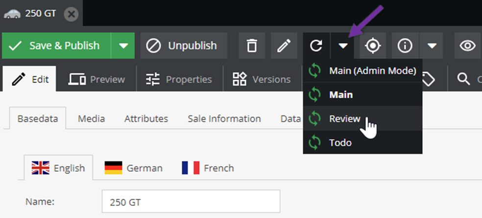
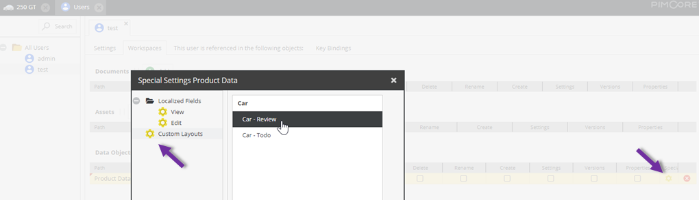

# Custom Layouts
It is possible to create customized layouts based on the master definition and override the settings concerning the 
visual aspects of the layout and data components. It is also possible to make a field editable although it is 
marked as non-editable in the master layout. Custom layouts are available for all admin users and can be made 
available to standard users through the workspace settings.

> **Security Note**    
> Custom layouts are not intended to restrict access to sensitive data in high-security scenarios.

In order to define a custom layout, open the Custom Layout Editor through the Configure Custom Layouts button in the 
class editor. You can define as many layouts as you want. In the left panel you will see the master definition, 
in the middle the custom layout you are currently editing and on the right the specific settings for the selected 
field. You can to modify all visual aspects of the field. Other settings concerning the data aspects are locked. 
You can drag and drop elements from the master layout to the custom layout tree, or you can add layout components 
using the context menu.

Note that there is no need to add all data elements from the master layout to the custom layout. You can choose 
just as many you need. This does not have any impact on your data!

In the object editor, the layout can then be chosen via the reload button. Note that any data changes will be lost.

Admin users will notice an extra Layout called `Master (Admin Mode)` which is basically the same as the Master 
Layout except that invisible fields are shown and non-editable fields are made editable again. This layout is available 
for admin users only. 

As already mentioned above, custom layouts can be made available to standard users through the workspace settings in 
the user permissions. 

If no layout is selected for the given class then the data will be presented using the master layout. Otherwise, 
the user will have the choice between the selected layouts.

