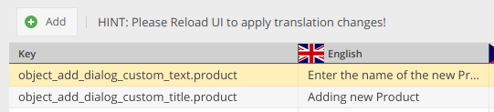

# Customize Editing Interface

## Customize _Add Object_ Dialog
To customize the _Add Object_ dialog, just create admin translations in the following format:  
`object_add_dialog_custom_title.CLASSNAME`   
`object_add_dialog_custom_text.CLASSNAME`  

replace `CLASSNAME` with the actual name of the class of which dialog you'd like to customize (case-sensitive). 

#### Example
   
 
 
 