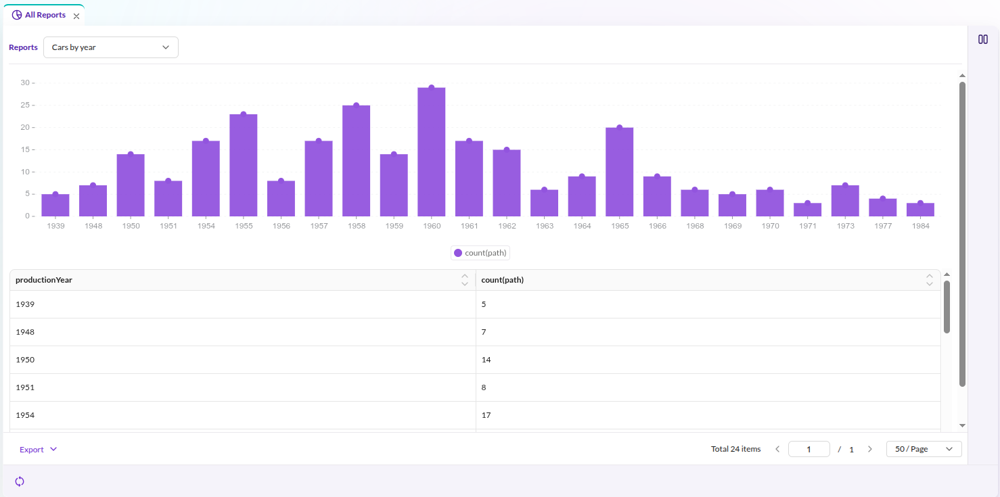
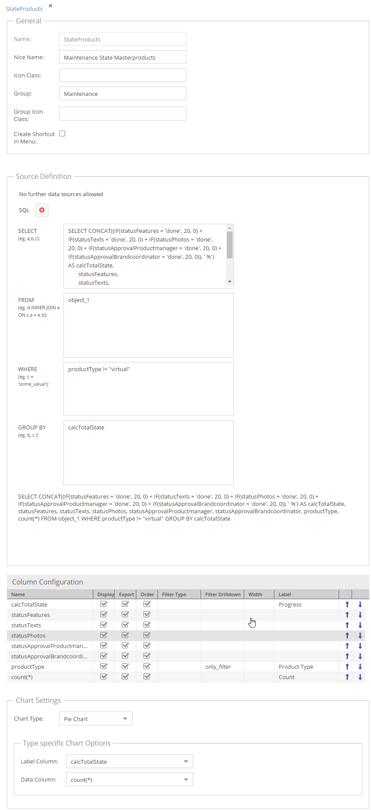

# Custom Reports

:::caution

To use this feature, enable the `PimcoreCustomReportsBundle` in your `bundles.php` file:

```php
Pimcore\Bundle\CustomReportsBundle\PimcoreCustomReportsBundle::class => ['all' => true]
```

Then install it with:

```sh
bin/console pimcore:bundle:install PimcoreCustomReportsBundle
```

:::

This page covers report configuration, built-in data source adapters, permissions,
and how to implement custom adapters with both a PHP backend and a Pimcore Studio frontend.



## Data Source Adapters

Each report uses a data source adapter to retrieve and prepare its data.
Pimcore ships with the following adapters:

- **SQL** - query data with custom SQL statements
  

  :::caution

  When using the SQL adapter, several SQL keywords cannot appear unquoted in column names:

  ```sql
  ALTER|CREATE|DROP|RENAME|TRUNCATE|UPDATE|DELETE
  ```

  For example, a column named `lastUpdate` needs backtick quoting:

  ```sql
  SELECT `lastUpdate`
  ```

  :::

- **Statistics Explorer** (Enterprise) - aggregation and pivot-table reports via
  [Statistics Explorer Custom Report Integration](https://github.com/pimcore/statistics-explorer/blob/doc-refactoring/doc/04_Custom_Report_Integration/README.md)

## Custom Report Permissions

Custom report permissions control report visibility:

- **Share globally**: all users with the `reports` permission can access the report.
- **Visible to users**: only the listed users can access the report.
- **Visible to roles**: only users with the listed roles can access the report.

## Custom Data Source Adapters

Implement custom source adapters for specialized data retrieval.
A custom adapter consists of a PHP backend (data retrieval) and a Pimcore Studio frontend (configuration form).

### PHP Backend: Adapter Class

Implement `CustomReportAdapterInterface`
(or extend `AbstractAdapter`) from `Pimcore\Bundle\CustomReportsBundle\Tool\Adapter`:

| Method | Description |
|--------|-------------|
| `getData(?array $filters, ?string $sort, ?string $dir, ?int $offset, ?int $limit, ?array $fields, ?array $drillDownFilters): array` | Return report data as an array with `data` (rows) and `total` (count) keys. |
| `getColumns(?stdClass $configuration): array` | Return available column names. |
| `getColumnsWithMetadata(?stdClass $configuration): array` | Return `ColumnInformation[]` controlling per-column settings: sort ordering, filtering, dropdown filtering, and label editability. Override to restrict which settings are configurable. |
| `getAvailableOptions(array $filters, string $field, array $drillDownFilters): array` | Return distinct values for drill-down filter dropdowns. |
| `getPagination(): bool` | Return whether the adapter supports pagination (default: `true`). |

Reference implementation:
[Sql.php](https://github.com/pimcore/pimcore/blob/2026.x/bundles/CustomReportsBundle/src/Tool/Adapter/Sql.php)

### PHP Backend: Adapter Factory

Create a factory implementing `CustomReportAdapterFactoryInterface`:

```php
interface CustomReportAdapterFactoryInterface
{
    public function create(stdClass $config, ?Config $fullConfig = null): CustomReportAdapterInterface;
}
```

For simple adapters without dependency injection, use `DefaultCustomReportAdapterFactory`
and pass the adapter class FQCN as argument:

```yaml
services:
    app.custom_report.adapter.factory.custom:
        class: Pimcore\Bundle\CustomReportsBundle\Tool\Adapter\DefaultCustomReportAdapterFactory
        arguments:
            - 'App\CustomReport\Adapter\Custom'
```

For adapters requiring injected services, implement `CustomReportAdapterFactoryInterface` directly.

### PHP Backend: Register the Adapter

Add the factory to the `pimcore_custom_reports.adapters` configuration.
The key becomes the adapter's type identifier. At runtime, the system resolves the factory
from a `ServiceLocator` using the `type` field in the report's `dataSourceConfig`:

```yaml
pimcore_custom_reports:
    adapters:
        myAdapter: app.custom_report.adapter.factory.custom
```

When a report stores `"type": "myAdapter"` in its data source configuration,
Pimcore looks up the `myAdapter` key in the registered adapter factories and calls `create()` on it.

### Pimcore Studio Frontend: Dynamic Type Provider

After registering the PHP adapter, create a corresponding Pimcore Studio component
so the adapter appears in the report configuration editor.

Extend `DynamicTypeCustomReportDefinitionAbstract`:

```typescript
import { injectable } from 'inversify'
import { type ReactElement } from 'react'
import {
  DynamicTypeCustomReportDefinitionAbstract
} from '@Pimcore/modules/reports/dynamic-types/definitions/custom-report-definition-adapters/dynamic-type-custom-report-definition-abstract'
import { type IReportConfigurationSectionProps } from '@Pimcore/modules/reports/reports-editor/types'

@injectable()
export class DynamicTypeMyCustomAdapter extends DynamicTypeCustomReportDefinitionAbstract {
  readonly id = 'myAdapter'

  getLabel (): ReactElement {
    return <>My Custom Adapter</>
  }

  getPagination (): boolean {
    return true
  }

  getCustomReportData (props: IReportConfigurationSectionProps): ReactElement {
    return <MyAdapterConfigForm {...props} />
  }
}
```

The `id` property must match the adapter key registered in `pimcore_custom_reports.adapters`.

`getCustomReportData()` returns the React component that renders in the report configuration view.
The component receives props typed as `IReportConfigurationSectionProps`:
- `currentData` (`ReportFormData`) - the current report configuration state
- `updateFormData` (`(data: ReportFormData) => void`) - callback to update configuration values
- `form` (`FormInstance`) - the Ant Design form instance for field binding

Register the dynamic type in a Pimcore Studio plugin.
The plugin binds the class to the DI container; the module retrieves it and registers it
with the dynamic type registry:

```typescript
// plugin.ts
import type { IAbstractPlugin } from '@Pimcore/modules/app/plugin/plugin-api'

export const MyPlugin: IAbstractPlugin = {
  name: 'my-custom-report-plugin',

  onInit ({ container }) {
    container.bind('MyPlugin/DynamicTypes/CustomReportDefinition/MyAdapter')
      .to(DynamicTypeMyCustomAdapter)
      .inSingletonScope()
  },

  onStartup ({ moduleSystem }) {
    moduleSystem.registerModule(MyModule)
  }
}
```

```typescript
// module/index.tsx
import type { AbstractModule } from '@Pimcore/app/module-system/module-system'
import { container } from '@Pimcore/app/depency-injection'
import { serviceIds } from '@Pimcore/app/config/services/service-ids'
import {
  type DynamicTypeCustomReportDefinitionRegistry
} from '@Pimcore/modules/reports/dynamic-types/definitions/custom-report-definition-adapters/dynamic-type-custom-report-definition-registry'

export const MyModule: AbstractModule = {
  onInit () {
    const registry = container.get<DynamicTypeCustomReportDefinitionRegistry>(
      serviceIds['DynamicTypes/CustomReportDefinitionRegistry']
    )
    registry.registerDynamicType(
      container.get<DynamicTypeMyCustomAdapter>('MyPlugin/DynamicTypes/CustomReportDefinition/MyAdapter')
    )
  }
}
```

Reference implementations:
- SQL adapter:
  [dynamic-type-custom-report-definition-sql-adapter.tsx](https://github.com/pimcore/studio-ui-bundle/blob/1.x/assets/js/src/core/modules/reports/dynamic-types/definitions/custom-report-definition-adapters/types/dynamic-type-custom-report-definition-sql-adapter.tsx)
- Statistics Explorer adapters:
  [statistics-explorer/assets/studio/js/src/modules/statistics-explorer/dynamic-types/types/](https://github.com/pimcore/statistics-explorer/tree/doc-refactoring/assets/studio/js/src/modules/statistics-explorer/dynamic-types/types)

Creating a Pimcore Studio plugin requires a Module Federation bundle.
See the [Pimcore Studio Extending Guide](https://github.com/pimcore/studio-ui-bundle/blob/1.x/doc/04_Extending/README.md)
for setup instructions.
