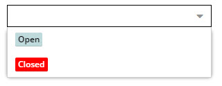

# Marking Stores

The workflow engine supports several marking store types for persisting the current places of a subject.

## state_table (default)

The default marking store. Place information is stored in the `element_workflow_state` table.
Use this for assets and documents. For data objects, the other marking store options
store data directly in the data object model as attributes.

##### Configuration Example
```yaml
   marking_store:
      type: state_table
```

## single_state

Stores the place in an attribute of the subject (calls the setter method).
Use this when a model cannot occupy more than one place at the same time.
This is the default `single_state` marking store provided by the Symfony framework.
For data objects, a select field (or input field) is the right Pimcore field
to store places with the `single_state` marking store.

##### Configuration Example
```yaml
   marking_store:
      type: single_state
      arguments:
         - workflowState
```

## multiple_state

Same as `single_state` but supports multiple simultaneous places.
This cannot be used with data object multiselect fields - use `data_object_multiple_state` instead.

##### Configuration Example
```yaml
   marking_store:
      type: multiple_state
      arguments:
         - workflowState
```

## data_object_multiple_state

Stores multiple places in a data object multiselect field.

##### Configuration Example
```yaml
   marking_store:
      type: data_object_multiple_state
      arguments:
         - workflowState
```


## data_object_splitted_state (data objects only)

Works like `single_state` and `data_object_multiple_state` but stores different places
in different data object attributes. Configure a mapping between places and attribute names.

##### Configuration Example

In the following example, text-related places are stored in `workflowStateText`
while image-related places are stored in `workflowStateImages`:

```yaml
   marking_store:
       type: data_object_splitted_state
       arguments:
           - text_open: workflowStateText
             text_finished: workflowStateText
             text_released: workflowStateText

             images_open: workflowStateImages
             images_finished: workflowStateImages
             images_released: workflowStateImages
```


## Options provider (for single_state, data_object_multiple_state and data_object_splitted_state)

When using data object attributes (select or multiselect) to store places,
set up `@pimcore.workflow.place-options-provider` as options provider
and the workflow name as options provider data in the data object attribute.


This options provider adds the places in a nicely formatted way:

