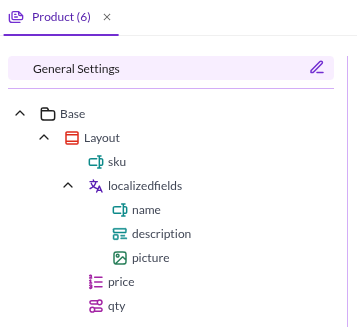
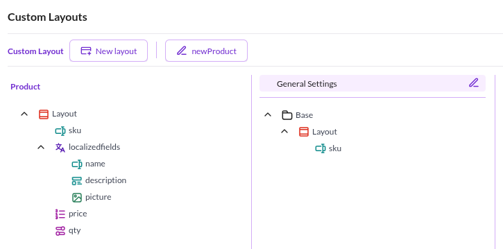
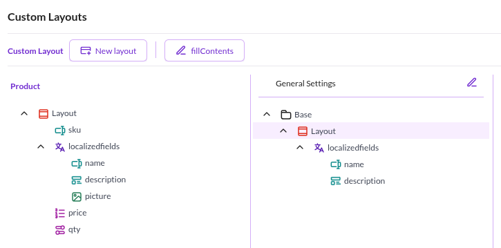
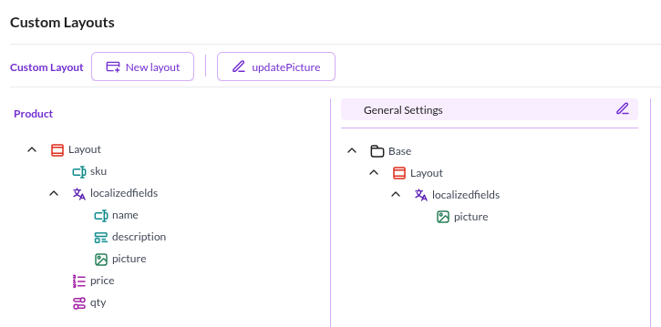
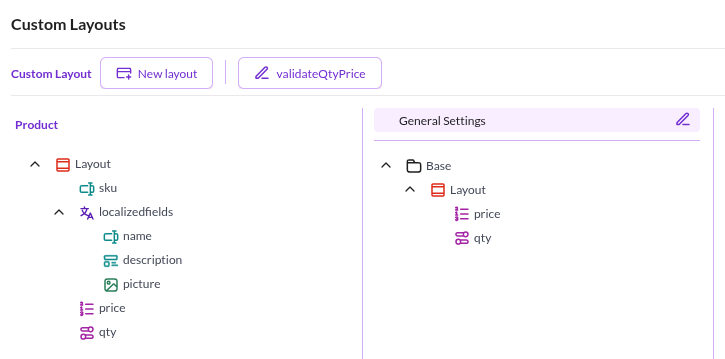
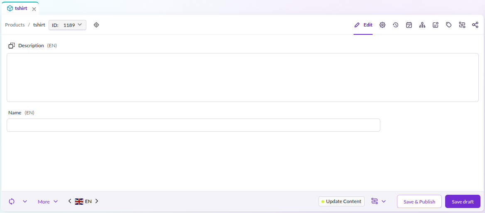
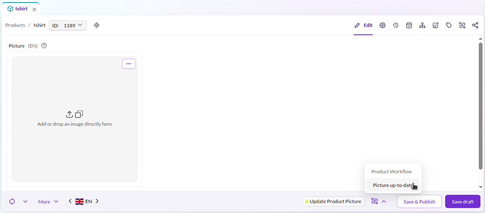
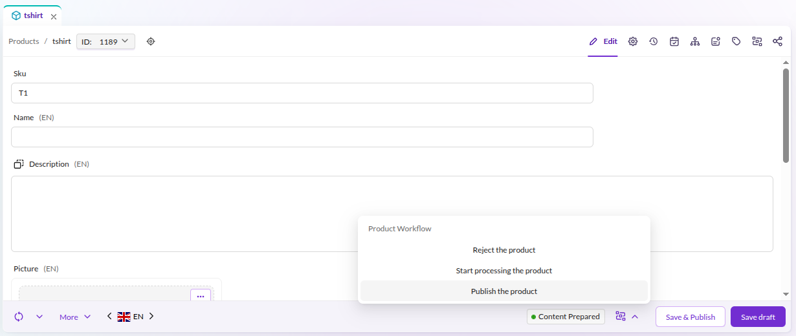
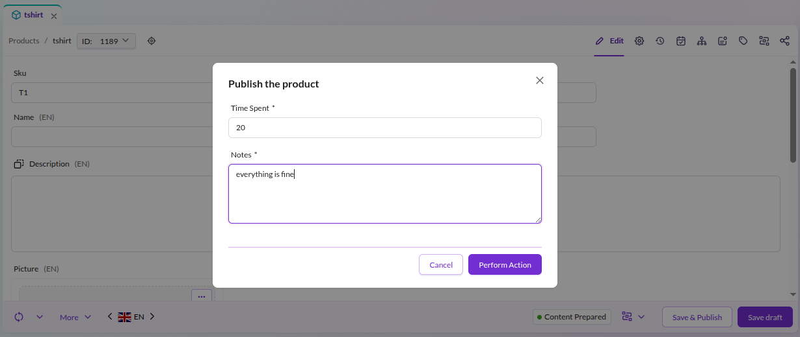
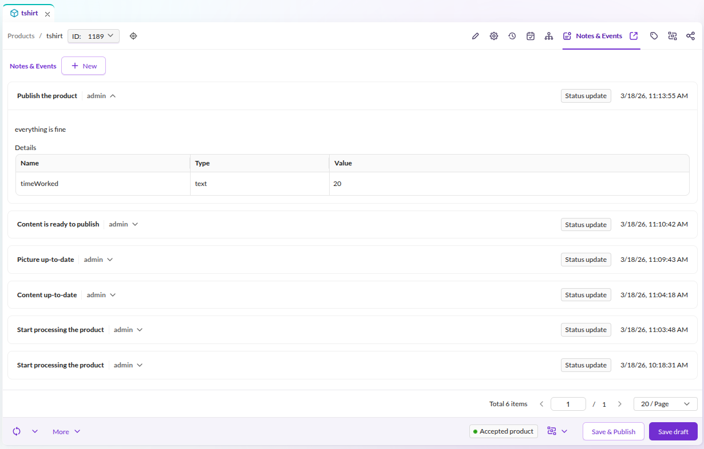

# Workflow Tutorial

This tutorial builds a product workflow for data objects, covering places, transitions, guards,
custom layouts, and additional fields.

## Create a class and custom layouts

Start with a simple product class containing sku, localized name, localized picture,
localized description, price, and quantity.



Add four custom layouts to assign to specific workflow statuses:

* `newProduct` layout with ID = 1



* `fillContents` layout with ID = 2



* `updatePicture` layout with ID = 3



* `validateQtyPrice` layout with ID = 4




## The workflow declaration

Create the base configuration in `config/config.yaml`:

```yaml
pimcore:
    workflows:
        workflow:
            label: 'Product Workflow'
            type: 'state_machine'
            supports:
            - 'Pimcore\Model\DataObject\Product'
            places:
                #TODO
            transitions:
                #TODO
```

The workflow is called **Product Workflow** and applies only to instances of
`Pimcore\Model\DataObject\Product`. The workflow type `state_machine` restricts the element to one active place at a time.
Places and transitions are defined in the following sections.

### Specify places

Define places for products. In this scenario, new products arrive from an external system
as empty objects with only a SKU. The workflow needs to support deciding which products
to use in Pimcore and which to reject. This requires (at least) three places:

* new - for the newest products
* rejected - for products that will not be used, with a required note explaining the reason
* update content - for products to prepare for publishing

```yaml
(...)
    places:
        new:
            label: 'New product'
            color: '#377ea9'
            permissions:
                - objectLayout: 1
        rejected:
            label: 'Rejected product'
            color: '#28a013'
        update_content:
            label: 'Update Content'
            title: 'Updating content step'
            color: '#d9ef36'
            permissions:
                - objectLayout: 2

(...)
```

The `objectLayout` key defines which custom layout to use for each place. Here, the *new* place
uses custom layout 1 and *update_content* uses custom layout 2.


### Specify the first transitions

An administrator can decide which products to process and which to reject.
Add two transitions:

* reject product - changes the status for products not to be used
* start processing - moves the product to the processing step

```yaml
(...)
    transitions:
        reject_product:
            from: new
            to: rejected
            options:
                label: 'Reject the product'
                notes:
                    commentEnabled: true
                    commentRequired: true
        start_processing:
            from: new
            to: update_content
            options:
                label: 'Start processing the product'
(...)
```


### More statuses, actions, and definitions

Add 4 more places for the content update pipeline:

* updating the content
* updating the picture
* updating the price and stock
* marking content as ready - moving the product back to the administrator

Add these to the configuration file:

```yaml

(...)
    places:
        (...)
        update_picture:
            label: 'Update Product Picture'
            title: 'Update the product picture'
            color: '#d9ef36'
            permissions:
                - objectLayout: 3
        validate_stock_and_price:
            label: 'Validate Stock + Price'
            title: 'Check the quantity and the price'
            color: '#d9ef36'
            permissions:
                - objectLayout: 4
        content_prepared:
            label: 'Content Prepared'
            title: 'Content ready to publish'
            color: '#28a013'
(...)

    transitions:
        (...)
        content_updated:
            from: update_content
            to: update_picture
            options:
                label: 'Content up-to-date'
                notes:
                    commentEnabled: true
                    commentRequired: false
        picture_updated:
            from: update_picture
            to: validate_stock_and_price
            options:
                label: 'Picture up-to-date'
                notes:
                    commentEnabled: true
                    commentRequired: false
        content_ready:
            from: validate_stock_and_price
            to: content_prepared
            options:
                label: 'Content is ready to publish'
(...)

```

### Last actions: publish or rollback

At the final stage, the workflow offers three choices:

* Publish the product (with an additional field called *"timeWorked"*)
* Start the workflow from the beginning
* Reject the product (with a note)

The reject and start processing transitions already exist. Add `content_prepared` as an additional
`from` place. This works because the workflow type `state_machine` supports multiple `from` places
per transition.

```yaml

(...)
    transitions:
        reject_product:
            from: [new, content_prepared]
            to: rejected
            options:
                label: 'Reject the product'
                notes:
                    commentEnabled: true
                    commentRequired: true
        start_processing:
            from: [new, content_prepared]
            to: update_content
            options:
                label: 'Start processing the product'
                notes:
                    commentEnabled: true
                    commentRequired: false
(...)
```

The final addition is a publish transition with a place and a guard restricting it to a certain role:

```yaml
(...)
    places:
        (...)
        accepted:
            label: 'Accepted product'
            color: '#28a013'
(...)
```

And the transition with a *"timeWorked"* additional field:

```yaml
(...)
    transitions:
        (...)
        publish:
            from: content_prepared
            to: accepted
            guard: "is_fully_authenticated() and is_granted('ROLE_PIMCORE_ADMIN')"
            options:
                label: 'Publish the product'
                notes:
                    commentEnabled: true
                    commentRequired: true
                    additionalFields:
                        - name: 'timeWorked'
                          fieldType: 'input'
                          title: 'Time Spent'
                          required: true
(...)
```


### Workflow in action

The following table shows the workflow at each stage:

| Status                                                  | Screenshot                                         |
| ------------------------------------------------------- |----------------------------------------------------|
| Initial status when new object comes into the system    |    |
| Update Content                                          |   |
| Update Picture                                          |   |
| Validate Price and Stock                                |         |
| Content is ready                                        |    |
| Publish the Product                                     |  |


### Check the history

The *"Notes & Events"* tab lists every action applied to the object through the workflow module.


