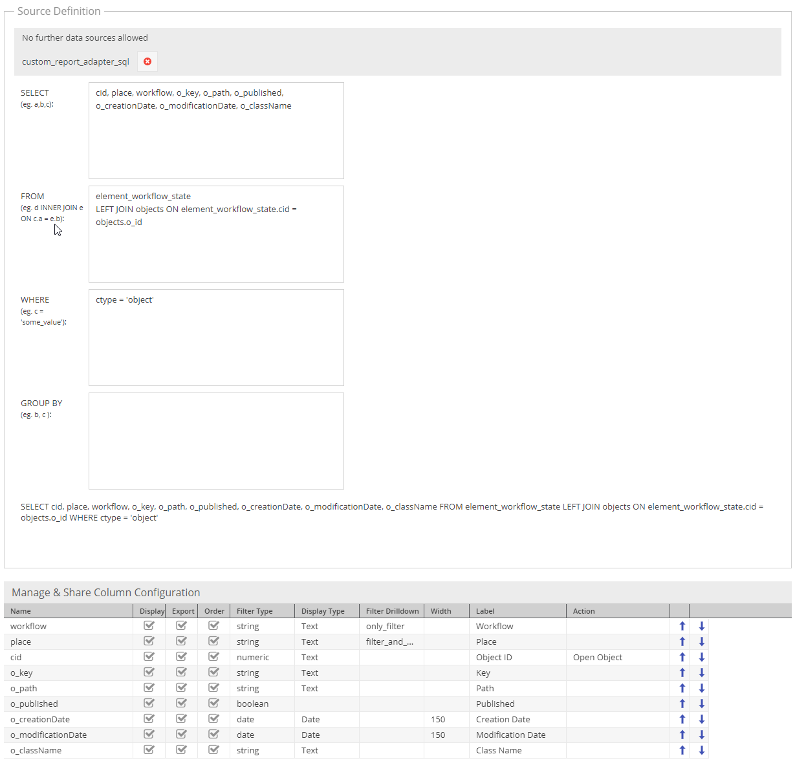

# Workflow Reporting

Depending on the marking store of workflows, different ways of Workflow Reporting are available. For details see 
[marking store docs](./02_Marking_Stores.md). 

## Using `state_table` and Custom Reports

You can easily use the custom reports to make workflow place reporting, filtering, exporting and directly open related elements.
This way, you can follow and monitor workflows and the progress of document, asset and object.

### Create a custom report for objects

First, you just have to create a new empty custom report, please see:
[custom reports](../18_Tools_and_Features/29_Custom_Reports.md)

After creating it, you can configure it like this for the Source Definition, Column Configuration and Chart Settings:

Save it and you are ready to use it!
You can filter globally by state and status, order and filter the columns and export results

Here is an example of rendered workflow custom report:

## Using `single_state`, `data_object_multiple_state` and `data_object_splitted_state` together with Object Grid

Since `single_state` (and others) stores the place information into data object attributes, Pimcore default
object grids can be used to do workflow reporting on Pimcore Objects. 
Just create a corresponding grid configuration and use default filtering and sorting functionality. 

Additionally extensions like [Advanced Object Search](https://github.com/pimcore/advanced-object-search) can be used to 
create saved searches with predefined filters.
