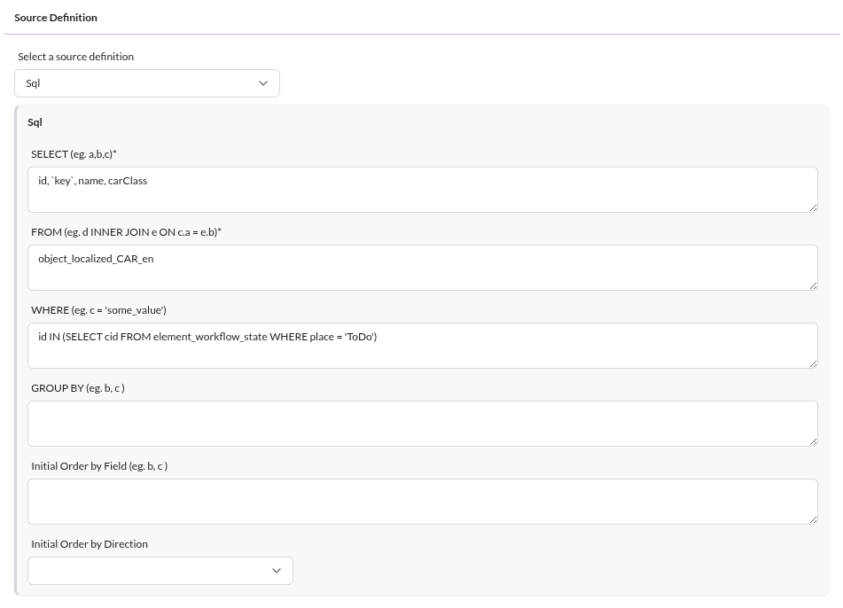
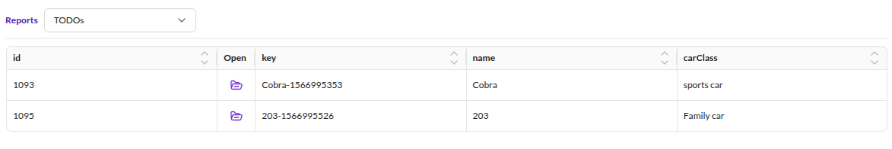

# Workflow Reporting

Depending on the marking store of workflows, different reporting methods are available.
See [marking store docs](./01_Configuration/01_Marking_Stores.md) for details.

## Using `state_table` and Custom Reports

Use custom reports for workflow place reporting, filtering, exporting,
and directly opening related elements.
This way, follow and monitor workflows and the progress of documents, assets, and objects.

### Create a custom report for objects

Create a new empty custom report.
See [custom reports](../06_Reporting/01_Custom_Reports.md).

After creating it, configure the Source Definition, Column Configuration, and Chart Settings:

Save it and start using it.
Filter globally by state and status, order and filter the columns, and export results.

Here is an example of a rendered workflow custom report:

## Using `single_state`, `data_object_multiple_state` and `data_object_splitted_state` together with Object Grid

Since `single_state` (and others) stores place information in data object attributes,
Pimcore default object grids handle workflow reporting on Pimcore Objects.
Create a corresponding grid configuration and use default filtering and sorting functionality.

Additionally, extensions like [Advanced Object Search](https://github.com/pimcore/advanced-object-search)
provide saved searches with predefined filters.
