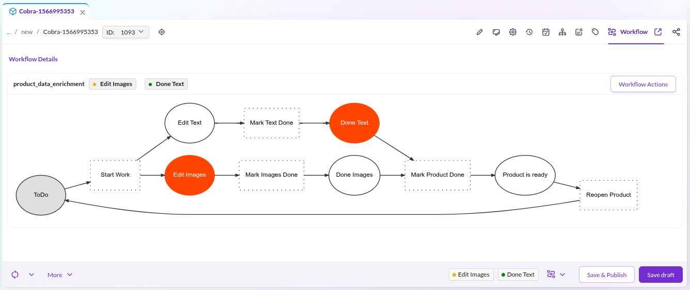

# Workflow Management

Pimcore Workflow Management configures multiple workflows on elements (assets, documents, data objects)
to support data maintenance processes and element life cycles.
It extends the [Symfony workflow component](https://symfony.com/doc/current/workflow.html)
with Pimcore-specific features. Familiarize yourself with the Symfony workflow basics before proceeding.

## Concepts

**Workflow**
A workflow models the process an element goes through in Pimcore. It consists of *places*, *transitions*,
a *marking store*, *global actions*, and additional configuration options.
Each element can participate in multiple workflows simultaneously.

**Workflow Type 'Workflow'**
The default type. It models a *workflow net* (a subclass of a *petri net*)
and allows an element to occupy multiple places simultaneously.

**Workflow Type 'State Machine'**
A subset of a workflow that holds a single state. A state machine cannot occupy
more than one place at the same time.
See also [Symfony docs](https://symfony.com/doc/current/workflow/state-machines.html).

**Place**
A place is a step in the workflow describing a status or characteristic of an element,
for example *in progress*, *product attributes defined*, *copyright available*, or *ready for publish*.
Depending on the place, an element may use a specific view (e.g. custom layout for data objects)
and have certain permissions (e.g. finished elements cannot be modified).

**Marking Store**
The marking store persists the current place(s) for each element.
Pimcore ships with several stores configurable in the
[workflow configuration](./01_Configuration/README.md).

**Transition**
A transition describes the action of moving from one place to another.
Transitions are allowed or blocked depending on additional criteria (transition guards)
and may require notes or information entered by the user.

**Transition Guard**
Criteria that determine whether a transition is currently allowed.

**Global Action**
Global actions are available at every place, unlike transitions which are only available
at certain places. Otherwise, they behave like transitions.

## Workflow in Pimcore Studio

When workflows are configured for an element, an additional tab displays workflow details
including all configured workflows, their current places, and a workflow graph.

:::note
Rendering the workflow graph requires `graphviz` as an additional system requirement.
:::

### Workflow History

The *"Notes & Events"* tab lists every action applied to the element through the workflow module.

## Configuration

Workflow configuration uses the Symfony configuration tree under the `pimcore.workflows` namespace.
Define workflows in your project's configuration files (e.g. `config/config.yaml`).
The [Configuration](./01_Configuration/README.md) section covers all aspects in detail:
marking stores, support strategies, permissions, notifications,
and a complete YAML reference with all available options.

## Workflow Designer (Enterprise)

The Workflow Designer provides a visual editor for creating and managing workflows in Pimcore Studio.
See [Workflow Designer documentation](https://github.com/pimcore/workflow-designer/blob/2026.x/doc/01_Installation_and_Configuration.md)
for installation and configuration details.

## Working with the PHP API

The workflow management fires Symfony events during transitions and global actions.
Use these events to extend workflow behavior, validate data, or trigger side effects.
See [Working with PHP API](./07_Working_with_PHP_API.md) for programmatic access to workflows
and event handling.

## Further Resources

- [Workflow Tutorial](./06_Workflow_Tutorial.md) - step-by-step guide to building a product workflow
  with places, transitions, custom layouts, and guards
- [Workflow Reporting](./08_Workflow_Report.md) - monitor workflow progress with custom reports
  and object grid filtering
