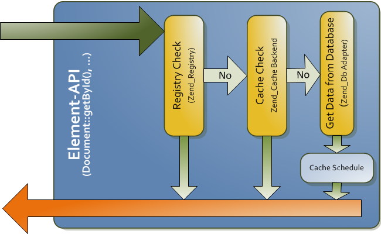

# Cache

Pimcore uses caches extensively for different types of data. The primary cache is a pure object 
cache where every element (document, asset, object) in Pimcore is cached as it is (serialized objects). 
Every cache item is tagged with dependencies so the system is able to evict dependent objects if 
a referenced object changes.

The second cache is the output cache, which you can use either as pure page cache (configurable 
in system settings), or as in-template cache (see more at [template extensions](../../01_Documents/02_Templates/02_Twig_Extensions/README.md)).

The third cache is used for subsystems like translations, database schemes, and bundle-specific data.
Each subsystem controls its own cache behavior.

All of the described caches are utilizing the `Pimcore\Cache` interface to store their objects. `Pimcore\Cache` utilizes
a `Pimcore\Cache\Core\CoreCacheHandler` to apply Pimcore's caching logic on top of a [`PSR-6`](http://www.php-fig.org/psr/psr-6/)
cache implementation which needs to implement [cache tagging](https://github.com/php-cache/tag-interop).

## Configuring the cache

Pimcore uses the `pimcore.cache.pool` Symfony cache pool, you can configure it according to your needs, but it's crucial 
that the pool supports tags.

```yaml
# config/packages/cache.yaml
framework:
    cache:
        pools:
            pimcore.cache.pool:
                public: true
                #tags: true
                default_lifetime: 31536000  # 1 year
                #adapter: pimcore.cache.adapter.doctrine_dbal
                #provider: 'doctrine.dbal.default_connection'
                adapter: cache.adapter.redis_tag_aware
                provider: 'redis://localhost'
```

By default, the cache will reuse the Doctrine connection and write to your DB's `cache_items` tables. You can override
the used connection by setting `connection` setting to a known Doctrine connection (see
[DoctrineBundle Reference](https://symfony.com/doc/current/reference/configuration/doctrine.html#doctrine-dbal-configuration)
for further information).
 
If you enable the `redis` cache configuration, the Redis cache will be used instead of the Doctrine one, even if Doctrine
is enabled as well. 
> **IMPORTANT!** It is crucial to test and verify your Redis configuration, if Pimcore is unable to connect to Redis, the entire system will stop working.


### Recommended Redis Configuration (`redis.conf`)
```
# select an appropriate value for your data
maxmemory 768mb
                   
# IMPORTANT! Other policies will cause random inconsistencies of your data!
maxmemory-policy volatile-lru   
save ""
```

> With the default settings, the minimum supported Redis version is 3.0.

### Object cache write behavior

Two settings control how the object cache is written:

```yaml
# config/config.yaml
pimcore:
    cache:
        # maximum number of items written to the object cache per request (default: 50)
        max_write_items: 50
        # allow the object cache to be written in CLI mode (default: false)
        handle_cli: false
```

* **`max_write_items`** — During a request, cacheable items are collected in a save queue and
  written to the cache pool on shutdown. To bound memory and shutdown time, only the
  highest-priority `max_write_items` entries are written; any beyond the limit are dropped and a
  warning is logged (including how many were dropped). Requests that legitimately load many
  cacheable elements — large listings, exports, deep object graphs — may benefit from a higher
  value. Must be `>= 1`.
* **`handle_cli`** — By default the object cache is **not** written from CLI processes (console
  commands, messenger workers), because long-running scripts are prone to race conditions that can
  leave stale entries in a shared cache pool. Enable it only if your CLI workload is read-heavy and
  benefits from a warm object cache, and you have considered the concurrency implications. Note that
  this only governs the **deferred / non-forced** writes that make up the normal caching path — it
  does **not** block every CLI cache write: forced writes still go through in CLI regardless of this
  setting (`Cache::save(..., force: true)`, `setForceImmediateWrite(true)`, and internal forced
  callers such as cache warming). It also does not affect reading from the cache in CLI, only
  writing to it.

## Element Cache Workflow (Asset, Document, Object)




## Using the Cache for your Application

Use the `Pimcore\Cache` facade to interact with the core cache or directly use the `Pimcore\Cache\Core\CoreCacheHandler` service.

You can use this functionality for your own application, and also to control the behavior of the Pimcore cache (but be
careful!).

If you don't need the transactional tagging functionality as used in the core you're free to use a custom cache system as
[provided by Symfony](https://symfony.com/doc/current/components/cache.html) but be aware that custom caches are not 
integrated with Pimcore's cache clearing functionality.
 
#### Example of custom usage in an action
```php
$lifetime = 99999;
$cacheKey = md5($uri);
if(!$data = \Pimcore\Cache::load($cacheKey)) {
    $data = \Pimcore\Tool::getHttpData('http://www.pimcore.org/...');
    \Pimcore\Cache::save(
        $data,
        $cacheKey,
        ["output","tag1","tag2"],
        $lifetime);
}
```

#### Overview of functionalities
```php
// disable the cache globally
\Pimcore\Cache::disable();
 
// enable the cache globally
\Pimcore\Cache::enable();
 
// invalidate caches using a tag
\Pimcore\Cache::clearTag("mytag");
 
// invalidate caches using tags
\Pimcore\Cache::clearTags(["mytag","output"]);
 
// clear the whole cache
\Pimcore\Cache::clearAll();
 
// disable the queue and limit and write immediately
\Pimcore\Cache::setForceImmediateWrite(true);
```

#### Disable the Cache for a Single Request
Sometimes it's useful to deactivate the cache for testing purposes for a single request. You 
can do this by passing the URL parameter `pimcore_nocache=true`. Note: This is only possible if you are in [DEBUG MODE](../04_Debugging.md#debug-mode)

For example: `http://www.pimcore.org/download?pimcore_nocache=true` 

This will disable the entire cache, not only the output-cache. To disable only the output-cache 
you can add this URL parameter: `?pimcore_outputfilters_disabled=true`
Other debug parameters include `pimcore_outputfilters_disabled` (disables output filters only)
and `pimcore_debug_translations` (returns translation keys instead of values).


If you want to disable the cache in your code, you can use: 
```php
\Pimcore\Cache::disable();
```

This will disable the entire cache, not only the output-cache. WARNING: Do not use this in production code!

It is also possible to just disable the output-cache in your code, read more [here](./01_Full_Page_Cache.md).


## Further Reading

* Details about output-cache - see [Output Cache](./01_Full_Page_Cache.md).
