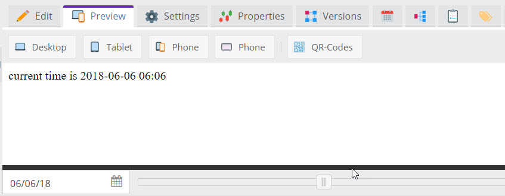

# Preview Scheduled Content

The Document preview tab provides a time slider to preview content at any given time.
To use this feature in custom implementations (e.g. custom controller actions),
use the `OutputTimestampResolver` service to get the timestamp instead of using the current timestamp. 

```php

    public function timestampAction(OutputTimestampResolver $outputTimestampResolver): Response
    {
        $currentTimestamp = $outputTimestampResolver->getOutputTimestamp();

        $response = "
        <html><head></head><body>
            current time is " . date("Y-m-d H:i", $currentTimestamp) . "
        </body></html>
        ";

        return new Response($response);
    }

``` 



> As soon as `$outputTimestampResolver->getOutputTimestamp()` is called somewhere, the time slider in 
> document preview is shown. It is important, that the response is a valid html (with `<head>` and 
> `<body>`), otherwise the time slider will not be shown. 

> The preview can only take content into account that is already in the system and published. It cannot
> take scheduled versions of documents, assets or objects into account. 

See also [Scheduled Block](../01_Documents/02_Templates/03_Editables/42_Scheduled_Block.md) for an editable that uses
this functionality.
