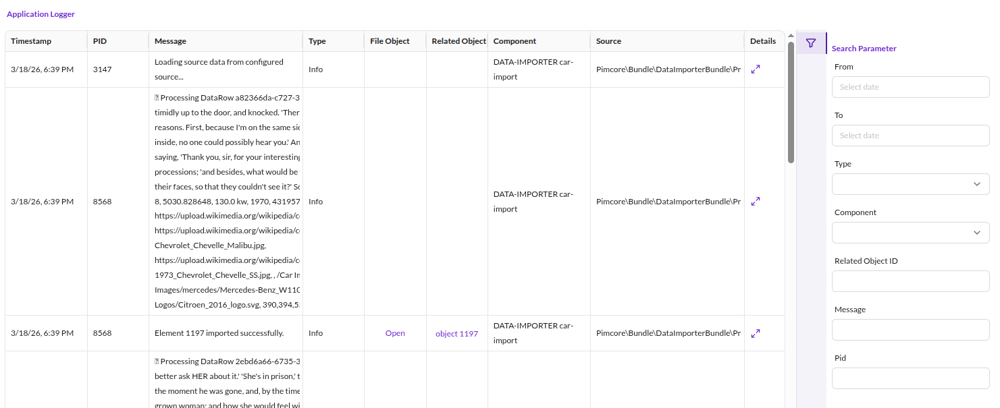
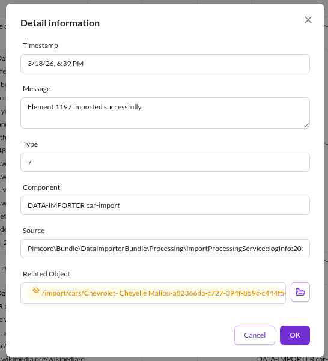

# Application Logger

:::caution

To use this feature, enable the `PimcoreApplicationLoggerBundle` in your `bundle.php` file
and install it:

`bin/console pimcore:bundle:install PimcoreApplicationLoggerBundle`

:::

## General

The Application Logger bundle lets developers log events and errors
within a Pimcore application.

<div class="inline-imgs">

View and search logs in Pimcore Studio under `System` -> `Application Logger`:

</div>



## Configuration

Configure the Application Logger in your project's YAML configuration under the `pimcore.applicationlog` key.

### Full Configuration Reference

```yaml
pimcore:
    applicationlog:
        loggers:
            db:
                # Minimum log level or a list of specific levels to capture
                # Default: 'debug'
                min_level_or_list: 'debug'  # or ['debug', 'info'] for specific levels
                # Maximum log level to capture
                # Default: 'emergency'
                max_level: 'emergency'
        mail_notification:
            # Enable email summaries of log entries
            # Default: false
            send_log_summary: false
            # Minimum priority for entries included in the email summary.
            # Use the level name or its numeric value:
            # 8 (debug), 7 (info), 6 (notice), 5 (warning),
            # 4 (error), 3 (critical), 2 (alert), 1 (emerg)
            # Higher values are more inclusive.
            # Default: null (all levels)
            filter_priority: null
            # Email addresses for log summaries, separated by ; or ,
            mail_receiver: 'admin@example.com; ops@example.com'
        # Number of days before log entries are moved to archive tables
        # Default: 30
        archive_treshold: 30
        # Optional separate database for archive tables.
        # Recommended for high-volume logging.
        # Default: '' (same database)
        archive_alternative_database: ''
        # Storage engine for archive tables (e.g. ARCHIVE, InnoDB, Aria, MyISAM).
        # When set to 'archive', auto-detects the best available engine.
        # Default: 'archive'
        archive_db_table_storage_engine: 'archive'
        # Number of months before archive tables are deleted
        # Default: 6
        delete_archive_threshold: 6
```

### Log Level Filtering

Log all messages with level `debug` or `info` only:
```yaml
pimcore:
    applicationlog:
        loggers:
            db:
                min_level_or_list: ['debug', 'info']
```

Log all messages from level `info` through `emergency`:
```yaml
pimcore:
    applicationlog:
        loggers:
            db:
                min_level_or_list: 'info'
                max_level: 'emergency'
```

### Mail Notifications

When `send_log_summary` is enabled, the defined receivers receive log entries by email
during the regular Pimcore maintenance cycle. The `filter_priority` controls which log
messages are included (e.g. only errors and above).

### Log Archival

The archive function automatically creates database tables (`application_logs_archive_YYYY_MM`)
for log entry archival. In the example above, log entries move to archive tables after 30 days.
Archive tables are automatically deleted after the `delete_archive_threshold` (default: 6 months).

## How to Create Log Entries

The Application Logger is a PSR-3 compatible component available as service
`Pimcore\Bundle\ApplicationLoggerBundle\ApplicationLogger`.

### Basic Usage - Example

#### Controller / Action

```php
<?php

namespace App\Controller;

use Pimcore\Bundle\ApplicationLoggerBundle\ApplicationLogger;
use Pimcore\Controller\FrontendController;

class TestController extends FrontendController
{
    // injected as action argument (controller needs to be registered as service)
    public function testAction(ApplicationLogger $logger): void
    {
        $logger->error('Your error message');
        $logger->alert('Your alert');
        $logger->debug('Your debug message', ['foo' => 'bar']); // additional context information
    }

    public function anotherAction(): void
    {
        // fetched from container
        $logger = $this->get(ApplicationLogger::class);
        $logger->error('Your error message');
    }
}
```

#### Dependency Injection

```yaml
App\YourService:
    calls:
        - [setLogger, ['@Pimcore\Bundle\ApplicationLoggerBundle\ApplicationLogger']]
```

Or use autowiring:

```yaml
services:
    _defaults:
        autowire: true

    App\YourService: ~
```

```php
<?php

namespace App;

use Pimcore\Bundle\ApplicationLoggerBundle\ApplicationLogger;

class YourService
{
    /**
     * @var ApplicationLogger
     */
    private $logger;

    public function __construct(ApplicationLogger $logger)
    {
        $this->logger = $logger;

        $logger->debug('Hello from YourService');
    }
}
```

### Usage as Monolog Handler

Instead of using the `ApplicationLogger` class directly, configure Monolog
to use the Application Logger as a Monolog handler.
Pimcore provides the `ApplicationLoggerDb` handler, preconfigured as a service:

```yaml
monolog:
    handlers:
        # monolog allows us to register custom handlers via type: service
        # note that the only supported extra option besides type and id is channels
        application_logger_db:
            type: service
            id: Pimcore\Bundle\ApplicationLoggerBundle\Handler\ApplicationLoggerDb
            channels: ["application_logger"]
```

The channel(s) must exist. Create them by [configuring them manually](https://symfony.com/doc/current/logging/channels_handlers.html#creating-your-own-channel)
or by using [DI tags](https://symfony.com/doc/current/reference/dic_tags.html#dic-tags-monolog)
to select the logger for the target channel.
When using DI tags, Monolog creates the channel implicitly.

> **IMPORTANT**: The `ApplicationLoggerDb` handler depends on the database connection.
  Exclude channels logging database queries (typically the `doctrine` channel)
  to avoid infinite loops.
  Either specify an allowlist of supported channels (as shown above)
  or exclude the `doctrine` channel by setting channels to `["!doctrine"]`.

As the `type: service` handler config does not support filtering by log level,
use the `filter` handler type to wrap the Application Logger:

```yaml
monolog:
    handlers:
        # The filter handler can be used to filter for a given log level.
        # Note that the supported channels are now configured on the filter
        # handler. To filter by level you can set accepted_levels or min_level and max_level.
        # See https://github.com/symfony/monolog-bundle/blob/master/DependencyInjection/Configuration.php#L97
        # for details.
        application_logger_filter:
            type: filter
            channels: ["application_logger"]
            handler: application_logger_db
            min_level: ERROR
        application_logger_db:
            type: service
            id: Pimcore\Bundle\ApplicationLoggerBundle\Handler\ApplicationLoggerDb
```

Combine this handler with other log handlers such as the
[Fingers Crossed Handler](https://symfony.com/doc/current/logging.html#handlers-that-modify-log-entries).
See the [Symfony Logging documentation](https://symfony.com/doc/current/logging.html) for details.

Once the handler is configured, use it like any other Monolog logger by specifying
a DI tag for the target channel:

```php
<?php

namespace App\Controller;

use Psr\Log\LoggerInterface;

// we take a controller as example here, but this can be any service
// no need to extend a base controller here as we inject our dependencies
// via DI
class TestController
{
    private LoggerInterface $logger;

    public function __construct(LoggerInterface $logger)
    {
        $this->logger = $logger;
    }

    public function testAction(): void
    {
        $this->logger->error('Your error message');
    }
}
```

The service definition adds a DI tag to specify which logger to inject:

```yaml
services:
    App\Controller\TestController:
        arguments:
            $logger: '@logger'
        tags:
            - { name: monolog.logger, channel: application_logger }
```

Autowire the logger channel by naming the argument as `(channel name in camel case) + Logger`.

Example for channel `foo_bar`:

```php
  public function __construct(LoggerInterface $fooBarLogger)
  {
      $this->logger = $fooBarLogger;
  }
```

More details on [Logging Channel Handlers](https://symfony.com/doc/current/logging/channels_handlers.html#how-to-autowire-logger-channels).

### Special Context Variables

Three context variables have special functionality: `fileObject`, `relatedObject`, `component`.

```php
<?php

namespace App\Controller;

use Pimcore\Bundle\ApplicationLoggerBundle\ApplicationLogger;
use Pimcore\Bundle\ApplicationLoggerBundle\FileObject;
use Pimcore\Model\DataObject\AbstractObject;
use Symfony\Component\HttpFoundation\Response;

class TestController
{
    public function testAction(ApplicationLogger $logger): Response
    {
        $fileObject = new FileObject('some interesting data');
        $myObject   = DataObject::getById(73);

        $logger->error('my error message', [
            'fileObject'    => $fileObject,
            'relatedObject' => $myObject,
            'component'     => 'different component',
            'source'        => 'Stack trace or context-relevant information' // optional, if empty, gets automatically filled with class:method:line from where the log got executed
        ]);

        // ...
    }
}
```

In the Application Logger grid, the new row appears as *my error message* with a related object.

Click the row to navigate to the object editor via the *Related object* edit icon in the popup.




### Logging Exceptions

The Application Logger provides a helper method to log exceptions
and implicitly create a `FileObject` from the exception:

```php
<?php

use Pimcore\Bundle\ApplicationLoggerBundle\ApplicationLogger;

$exception = new \RuntimeException('failed :(');

// 1) When directly using the application logger (see basic usage above). Given your
//    logger is an instance of `ApplicationLogger`:

/** @var ApplicationLogger $appLogger */
$appLogger->logException('Oh no!', $exception, 'alert', $relatedObject, $component);

// 2) When using as monolog handler (see above). Given your logger is any PSR-3 compatible logger, you
//    can use a static helper to generate a log entry with the same file object as the logging call
//    above.

/** @var \Psr\Log\LoggerInterface $logger */
ApplicationLogger::logExceptionObject($logger, 'Oh no!', $exception, 'alert', $relatedObject);
```


### Setting an Individual Logger Level

Add a console logger and set the minimum logging level to *INFO*
(overwrites the log level in Pimcore configuration):

```php
$logger = \Pimcore\Bundle\ApplicationLoggerBundle\ApplicationLogger::getInstance("SAP_exporter", true);
// returns a PSR-3 compatible logger, registers a custom app logger as `pimcore.app_logger.SAP_exporter` on the service container
$logger->addWriter(new \Monolog\Handler\StreamHandler('php://output', \Monolog\Level::Info));
```

