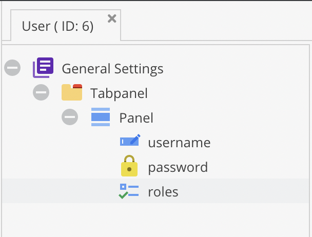

# Authenticate Against Pimcore Objects

Pimcore provides base implementations to facilitate integrating Symfony's Security component
with users stored as Pimcore data objects.

As an example, assume a user object defined in `App\Model\DataObject\User` that stores its password
in a field named `password` (field type `Password`). The password field uses the `password_hash` algorithm,
the standard way to handle passwords in PHP (internally using bcrypt). The class definition looks
like this (a working example ships with the `demo-basic` install profile):



Since a user object must implement the `UserInterface` provided by Symfony, override the generated class
and implement the remaining methods not covered by field getters:

```php
<?php
// src/Model/DataObject/User.php

namespace App\Model\DataObject;

use Pimcore\Model\DataObject\ClassDefinition\Data\Password;
use Pimcore\Model\DataObject\User as BaseUser;
use Symfony\Component\Security\Core\User\UserInterface;

/**
 * Our custom user class implementing Symfony's UserInterface.
 */
class User extends BaseUser implements UserInterface
{
    /**
     * Trigger the hash calculation to remove the plain text password from the instance.
     *
     * This is necessary to make sure no plain text passwords are serialized.
     */
    public function eraseCredentials(): void
    {
        /** @var Password $field */
        $field = $this->getClass()->getFieldDefinition('password');
        $field->getDataForResource($this->getPassword(), $this);
    }
}
```

Next, configure Pimcore to use the overridden class:

```yaml
# config/config.yaml
pimcore:
    models:
        class_overrides:
            'Pimcore\Model\DataObject\User': 'App\Model\DataObject\User'
```


## Loading Users with a User Provider

A user provider finds matching user objects for a given username. Pimcore ships an `ObjectUserProvider`
that loads users from a defined class type and searches by a configured property. Here, load users
from `App\Model\DataObject\User` and query the `username` field.

Define a user provider service (ensure your bundle loads service definitions, see
[Loading Service Definitions](../../10_Extending_Pimcore/04_Pimcore_Bundle_Developers_Guide/02_Loading_Service_Definitions.md)):

```yaml
# config/services.yaml
services:
    # The user provider loads users by Username.
    # Pimcore provides a simple ObjectUserProvider which is able to load users from a specified class by a configured
    # field. The website_demo.security.user_provider will load users from the App\Model\DataObject\User by looking at
    # their username field.
    website_demo.security.user_provider:
        class: Pimcore\Security\User\ObjectUserProvider
        arguments: ['App\Model\DataObject\User', 'username']
```

This service is used later in the security configuration to tell the firewall
where to load users from. Internally, `ObjectUserProvider` calls
`User::getByUsername($username, 1)`. For more complex use cases,
extend `ObjectUserProvider` or provide a custom implementation.

For more information, see
[How to Create a custom User Provider](https://symfony.com/doc/current/security/custom_provider.html)
on the Symfony docs.


## Password Hashing

The standard approach for hashing and verifying passwords in Symfony delegates the logic
to a `PasswordHasherInterface`. Since Pimcore's `Password` field definition already provides
this logic, the password hasher delegates to the user object.

Symfony builds and caches one password hasher instance per user type (class). To delegate
calculation to the user object, an additional layer builds password hasher instances
scoped to individual user objects at runtime.

Two integration points are required:

* A `PasswordFieldHasher` that accesses the user instance and delegates hash calculation
  and verification to the password field definition. Configure it with the field name
  (`password` in this case).
* A `UserAwarePasswordHasherFactory` that builds a dedicated `PasswordFieldHasher` instance
  per user object.

Define the factory service:
```yaml
# The password hasher factory is responsible for verifying the password hash for a given user. As we need some special
# handling to be able to work with the password field, we use the UserAwarePasswordHasherFactory  to build a dedicated
# hasher per user. This service is configured in pimcore.security.password_hasher_factories to handle our user model.
services:
    website_demo.security.password_hasher_factory:
        class: Pimcore\Security\Hasher\Factory\UserAwarePasswordHasherFactory
        arguments:
            - Pimcore\Security\Hasher\PasswordFieldHasher
            - ['password']
```

Instead of configuring the password hasher in `security.password_hashers` (the standard Symfony way),
register the factory in `pimcore.security.password_hasher_factories`.
This is an additional way of building password hashers. For cases without user-specific handling,
use the standard Symfony approach.

```yaml
pimcore:
    security:
        # the password hasher factory as defined in services.yaml
        password_hasher_factories:
            App\Model\DataObject\User: website_demo.security.password_hasher_factory
```

When a password hasher is loaded for an `App\Model\DataObject\User` object,
the `UserAwarePasswordHasherFactory` builds a dedicated `PasswordFieldHasher` instance
instead of returning the same instance for all users.


## Configuring the Firewall

With all services in place, use them in the firewall configuration. As an example,
configure a firewall with HTTP basic auth:

```yaml
pimcore:
    security:
        # the password hasher factory as defined in services.yaml
        password_hasher_factories:
            App\Model\DataObject\User: website_demo.security.password_hasher_factory

security:
    providers:
        # the user provider as defined in services.yaml
        demo_cms_provider:
            id: website_demo.security.user_provider

    firewalls:
        # demo_cms firewall is valid for the whole site
        demo_cms_fw:
            # the provider defined above
            provider: demo_cms_provider
            http_basic: ~
```

This provides a starting point for custom authentication based on Pimcore objects. For further information:

* The [demo-enterprise](https://github.com/pimcore/demo-enterprise) repository,
  which implements a full form/session login with CMF integration.
* The [Symfony Security Component documentation](https://symfony.com/doc/current/security.html)
