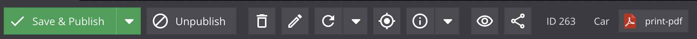

# Add a Button to Object Editor

Sometimes it might be useful to add additional buttons to the object editor (or any other editor) in Pimcore Backend For example, to add a download button for a product data sheet, as the following
screenshot shows. 




**Solution**

1) Create a bundle with a Pimcore Backend Interface java script extension as described 
[here](../../backlog/06_Event_Listener_UI.md). 

2) Implement a listener for the `postOpenObject` event like follows: 

```javascript

document.addEventListener(pimcore.events.postOpenObject, (e) => {
    if (e.detail.object.data.general.className === 'ShopProduct') {
        e.detail.object.toolbar.add({
            text: t('show-pdf'),
            iconCls: 'pimcore_icon_pdf',
            scale: 'small',
            handler: function (obj) {
                //do some stuff here, e.g. open a new window with an PDF download
            }.bind(this, e.detail.object)
        });
        pimcore.layout.refresh();
    }
});
```
