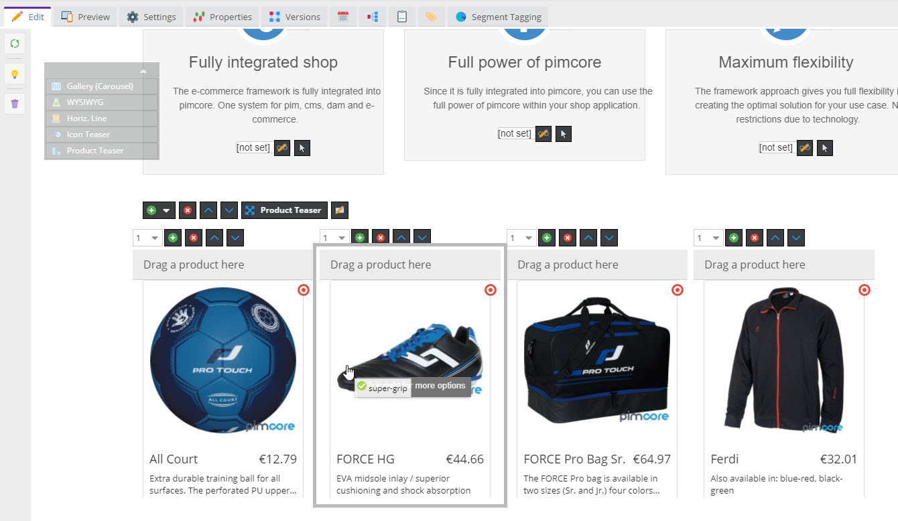

# Integrating Commerce Data With Content

A common requirement in e-commerce projects is integrating content and commerce data. Pimcore's integrated approach provides several tools to combine both seamlessly.

One of these tools are [Renderlets](../01_Documents/02_Templates/03_Editables/28_Renderlet.md),
which provide a great way to integrate dynamic object (thus commerce) content to Pimcore documents. 




Follow the steps to create a product teaser similar to the one in the [Pimcore demo](https://demo.pimcore.com/).

### Create Area Brick `MyProductTeaser` with Renderlet 

**MyProductTeaser Implementation** 
```php
<?php

namespace App\Document\Areabrick;

class MyProductTeaser extends AbstractAreabrick
{
    public function getName(): string
    {
        return 'My Product Teaser';
    }
}

```

**MyProductTeaser Template**
```twig
<div class="row">
    
        {{ pimcore_renderlet('productteaser', {
            controller: 'shop',
            action: 'productCell',
            width: 270,
            height: 370,
            title: 'Drag a product here',
            editmode: editmode
        }) }}
    
</div>
```


### Create Controller and Action for Teaser Content

**Controller Action** 
```php
    public function productCellAction(Request $request): Response
    {
        $id = $request->attribute->getInt('id');
        $type = $request->attribute->get('type');

        if ($type === 'object') {
            $product = Product::getById($id);

            return $this->render('product/product_cell.html.twig', ['product' => $product]);
        }

        throw new \Exception('Invalid Type');
    }
```

**Template** 
```twig


<div class="col-sm-{{ col }} col-lg-{{ col }} col-md-{{ col }}">
    <div class="thumbnail product-list-item">
        <a href="{{ product.linkProduct.detailUrl }}">
            {{ product.getFirstImage('productList').html({class: 'product-image'}) }}
            <div class="caption">
                <h4 class="pull-right">{{ product.OSPrice }}</h4>

                <h4>{{ product.OSName }}</h4>
    
                <p>{{ product.description|striptags|trim[:70] }}</p>

            </div>
        </a>

        <div class="buttons">
            <div class="row">
                <div class="col-md-6">
                </div>
                <div class="col-md-6">
                    <a href="{{ pimcore_url({
                        language: language,
                        action: 'add',
                        item: product.id,
                    }, 'cart') }}" class="btn btn-success btn-product">
                        <span class="glyphicon glyphicon-shopping-cart"></span>
                        {{ 'shop.buy'|trans }}
                    </a>
                </div>
            </div>
        </div>
    </div>
</div>
```
