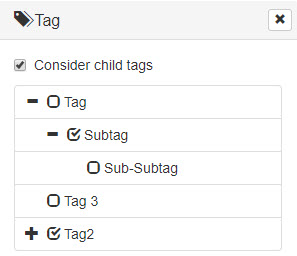

# Using Pimcore Tags for Filtering in Frontend

The [Pimcore Tags](../05_Content_Management_Features/03_Tags.md) functionality is primarily designed
as Pimcore Studio functionality for tagging and filtering elements. It can also serve as a
foundation for custom frontend filtering.


The following code snippets provide a starting point.

#### Preparing Data for Template

How you prepare data for your template depends on the template structure and how you
visualize the tag hierarchy.

For example, build a tag tree based on [bootstrap treeview](https://github.com/jonmiles/bootstrap-treeview/):



```php
<?php

// Prepare data for template in your controller
$tagList = new \Pimcore\Model\Element\Tag\Listing();

// Select parent node for tags or use all root tags
if ($request->query->get("node")) {
    $tagList->setCondition("parentId = ?", $request->query->getInt("node"));
} else {
    $tagList->setCondition("ISNULL(parentId) OR parentId = 0");
}
$tagList->setOrderKey("name");
$tags = [];
foreach ($tagList->load() as $tag) {
    $tags[] = $this->convertTagToArray($tag, $request->query->get('tags-filter'));
}
```

```php
<?php
/**
*  Function to convert tags to an array that is expected by bootstrap tree view
*/
protected function convertTagToArray(\Pimcore\Model\Element\Tag $tag, $assignedTagIds)
{
    $tagArray = [
        "id" => $tag->getId(),
        "text" => $tag->getName()
    ];
    $state = [];
    $state["checked"] = array_search($tag->getId(), $assignedTagIds) !== false;
    $tagArray["state"] = $state;
    $children = $tag->getChildren();
    foreach ($children as $child) {
        $childrenNodes = $this->convertTagToArray($child, $assignedTagIds);
        if($this->hasCheckedNodes($childrenNodes)) {
            $tagArray["state"]["expanded"] = true;
        }
        $tagArray['nodes'][] = $childrenNodes;
    }
    return $tagArray;
}

protected function hasCheckedNodes($nodesArray) {
    $it = new \RecursiveIteratorIterator(
        new \ParentIterator(new \RecursiveArrayIterator($nodesArray)),
        \RecursiveIteratorIterator::SELF_FIRST
    );
    foreach ($it as $key => $value) {
        if ($key == 'state' && $value['checked']) {
            return true;
        }
    }
    return false;
}

```


```javascript
// Template script to set up bootstrap treeview

$tree = $('#filter-tag-tree');
$tree.treeview({data: tagTreeData, showCheckbox: true, levels: 1});

```


#### Filtering Elements Based on Tags

Filtering elements based on tags requires queries on the element listing. The following example
filters an asset listing. Listings for other element types work the same way.

Important to know:
- Tags and their hierarchy are stored in the table `tags`.
- The table `tags` also has the column `idPath`, useful for filtering tags including their children.
- Tag assignment to elements is stored in the table `tags_assignment`.


```php
<?php

use Pimcore\Db\Helper;

    public function filterForTags(Asset\Listing $listing, Request $request): Asset\Listing
    {
        // Get tag IDs to filter for, e.g. from request param
        $values = $request->query->all('tags-filter') ?: explode(',', $request->query->getString('tags-filter'));

        if($values)
        {
            $conditionParts = [];
            foreach ($values as $tagId) {

                // Decide if child tags should be considered or not
                if ($request->query->getBool("considerChildTags")) {
                    $tag = \Pimcore\Model\Element\Tag::getById((int)$tagId);
                    if ($tag) {
                        // Get ID path of tag for filtering child tags
                        $tagPath = $tag->getFullIdPath();

                        $conditionParts[] = "id IN (
                            SELECT cId FROM tags_assignment INNER JOIN tags ON tags.id = tags_assignment.tagid
                            WHERE
                                ctype = 'asset' AND
                                (id = " . (int) $tagId . " OR idPath LIKE " . $listing->quote(Helper::escapeLike($tagPath) . "%") . ")
                        )";
                    }
                } else {
                    $conditionParts[] = "id IN (
                        SELECT cId FROM tags_assignment WHERE ctype = 'asset' AND tagid = " . (int) $tagId .
                    ")";
                }
            }


            if (count($conditionParts) > 0) {
                $condition = implode(" AND ", $conditionParts);
                $listing->addConditionParam($condition);
            }
        }
        return $listing;
    }

```
