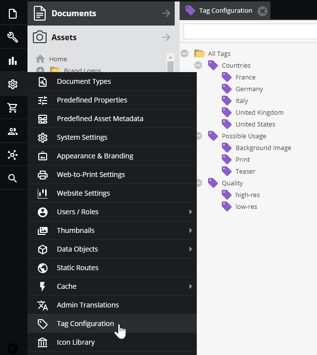
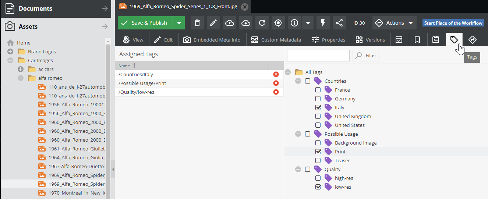
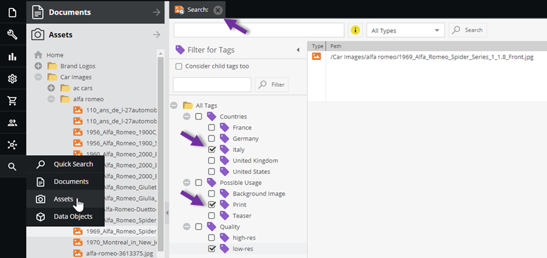
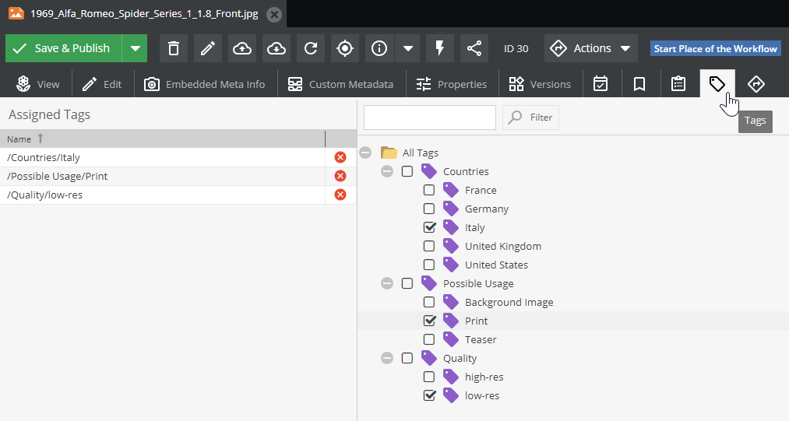

# Tags

## General

Tags provide a way to create additional taxonomies and classifications for Documents, Assets and Data Objects. 

Using tags, you can easily filter Pimcore Elements (Documents, Data Objects, Assets) and keep the additional search criteria to the application.

## Tags Definition

The available tags have to be defined centrally (user permission *tags configuration* is necessary).
 


## Tags Assignment

In `Documents`, `Assets`, or `Data Objects` editor, there is an additional tab where tags can be assigned to the current element (user permission *tags assignment* is necessary).



## Tags Usage

In the `Search` dialog, tags can be selected as additional criteria for the search (user permission *tags search* necessary).



## Working With Tags via API

### Overview 

For accessing and working with tags via API, take a look into `Pimcore\Model\Element\Tag`.

```php
/**
 * returns all assigned tags for element
 *
 * @return Tag[]
 */
public static function getTagsForElement(string $cType, int $cId): array
{
    $tag = new Tag();

    return $tag->getDao()->getTagsForElement($cType, $cId);
}

/**
 * adds given tag to element
 */
public static function addTagToElement(string $cType, int $cId, Tag $tag): void
{
    $tag->getDao()->addTagToElement($cType, $cId);
}

/**
 * removes given tag from element
 */
public static function removeTagFromElement(string $cType, int $cId, Tag $tag): void
{
    $tag->getDao()->removeTagFromElement($cType, $cId);
}

/**
 * sets given tags to element and removes all other tags
 * to remove all tags from element, provide empty array of tags
 *
 * @param Tag[] $tags
 */
public static function setTagsForElement(string $cType, int $cId, array $tags): void
{
    $tag = new Tag();
    $tag->getDao()->setTagsForElement($cType, $cId, $tags);
}
```

### API Usage Examples

#### *Get Tags for Element*

To get all tags from the element below: 



You can use the `getTagsForElement` method by specifying the element type in the `$cType` parameter. 
In the case above, the element type is `asset`. 

```php
$tags = \Pimcore\Model\Element\Tag::getTagsForElement('asset', 30);
dump($tags);
```

The output will be an array with the `Pimcore\Model\Element\Tag` elements.

```
array:3 [▼
  0 => Pimcore\Model\Element\Tag {#7351 ▼
    #id: 9
    #name: "Italy"
    #parentId: 7
    #idPath: "/7/"
    #children: null
    #parent: Pimcore\Model\Element\Tag {#7354 ▶}
    #dao: Pimcore\Model\Element\Tag\Dao {#7349 ▶}
    id: 9
    name: "Italy"
    parentId: 7
    idPath: "/7/"
    children: null
    parent: Pimcore\Model\Element\Tag {#7354 ▶}
  }
  1 => Pimcore\Model\Element\Tag {#7357 ▶}
  2 => Pimcore\Model\Element\Tag {#7345 ▶}
]  
```

#### *Assign a New Tag to an Element*

To add a new tag to an element, you first need to create the new tag. Then you just have to use the `\Pimcore\Model\Element\Tag::addTagToElement` method to assign the tag to the chosen element (by element id).

```php
$tag =  new \Pimcore\Model\Element\Tag();
try {
    $tag->setName('newtag')->save();
    \Pimcore\Model\Element\Tag::addTagToElement('asset', 30, $tag);
} catch (Exception $e) {
// ....
}

```

The result will be:


In the same way, you can use the rest of the available methods. 
The type properties list is standard. You can use one of `document`, `asset` or `object`.
