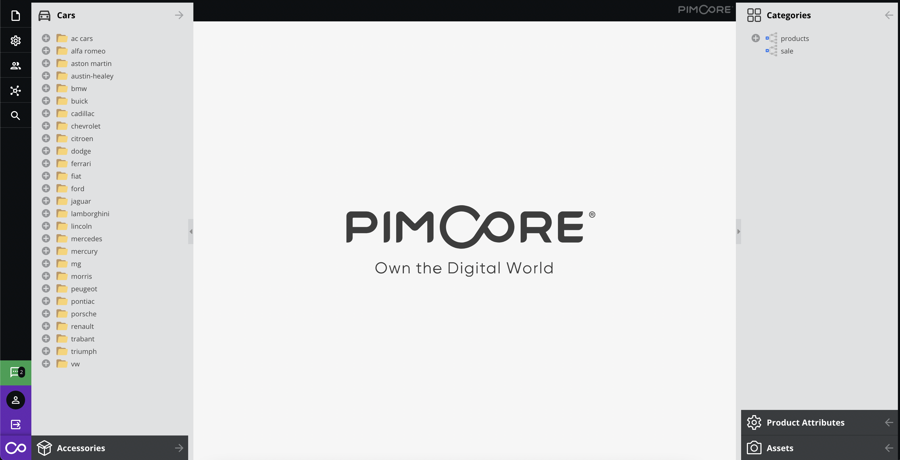
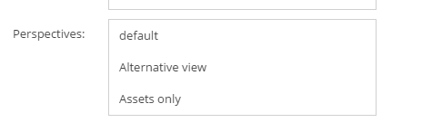

# Perspectives 

## General

Perspectives allow to create different views in the backend UI and even customize the standard perspective.
This feature could be combined with the configuration options already available for the [Custom Views](../05_Objects/01_Object_Classes/05_Class_Settings/20_Custom_Views.md).

You can create or edit perspectives and custom views within the Pimcore backend UI using the [perspective editor](https://pimcore.com/docs/platform/Perspective_Editor/) bundle.

> **Security Note**    
> Perspectives and Custom Views are not intended to be used to restrict access to data

Please be aware that if combined with custom views, the custom view settings must be defined in the `customviews.yaml` (the filename is up to you). 
The link is accomplished via the ID.

You can define:

* which trees you want to see
* where it is positioned (left/right)
* the order and which one should be expanded by default
* the available tree context menu items 
* the navigation menu items
* the standard elements on the welcome screen
* which portlets can be added to a dashboard



You can define an arbitrary number of perspectives and switch between them via the File menu.


You can restrict the access to certain perspectives via the user settings.



## The Configuration File

Format and location of the perspective configuration depends on your environment.
Per default the symfony-config is used.
If you want to change the default behaviour, have a look at the [environment](../21_Deployment/03_Configuration_Environments.md#configuration-storage-locations--fallbacks) configuration options. 

Please refer to the [example configuration](14_Perspective_Example.md) for further details on how this can be set up.

You can find out there how the default view is prepared and how to add a special perspective.

The table below, describes the most useful of available options in the configuration file.

| Reference                                                         | Value                                          | Description                                                                                |
|-------------------------------------------------------------------|------------------------------------------------|--------------------------------------------------------------------------------------------|
| `[perspectiveName]["icon"]`                                       | string                                         | Path to the icon file.                                                                     |
| `[parspectiveName]["iconCls"]`                                    | string                                         | The CSS class added to the icon.                                                           |
| `[perspectiveName]["elementTree"]`                                | array                                          | Array which contain the rows with configuration information like the tree type .           |
| `[perspectiveName]["elementTree"][i]["type"]`                     | string (documents,objects,assets,customview)   | What type of elements will be rendered in the tree.                                        |
| `[perspectiveName]["elementTree"][i]["position"]`                 | string (left,right)                            | a place, where the tree is initially generated                                             |
| `[perspectiveName]["elementTree"][i]["id"]`                       | integer                                        | The id of customview elements rendered in the tree. (works only with the *customview* type) |
| `[perspectiveName]["toolbar"]`                                    | array                                          | that option allows to add changes in the toolbar menu.                                     |
| `[perspectiveName]["toolbar"][i][menuName]`                       | string (file,marketing,extras,settings,search) | these are the default toolbar menus                                                        |
| `[perspectiveName]["toolbar"][i][menuName]["hidden"]`             | boolean                                        | ability to hide a specified menu (the available list you can find in the example below)    |
| `[perspectiveName]["toolbar"][i][menuName]["items"]["itemsName"]` | boolean                                        | You could specify there, which submenu elements you would like to generate.                |


## Simple example

Note: This is a simple example, which could be used for catalog administrators. For advanced usage please see the [example configuration](14_Perspective_Example.md).

We need only to see 
* products (objects from a specific directory)
* assets
* search button

To specify the range of objects you're going to use you, you have to firstly add a customview.
See the [Custom views](../05_Objects/01_Object_Classes/05_Class_Settings/20_Custom_Views.md) section to get more details.

The custom view definition would look like that:

```yaml
#var/config/perspectives/perspective.yaml

...
4e9f892c-7734-f5fa-d6f0-31e7f9787ffc:
    name: Cars
    treetype: object
    position: left
    rootfolder: '/Product Data/Cars'
    showroot: false
    sort: 3
    treeContextMenu:
        object:
            items:
                add: true
                addFolder: true
                importCsv: true
                cut: true
                copy: true
                paste: true
                delete: true
                rename: true
                reload: true
                publish: true
                unpublish: true
                searchAndMove: true
                lock: true
                unlock: true
                lockAndPropagate: true
                unlockAndPropagate: true
                changeChildrenSortBy: true
    icon: /bundles/pimcoreadmin/img/flat-white-icons/automotive.svg
    classes: CAR
    joins: {  }
    id: 4e9f892c-7734-f5fa-d6f0-31e7f9787ffc
```

Let's update the `var/config/perspectives/example.yaml` by the new perspective.

```yaml
#var/config/perspectives/perspective.yaml

...
demo:
    elementTree:
        -
            type: customview
            position: left
            sort: 0
            expanded: false
            hidden: false
            id: 4e9f892c-7734-f5fa-d6f0-31e7f9787ffc
        -
            type: assets
            position: right
            sort: 0
            expanded: false
            hidden: false
            treeContextMenu:
                asset:
                    items:
                        add:
                            hidden: false
                            items:
                                upload: true
                                uploadCompatibility: true
                                uploadZip: true
                        addFolder: true
                        rename: true
                        copy: true
                        cut: true
                        paste: true
                        pasteCut: true
                        delete: true
                        searchAndMove: true
                        lock: true
                        unlock: true
                        lockAndPropagate: true
                        unlockAndPropagate: true
                        reload: true
    iconCls: pimcore_nav_icon_perspective
    icon: null
    toolbar:
        file:
            hidden: true
            items:
                perspectives: false
                dashboards: false
                openDocument: false
                openAsset: false
                openObject: false
                searchReplace: false
                schedule: false
                seemode: false
                closeAll: false
                help: false
                about: false
        marketing:
            hidden: true
            items:
                reports: false
                tagmanagement: false
                targeting: false
                seo:
                    hidden: false
                    items:
                        documents: false
                        robots: false
                        httperrors: false
        extras:
            hidden: true
            items:
                glossary: false
                redirects: false
                translations: false
                recyclebin: false
                plugins: false
                notesEvents: false
                applicationlog: false
                gdpr_data_extractor: false
                emails: false
                maintenance: false
                systemtools:
                    hidden: false
                    items:
                        phpinfo: false
                        opcache: false
                        requirements: false
                        serverinfo: false
                        database: false
                        fileexplorer: false
        settings:
            hidden: true
            items:
                customReports: false
                marketingReports: false
                documentTypes: false
                predefinedProperties: false
                predefinedMetadata: false
                system: false
                website: false
                web2print: false
                users:
                    hidden: false
                    items:
                        users: false
                        roles: false
                thumbnails: false
                objects:
                    hidden: false
                    items:
                        classes: false
                        fieldcollections: false
                        objectbricks: false
                        quantityValue: false
                        classificationstore: false
                        bulkExport: false
                        bulkImport: false
                routes: false
                cache:
                    hidden: false
                    items:
                        clearAll: false
                        clearData: false
                        clearSymfony: false
                        clearOutput: false
                        clearTemp: false
                adminTranslations: false
                tagConfiguration: false
                perspectiveEditor: false
        search:
            hidden: false
            items:
                quickSearch: false
                documents: true
                assets: false
                objects: false
        datahub:
            hidden: false
```

I changed the number of elements rendered in the main Pimcore menu.

Also I added two trees. The first (on the right side) for assets and the second on the left side for the 
custom view with product objects.
 
The view after switch looks like in the picture.


