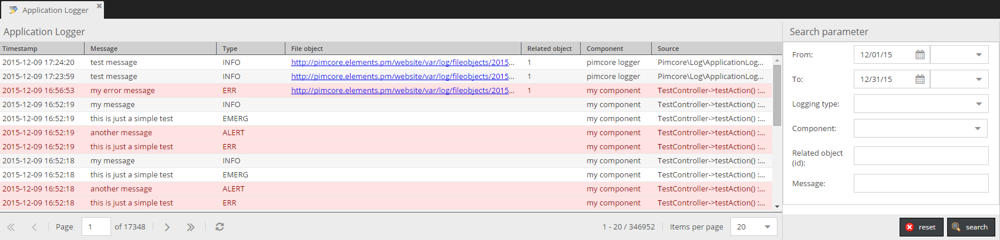

# Application logger
:::caution

To use this feature, please enable the `PimcoreApplicationLoggerBundle` in your `bundle.php` file and install it accordingly with the following command:

`bin/console pimcore:bundle:install PimcoreApplicationLoggerBundle`

:::

## General

The application logger bundle is a tool which developers can use to log certain events and errors within a Pimcore powered application.

<div class="inline-imgs">

The logs are visible and searchable within the Pimcore backend GUI  **Tools -> Application Logger**:

</div>




## How to create log entries

The application logger is a PSR-3 compatible component and available on the service container as service `Pimcore\Bundle\ApplicationLoggerBundle\ApplicationLogger`
and therefore it can be used the usual way.

### Basic Usage - Example

#### Controller / Action

```php
<?php

namespace App\Controller;

use Pimcore\Bundle\ApplicationLoggerBundle\ApplicationLogger;
use Pimcore\Controller\FrontendController;

class TestController extends FrontendController
{
    // injected as action argument (controller needs to be registered as service)
    public function testAction(ApplicationLogger $logger): void
    {
        $logger->error('Your error message');
        $logger->alert('Your alert');
        $logger->debug('Your debug message', ['foo' => 'bar']); // additional context information
    }
    
    public function anotherAction(): void
    {
        // fetched from container
        $logger = $this->get(ApplicationLogger::class);
        $logger->error('Your error message');
    }
}
```

#### Dependency Injection

```yaml
App\YourService: 
    calls:
        - [setLogger, ['@Pimcore\Bundle\ApplicationLoggerBundle\ApplicationLogger']]
```

You can also make use of autowiring by defining the application logger as dependency:

```yaml
services:
    _defaults:
        autowire: true

    App\YourService: ~
```

```php
<?php

namespace App;

use Pimcore\Bundle\ApplicationLoggerBundle\ApplicationLogger;

class YourService
{
    /**
     * @var ApplicationLogger 
     */
    private $logger;
    
    public function __construct(ApplicationLogger $logger)
    {
        $this->logger = $logger;
        
        $logger->debug('Hello from YourService');
    }
}
```

### Usage as monolog handler

Instead of using the `ApplicationLogger` class, you can configure monolog to use the application logger as monolog log handler
and make full use of monolog's possibilities. To do so, Pimcore provides the `ApplicationLoggerDb` monolog handler which
is already preconfigured as service and can easily be registered to monolog:

```yaml
monolog:
    handlers:
        # monolog allows us to register custom handlers via type: service
        # note that the only supported extra option besides type and id is channels
        application_logger_db:
            type: service
            id: Pimcore\Bundle\ApplicationLoggerBundle\Handler\ApplicationLoggerDb
            channels: ["application_logger"]
``` 

Note that the channel(s) need to exist. This can either by achieved by [configuring them manually](https://symfony.com/doc/current/logging/channels_handlers.html#creating-your-own-channel)
or by using [DI tags](https://symfony.com/doc/current/reference/dic_tags.html#dic-tags-monolog) to select the logger for
the channel you want to log to. When using DI tags, the channel will be created implicitly by monolog.

> **IMPORTANT**: As the `ApplicationLoggerDb` handler has a dependency on the database connection it is important to exclude
  channels logging database queries (typically the `doctrine` channel) from the handler to avoid infinite loops. Either
  specify a allowlist of supported channels (as shown in the example above) or exclude the `doctrine` channel by setting
  channels to `["!doctrine"]`.
  
As the `type: service` handler config does not support filtering by log level, you can use the `filter` handler type to
wrap the application logger and to filter by a specific log level:

```yaml
monolog:
    handlers:
        # The filter handler can be used to filter for a given log level.
        # Note that the supported channels are now configured on the filter
        # handler. To filter by level you can set accepted_levels or min_level and max_level.
        # See https://github.com/symfony/monolog-bundle/blob/master/DependencyInjection/Configuration.php#L97
        # for details.
        application_logger_filter:
            type: filter
            channels: ["application_logger"]
            handler: application_logger_db
            min_level: ERROR
        application_logger_db:
            type: service
            id: Pimcore\Bundle\ApplicationLoggerBundle\Handler\ApplicationLoggerDb
```

Of course you can also use the handler in combination with other log handlers such as the [Fingers Crossed Handler](https://symfony.com/doc/current/logging.html#handlers-that-modify-log-entries).
See the [Symfony Logging Documentation](https://symfony.com/doc/current/logging.html) for details.

As soon as the handler is configured, you can use it (as any other monolog logger) by using a DI tag to specify the channel you want to log to:

```php
<?php

namespace App\Controller;

use Psr\Log\LoggerInterface;

// we take a controller as example here, but this can be any service
// no need to extend a base controller here as we inject our dependencies
// via DI
class TestController
{
    private LoggerInterface $logger;
    
    public function __construct(LoggerInterface $logger)
    {
        $this->logger = $logger;   
    }   
    
    public function testAction(): void
    {
        $this->logger->error('Your error message');
    }   
}
```

The service definition can add a DI tag to specify which logger should be injected:

```yaml
services:
    App\Controller\TestController:
        arguments:
            $logger: '@logger'
        tags:
            - { name: monolog.logger, channel: application_logger }
``` 

It's also possible to autowire the logger channel by changing the argument name format to `(channel name in camel case) + Logger`. 

An example for channel `foo_bar`:

```php
  public function __construct(LoggerInterface $fooBarLogger)
  {
      $this->logger = $fooBarLogger;
  }
```

More details on [Logging Chanel Handlers](https://symfony.com/doc/current/logging/channels_handlers.html#how-to-autowire-logger-channels)

### Special context variables

There are some context variables with a special functionality: `fileObject`, `relatedObject`, `component`.

```php
<?php

namespace App\Controller;

use Pimcore\Bundle\ApplicationLoggerBundle\ApplicationLogger;
use Pimcore\Bundle\ApplicationLoggerBundle\FileObject;
use Pimcore\Model\DataObject\AbstractObject;
use Symfony\Component\HttpFoundation\Response;

class TestController
{
    public function testAction(ApplicationLogger $logger): Response
    {
        $fileObject = new FileObject('some interesting data');
        $myObject   = DataObject::getById(73);
        
        $logger->error('my error message', [
            'fileObject'    => $fileObject,
            'relatedObject' => $myObject, 
            'component'     => 'different component',
            'source'        => 'Stack trace or context-relevant information' // optional, if empty, gets automatically filled with class:method:line from where the log got executed
        ]);
        
        // ...
    }
}
```

In the application logger grid, the new row was created: *my error message* with related object. 

If you click on the row you can go to the object editor by clicking on the *Related object* edit icon in the popup.


### Logging exceptions

The application logger provides a helper method to log exceptions and implicitly create a `FileObject` from the exception
when writing the log entry. This can be done in 2 ways depending on how you use the application logger:

```php
<?php

use Pimcore\Bundle\ApplicationLoggerBundle\ApplicationLogger;

$exception = new \RuntimeException('failed :(');

// 1) When directly using the application logger (see basic usage above). Given your
//    logger is an instance of `ApplicationLogger`:

/** @var ApplicationLogger $appLogger */
$appLogger->logException('Oh no!', $exception, 'alert', $relatedObject, $component);

// 2) When using as monolog handler (see above). Given your logger is any PSR-3 compatible logger, you
//    can use a static helper to generate a log entry with the same file object as the logging call
//    above.

/** @var \Psr\Log\LoggerInterface $logger */
ApplicationLogger::logExceptionObject($logger, 'Oh no!', $exception, 'alert', $relatedObject);
```


### Setting an individual logger level

Adds a console logger and sets the minimum logging level to *INFO* (overwrites log level in Pimcore system settings):

```php
$logger = \Pimcore\Bundle\ApplicationLoggerBundle\ApplicationLogger::getInstance("SAP_exporter", true); 
// returns a PSR-3 compatible logger, registers a custom app logger as `pimcore.app_logger.SAP_exporter` on the service container
$logger->addWriter(new \Monolog\Handler\StreamHandler('php://output', \Monolog\Logger::INFO));
```

## Configuration

There are some options in the system settings to configure the application logger (within the *Debug* panel):


When the *Send log summary per mail* checkbox is activated the defined receivers will receive log entries by mail. 
The priority can be used to setup which log messages will be contained in the mail. 
For example errors are more important than just info entries. 

The archive function automatically creates new database tables to archive the log entries in the form `application_logs_archive_*`. 
In the above example log entries will be moved after 30 days to these archive tables. 
Optionally a different database name for the archive tables can be defined. 
