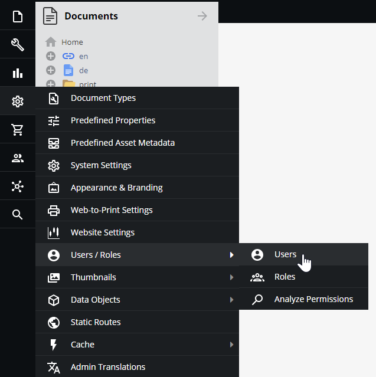
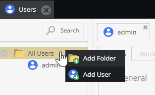
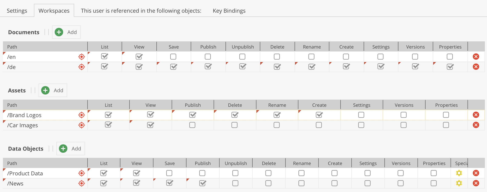

# Users and Roles

## General

User permissions in Pimcore are based on a users and roles concept. Each user can have several roles and both - users and roles - can have permissions. 
 
Users and roles are configured in Pimcore backend UI at `Settings` > `Users & Roles` > `Users` and
 `Settings` > `Users & Roles` > `Roles`. 

## Add a New User/Role

To add a new user in the `Users` tab, right-click on the folder corresponding to the new user's category in the tree and select `Add User`. You can add a new role similarly in the `Roles` tab.

## Permissions
In Pimcore, there are two levels of user permissions: 
1) Permissions on system components,
2) Permissions on data elements (Assets, Data Objects, and Documents). 

Permissions can be granted to individual users or groups of users (called "roles" in Pimcore). 
The following paragraphs describe how and where permissions can be set and how they will or will not affect each other.

It is not mandatory to use roles, permissions can be granted to users directly. However, it is advised to use roles if there is a larger user group to manage. In the `Users/Roles` settings tab it can be decided which permissions are granted to that user or role. An individual user has a few more general settings than the role.

### System Permissions

* Admin - if checked, all permissions on all system components are granted to that user
* Show welcome screen on startup
* Show close warning
* Roles - Select all roles incorporated by the user
* Perspectives - Which [perspectives](../18_Tools_and_Features/13_Perspectives.md) are available for this user

The following list outlines what the different system permissions (available for users and roles) mean:

* **Assets**: Assets tree is visible
* **Classes**: Object classes editor visible (user can create and modify object classes)
* **Clear Cache**: defines if a user may clear Pimcore cache (internal cache and response cache if configured)
* **Clear Temporary Files**: defines if user may delete temporary system files (e.g thumbnails)
* **Dashboards**: User can create Dashboards
* **Documents**: Documents tree is visible
* **Document Types**: User can create and modify predefined document types
* **Emails**: User sees E-Mail history
* **Extensions**: specifies if a user is allowed to download install and manage extension
* **Glossary**: Glossary entries visible
* **HTTP Errors**: HTTP Errors are visible 
* **Notes & Events**: Notes & Events are visible 
* **Objects**: Objects tree is visible 
* **Predefined Properties**: User can create and modify predefined properties
* **Recycle Bin**: User has access to the recycle bin and see all the deleted elements (even by other users).
* **Redirects**: User can create and modify redirects
* **Reports**: User has access to reports module
* **Seemode**: Seemode available/not available for user
* **Select Options**: Object [select options editor](../05_Objects/01_Object_Classes/01_Data_Types/77_Select_Options.md)
* **SEO Document Editor**: User has access to SEO document editor
* **System Settings**: User has access to system settings
* **Tag & Snippet Management**: User can create and modify entries in tag & snippet management
* **Targeting**: User has access to targeting module
* **Thumbnails** User can create and modify thumbnail configurations
* **Translations**: defines whether a user may view and edit website translations
* **Users**: defines whether a user may manage other users' settings and system permissions
* **Website Settings**: User can create and modify website settings

Users will benefit from any system permission that is granted to them directly or to any role they incorporate. 
Permission granted to a role incorporated by an individual user can not be rescinded for that particular user. So it does not matter if the user's individual permissions settings checkbox is unchecked once this permission is granted through a role.

### Element Permissions - Workspaces

Beyond the permissions mentioned above, a user's access can be restricted on element basis. This can be done by defining workspaces for a user or role. Provided that a user may generally access documents, it can be specified what a user/role may do or not do with each document or workspace. The same is true for Data Objects and Assets. These settings are manipulated in the `Workspaces` tab of a user/role. 

A user needs to be granted access to one or more workspaces. The user can not access any resources outside his workspace(s). 

However, there are a few general rules on element permissions that need to be regarded:
* if an user does not have the right to list an element, all other permissions are obsolete.
* if an user does not have the list permission on an element, all permissions on this element's children are obsolete.

The user permissions on element basis are summed up as follows:

* **list**: this element (and potential child elements) can be listed in tree
* **view**: this element (and potential child elements) can be opened
* **save**: this element (and potential child elements) can be saved (save button visible)
* **publish**: this element (and potential child elements) can be published (publish button visible)
* **unpublish**: this element (and potential child elements) can be unpublished (unpublish button visible); does not exist for assets
* **create**: new child elements can be created (does not exist for assets)
* **delete**: this element (and potential child elements) can be deleted
* **rename**: this element's (and potential child elements') name can be changed
* **settings**: this element's (and potential child elements') settings can be managed i.e. the settings tab is visible; the settings permission also the path and thereby the right to move the element in tree
* **versions**: the `versions` tab is available
* **properties**: the `properties` tab is available and can be managed

Individual users are granted access to all defined workspaces for any role they incorporate. In addition to that, users can have their own workspaces. These are added to the permissions granted by roles.

For example, a role `myRole` has been granted list and view access to `/home/myPath`. The user editor incorporates the role `myRole` and thereby inherits all workspace settings from the role. 
In case the editor has his own workspace settings on `/home/myPath`, these permissions are added to permissions from any role they incorporate.

:::caution

Be aware that if individual permissions granted to a user are different from the ones granted by its role for the same workspace, user permissions win over the ones attributed to the role. This implies that if the user has fewer permissions granted as an individual than through its role, the role's permissions will also be overruled.

For example, a user has only `List` permissions on a workspace, but its role defines `List`, `View`, `Save`, and `Publish` permissions for the same workspace. Because its individual permissions are restricted, this user will only have the possibility to see the workspace tree allowed by its `List` permissions.

:::

It is also possible to restrict access to localized fields on a language level. By default, users can view and edit (as long as they also have sufficient object permissions) all localized fields. This can now be restricted to a subset of languages. 

The configuration panel is accessible via the `Special Settings` column. The same dialog also allows to specify available custom layouts for the user. 

#### Dynamically Control Permissions on Elements

By using the event `Pimcore\Event\ElementEvents::ELEMENT_PERMISSION_IS_ALLOWED`, it is possible to dynamically manipulate a user's permissions on a specific element on request.

Please note: When listing (tree view, search, etc.), this event is fired afterward on each element of the filtered result list. Therefore, in the case of granting a `list` permission on a disallowed element (list=0), it DOES NOT affect the listing conditions nor results (as if the element would be considered as allowed for filtering purposes).
