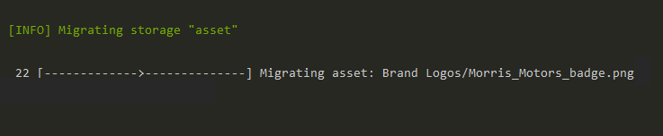

# File Storage Setup
Pimcore uses a powerful & flexible file storage library, called [Flysystem](https://github.com/thephpleague/flysystem) 
for storing all kind of content files like, assets, thumbnails, versioning data, ... and many more. 
 
To configure a custom file storage, just override any of the default definitions with specific adapter:

 ```yaml
flysystem:
    storages:
        pimcore.asset.storage:
            # Storage for asset source files, directory structure is equal to the asset tree structure
            adapter: 'local'
            visibility: private
            directory_visibility: public
            options:
                directory: '%kernel.project_dir%/public/var/assets'
        pimcore.asset_cache.storage:
            # Storage for cached asset files, e.g. PDF and image files generated out of Office files or videos
            # which are then used by the thumbnail engine as source files
            adapter: 'local'
            visibility: private
            options:
                directory: '%kernel.project_dir%/public/var/tmp/asset-cache'
        pimcore.thumbnail.storage:
            # Storage for image and video thumbnails, directory structure is equal to the source asset tree
            adapter: 'local'
            visibility: private
            directory_visibility: public
            options:
                directory: '%kernel.project_dir%/public/var/tmp/thumbnails'
        pimcore.version.storage:
            # Storage for serialized versioning data of documents/asset/data objects
            adapter: 'local'
            visibility: private
            options:
                directory: '%kernel.project_dir%/var/versions'
        pimcore.recycle_bin.storage:
            # Storage for serialized recycle bin data of documents/asset/data objects
            adapter: 'local'
            visibility: private
            options:
                directory: '%kernel.project_dir%/var/recyclebin'
        pimcore.admin.storage:
            # Storage for shared admin resources, such as the user avatar, custom logos, ...
            adapter: 'local'
            visibility: private
            options:
                directory: '%kernel.project_dir%/var/admin'
```

You can explore all [official adapters](https://flysystem.thephpleague.com/v2/docs/adapter/local/) and 
[third party adapters](https://packagist.org/?query=flysystem%20adapter) to use custom file storage.

Please keep in mind that all of those storages need to be shared between all computing nodes if running
on a clustered environment. Using the default `local` adapter is only working on single server environments.

Depending on your storage (e.g. if using S3), it can be also necessary to prefix the frontend path of assets 
and thumbnails, which can be done using the following configs:

 ```yaml
pimcore:
    assets:
        frontend_prefixes:
            # Prefix used for the original asset files
            source: https://oreo-12345678990.cloudfront.net/asset
            # Prefix used for all generated image & video thumbnails
            thumbnail: https://tavi-12345678990.cloudfront.net/thumbnail
            # Prefix used for the deferred thumbnail placeholder path. 
            # Thumbnails are usually generated on demand (if not configured differently), this 
            # prefix is used for thumbnails which were not yet generated and therefore are not 
            # available on the thumbnail storage yet. Usually it's not necessary to change this config.
            # However, a possible use case would be to point to a specific host that handles generating 
            # the thumbnails and takes the load from the main application server(s)
            # thumbnail_deferred: https://thumbnail-generator-node.example.com
```
This will add the configured prefix to the path of assets and thumbnails in the frontend context 
(e.g. your templates). 
So basically the path to `/Sample/Tavi.jpg` will change to
`https://tavi-12345678990.cloudfront.net/asset/Sample/Tavi.jpg`
and `/Sample/362/image-thumb__362__galleryThumbnail/Tavi.jpg` changes to
`https://tavi-12345678990.cloudfront.net/thumbnail/Sample/362/image-thumb__362__galleryThumbnail/Tavi.jpg`

This is especially useful if using an object storage that is publicly accessible or if using a CDN 
like CloudFront for your resources. 

### Example: AWS S3 Adapter for Assets
First, install AWS S3 Adapter with command:
```
composer require league/flysystem-aws-s3-v3
````

Next step is to configure AWS S3 client service for class `Aws\S3\S3Client` with following required arguments:

| Name          | Description                                                 |
|---------------|-------------------------------------------------------------|
| `endpoint`    | AWS S3 endpoint url                                         |
| `region`      | AWS Region to access the bucket                             |
| `version`     | latest or specific                                          |
| `credentials` | IAM Access keys: Access key ID & Secret access key          |

```yaml
# config/packages/prod/flysystem.yaml
services:
    assets_s3:
        class: 'Aws\S3\S3Client'
        arguments:
            -  endpoint: 'https://s3.eu-central-1.amazonaws.com'
               region: 'eu-central-1'
               version: 'latest'
               credentials:
                   key: '%env(S3_STORAGE_KEY)%'
                   secret: '%env(S3_STORAGE_SECRET)%'
```

For more information on required IAM permissions, please have a look at the [Flysystem documentation](https://flysystem.thephpleague.com/v1/docs/adapter/aws-s3-v3/#streamed-reads).

And then override core flysystem configuration to use remote storage instead of local. For that, change the adapter from 'local' to 'aws'.
Also update following options:
 - `client`: newly created service 'assets_s3'
 - `bucket`: create a new bucket on S3 Management console and use the bucket name.
 - `prefix`: prefix serves as the root folder for a storage type e.g. assets, versions, thumbnails etc. All storage contents will be generated inside this folder.
```yaml
# config/packages/prod/flysystem.yaml
flysystem:
    storages:
        pimcore.asset.storage:
            adapter: 'aws'
            visibility: public
            options:
                client: 'assets_s3'
                bucket: 'bucket-name'
                prefix: assets
```

### Storage Migration
If you are switching to different a storage type, it is often required to migrate contents from old storage to the newly configured one. Pimcore provides a command to solve the purpose of migrating contents from between storages, which in turn uses the flysystem `listcontents` API to read contents recursively from old (source) storage and copy contents to the new (target) storage. 

Follow these steps to migrate the content:
1. Create a Flysystem configuration for source & target storages. It is important to follow the naming structure, as follows: source config node: `pimcore.{storagetype}.storage.source` & target config node: `pimcore.{storagetype}.storage.target`

Few examples,

   | Migration Task | source node                        | target node                      |
   |----------------|------------------------------------|---------------------------------------|
   | `asset`        | pimcore.asset.storage.source       | pimcore.asset.storage.target     |
   | `thumbnail`    | pimcore.thumbnail.storage.source   | pimcore.thumbnail.storage.target |
   | `version`      | pimcore.version.storage.source     | pimcore.version.storage.target   |
   
```yaml
flysystem:
    storages:
        pimcore.asset.storage.source:
            adapter: 'local'
            visibility: public
            options:
                directory: '%kernel.project_dir%/public/var/assets'

        pimcore.asset.storage.target:
            adapter: 'aws'
            visibility: public
            options:
                client: 'assets_s3'
                bucket: 'bucket-name'
                prefix: asset

        pimcore.thumbnail.storage.source:
            adapter: 'local'
            visibility: private
            directory_visibility: public
            options:
                directory: '%kernel.project_dir%/public/var/tmp/thumbnails'

        pimcore.thumbnail.storage.target:
            adapter: 'aws'
            visibility: public
            options:
                client: 'assets_s3'
                bucket: 'bucket-name'
                prefix: thumbnail
```

2. Run command `pimcore:migrate:storage` with storage type argument: 
   `bin/console pimcore:migrate:storage asset`
   It is also possible to pass multiple arguments to migrate different storages in one go.

Output:

