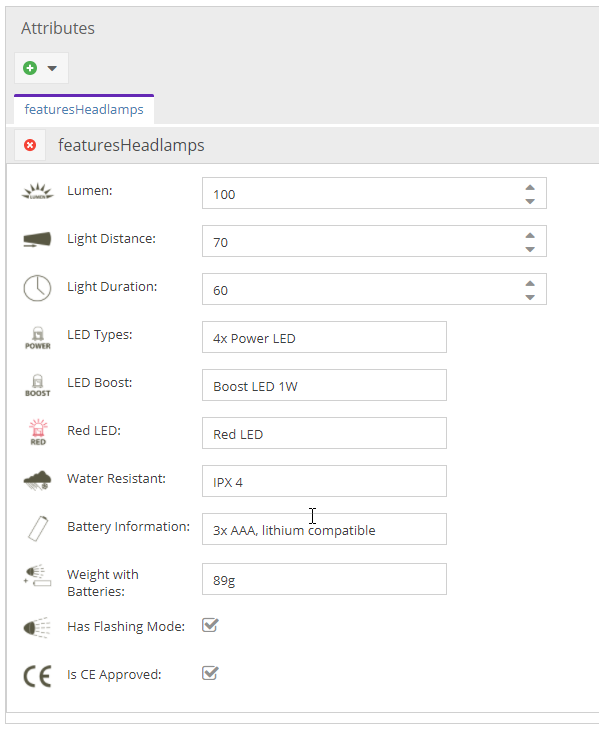
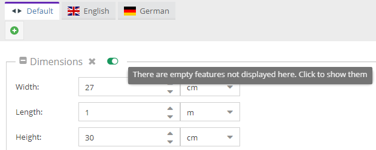

# Object Bricks vs Classification Store

Pimcore offers many possibilities regarding data modeling for structured data (= Pimcore Data Objects). 

Most of them are self-explanatory, while others often raise questions about when it makes most sense to use them and what 
exactly is the difference between the individual choices.

Candidates for such a choice are Object Bricks and Classification Store.

## Basic goal

Object Bricks and Classification Store share a common goal, which is best explained with an example:

A shop has products of many different categories (eg shoes, tents, flashlights, etc.). 
All these products have some attributes that are the same for all categories (eg name, photo, descriptive text, article 
number, color ...). These attributes are created in a common product class definition.
Apart from that, there are also attributes that are different for each category (shoes have sole profiles, tents have a 
floor material and flashlights have light intensity). All these attributes could of course also be created in the common 
product class definition. But that would result in a very large and confusing class definition (= not good). It is better 
to use Object Bricks or the Classification Store for these category-specific attributes.

Generally speaking, both data types make the rigid object class definition extensible at the object level. Of course, 
this is not just limited to product data, but can also be practical for other data. Attributes for both data types can 
be displayed, filtered and edited in the object grid view.

## Technical implementation differences
| |  Object Bricks |  Classification Store
|--------|--------------|---------------------
| Design options in the object editor | All layout options provided by ExtJS and Pimcore (Panels, Tabs, Regions, Fieldsets, Text Descriptions, ...) | All attributes are arranged among themselves in regions, little influence possibilities. 
| Available data types | Almost all Pimcore data types, apart from structured data types such as Field Collections, Classification Store, Object Bricks | Only very limited simple data types such as text fields, numbers, dates, selects and multiselects (eg also no relations).
| Storage of the data | Pimcore standard schema in own database tables with one column per attribute.	| 	Entity Attribute Value (EAV) schema, ie in a very long database table with one line per attribute (has the same effect on loading and filtering).
| Access to the data via API | Quite simply via getter and setter as known from Pimcore objects - see [here](../05_Objects/01_Object_Classes/01_Data_Types/60_Object_Bricks.md#page_Working-with-PHP-API) | Slightly harder on generic getter / setter calls - see [here](../05_Objects/01_Object_Classes/01_Data_Types/15_Classification_Store.md#page_Using-Classification-Store-via-PHP-API)
| Filter in object listings | Using JOINs directly in the Object-Listing Query, see [here](../05_Objects/01_Object_Classes/01_Data_Types/60_Object_Bricks.md#page_Querying-for-Objectbrick-data) | Only possible via custom subqueries and rather tedious.

## When do you use something - a checklist and a rule of thumb?

### A basic rule of thumb can be
- As long as a manageable number of categories with specific attributes is in place, rather use Object Bricks.
- Once there will be a lot of categories (more than 30) with a lot of attributes, then rather use Classification Store.

### In addition, there are a few more questions which can help you make a decision
- Are there relations in the attributes? → currently only works with **Object Bricks**
- Do the attributes have to be created automatically (eg via interface)? → easier with **Classification Store**

But there is (unfortunately) no rule, which is always valid. It just depends on a lot of factors, sometimes one is better, sometimes the other, sometimes a combination of both. So the decision has to be made by a developer (in coordination with senior colleagues or the Pimcore core team).

If you have any questions, of course you can always contact us ....
