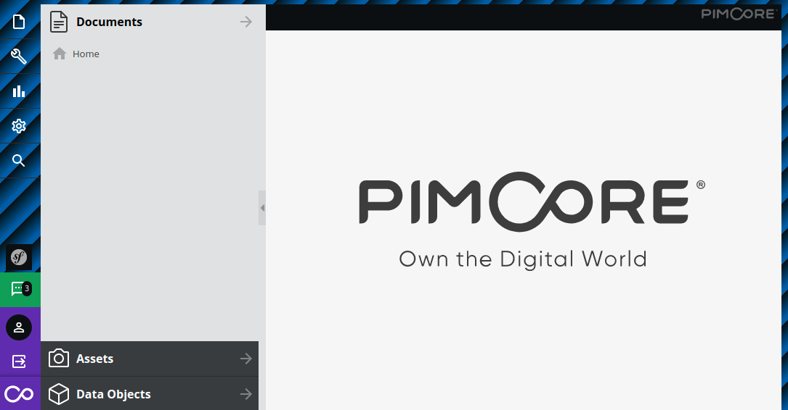

# Style Backend Depending on the Application Environment

Sometimes it makes sense to style the Pimcore backend UI depending on the application environment (`APP_ENV`) so that
backend users can easily differentiate by the looks.

Imagine having additional environments for Staging and Testing and you want to give editors a hint that they are working
in the correct environment.

This can be easily implemented since Pimcore 10.1.0
([#9794](https://github.com/pimcore/pimcore/pull/9794)) as the backend's body element contains a data attribute
`data-app-env` with the current application environment (e.g.
`<body class="pimcore_version_11" data-app-env="dev">`) and thus can be referenced with a CSS selector.



Add an event subscriber

```yaml
services:
    # Event subscribers
    App\EventSubscriber\:
        resource: '../src/EventSubscriber/*'
        tags: [ 'kernel.event_subscriber' ]
```

And subscribe to `\Pimcore\Bundle\AdminBundle\Event\BundleManagerEvents::CSS_PATHS` event in order to load a custom CSS file (e.g.
`/css/env.css`). 

```php
<?php

namespace App\EventSubscriber;

class AdminAssetsSubscriber implements \Symfony\Component\EventDispatcher\EventSubscriberInterface
{
    public static function getSubscribedEvents(): array
    {
        return [
            \Pimcore\Bundle\AdminBundle\Event\BundleManagerEvents::CSS_PATHS => 'onCssPaths',
        ];
    }

    public function onCssPaths(\Pimcore\Event\BundleManager\PathsEvent $event): void
    {
        $event->addPaths(['/css/env.css']);
    }
}
```

Create a CSS file `/css/env.css`. In this example, we intentionally style the Pimcore backend's UI body with a standout
background.

```css
body:not([data-app-env='prod']) #pimcore_body {
    background: repeating-linear-gradient(
        -45deg,
        #005baa,
        #005baa 5px,
        #0c0f12 30px,
        #0c0f12 10px
    );
}
```
