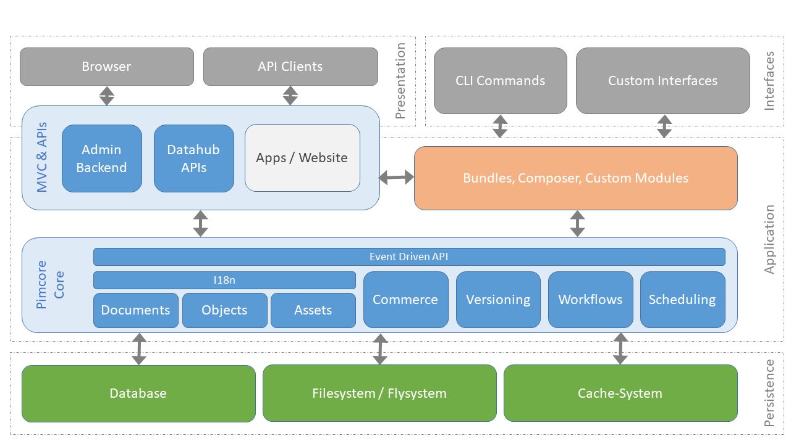

# Architecture Overview

At this point we want to give a short overview of the architecture of Pimcore. 

As usual, a picture is worth a thousand words: 
 

This chart shows the architecture of a typical Pimcore application. Everything in blue is shipped directly with Pimcore or an integral part of it. 
The other components are printed in different colors.

Pimcore itself consists of the Pimcore Core and the MVC component. 
The Pimcore Core is the main application, which provides all the basic
functionality and can be started within the MVC component or in a headless way, for example via CLI scripts.
The Pimcore Core is also responsible for accessing the persistence layer with Database, Filesystem and Cache-System. 

Built upon the Pimcore Core, the MVC component provides all the necessary 
functionalities for interacting with Pimcore via the Browser or any other HTTP
API client (REST, SOAP, ...).
 
Plugins and other custom modules/bundles can be added via Composer and complement the
Pimcore functionality with custom extensions and additional functions. 
Of course, plugins/bundles and custom modules can use the Pimcore Core functionality 
via its API and can also be used by the MVC component. 

When implementing solutions with Pimcore, your custom parts should be in one of the following locations within the architecture: 

 * Apps/Website within the MVC component: Here are all the solution specific implementations 
 like models, views and controllers for your website. 
 * Plugins/Bundles, custom modules: Here are all implementations and modules you might want to reuse 
 in other projects. Like in other solutions out there, it's not mandatory to make a plugin out of every piece of code. 
