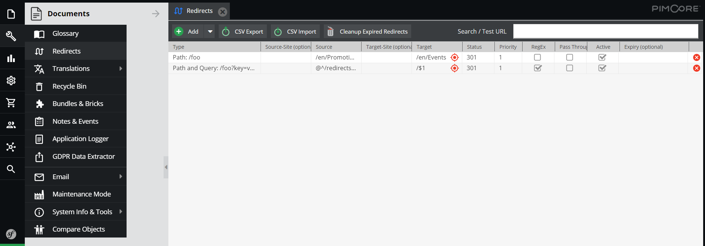
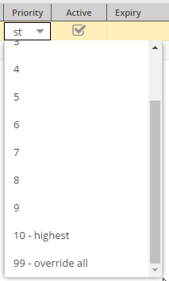
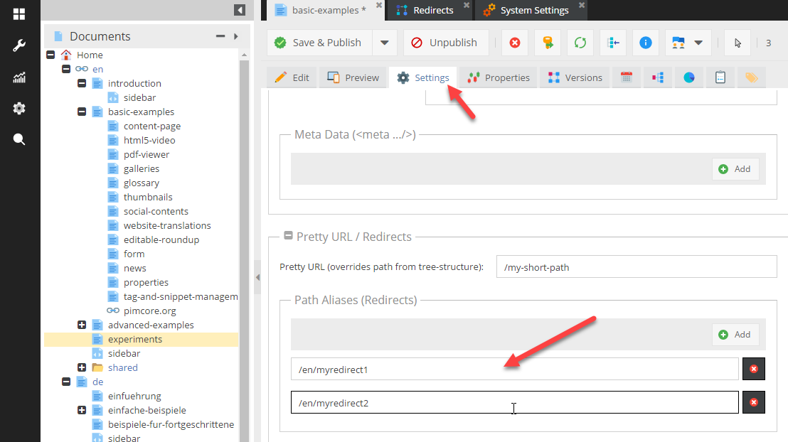

# URLs based on Redirects

## Introduction
Redirects are a useful feature of Pimcore for directing the user to the correct pages - may it be for marketing URLs, 
 for redirects after a website relaunch or redirects for moved Documents. 
 
Depending on their priority, Redirects come second (priority 99) or fifth (all other priorities) in the route processing priority.  

## Setting up Redirects
Redirects are configured in the Redirects editor, accessible via the Tools menu. 
 
 

#### Regular Expression and Back-Reference Syntax

You can use regular expressions to define the sources, the placeholders in the regex can be accessed in the target 
URL using the PCRE back-reference syntax. 

Notice: Only simple `$1-n` references are possible, no special back-reference syntax. 

#### Priority

Each redirect has a priority.

 
* 99 (override all): Redirects with priority 99 come second in route processing and therefore overwrite document paths and custom routes. 
* 1 (lowest) - 10 (highest): Redirects with priority 1 to 10 come fifth in route processing and are processes after document paths and custom routes. 

### Redirects with Documents

There are two additional features for Redirects in combination with Pimcore Documents.  
 
#### Shortcut for creating Redirects in Documents Settings
Redirects for certain Pimcore Documents can be configured directly in the Document settings. All URLs matching the 
here defined patterns are redirected to the current Document. These Redirects also appear in the [Redirects editor](#setting-up-redirects). 

#### Creating Redirects When Moving or Renaming Documents
It might be handy if Pimcore automatically creates Redirects when renaming of moving Documents (in terms of SEO and user experience). There is an option in 
the *System Settings* to enable that.

