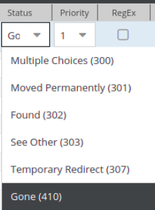

# URLs based on Redirects

## Introduction
Redirects are a useful feature of Pimcore for directing the user to the correct pages - may it be for marketing URLs, 
 for redirects after a website relaunch or redirects for moved Documents. 
 
Depending on their priority, Redirects come second (priority 99) or fifth (all other priorities) in the route processing priority.  


## Setting up Redirects
Redirects are configured in the Redirects editor, accessible via the Tools menu. 

#### Regular Expression and Back-Reference Syntax

You can use regular expressions to define the sources, the placeholders in the regex can be accessed in the target 
URL using the PCRE back-reference syntax. 


Notice: Only simple `$1-n` references are possible, no special back-reference syntax. 


#### Priority

Each redirect has a priority.


 
* 99 (override all): Redirects with priority 99 come second in route processing and therefore overwrite document paths and custom routes. 
* 1 (lowest) - 10 (highest): Redirects with priority 1 to 10 come fifth in route processing and are processed after document paths and custom routes. 


#### Creating Redirects When Moving or Renaming Documents
Pimcore provides the ability to automatically create Redirects when renaming and  moving Documents (in terms of SEO and user experience). A User will be prompted with the auto redirect option on performing these actions on documents.


#### Creating custom redirect status codes
The redirect status codes list can be extended by adding custom codes in config.yaml:

```yaml
pimcore:
    redirects:
        status_codes:
            308: Permanent Redirect
```


The new status codes can be seen in admin.

