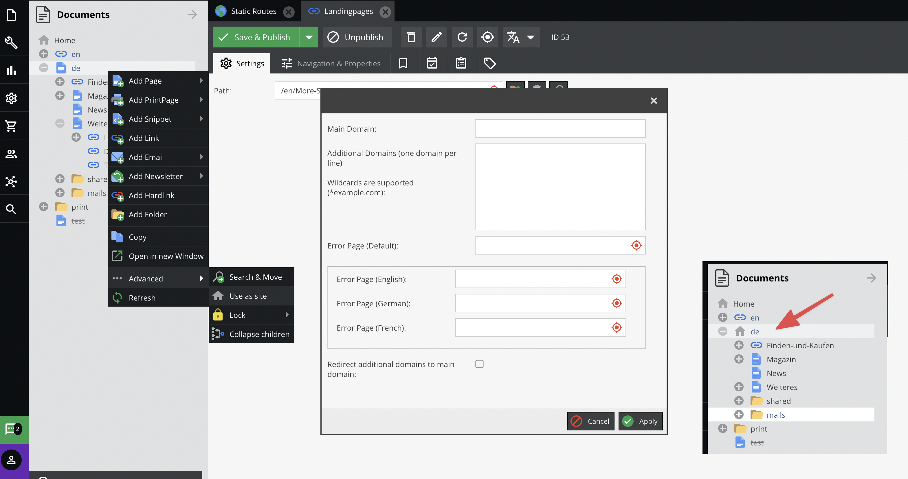

# Working with Sites

## Introduction
With Sites, it is possible to create multi domain web applications within Pimcore. 
 Starting point is always a certain node in the Documents tree. From this starting point on, the whole sub tree can appear
 as an own Site and is reachable with a certain domain.  

## Configuring Sites
You can create subsites in Pimcore very easily directly in the context menu of the Document tree: 



That's basically all.
 
 Note: Of course, your server setup (VHost, `ServerAlias`) must be configured properly so that all the requests for all the 
 domains are delegated to Pimcore. 
 
 
Now also the routing functionalities [Custom Routes](./02_Custom_Routes.md) and [Redirects](./04_Redirects.md) 
can be configured site specific. 
Also, lots of other Pimcore tools and functionalities like Glossary, Tag & Snippet Management, Marketing Settings 
(Google Analytics, Google Search Console, Google Tag Manager) and Website Settings are site specific. 


## Sites in your Code

#### Check if Current Request is Inside a Subsite

```php 
if(\Pimcore\Model\Site::isSiteRequest()) { /* ... */ }
```

#### Working with the Navigation Helper
See [Navigation](../../03_Documents/03_Navigation.md) for more information. 


#### Getting the full path of a document inside a subsite-request
```php 
$document->getRealFullpath(); // returns the path including the site-root
$document->getFullPath(); // returns the path relative to the site-root
```


#### Getting the root-document of the current site
```php 
if(\Pimcore\Model\Site::isSiteRequest()) {
    $site = \Pimcore\Model\Site::getCurrentSite();
    $navStartNode = $site->getRootDocument();
} else {
    $navStartNode = \Pimcore\Model\Document::getById(1);
}
```

#### Some other Tools
The functionality should be pretty self-explanatory: 
```php 
\Pimcore\Tool\Frontend::getSiteForDocument($document);
\Pimcore\Tool\Frontend::isDocumentInCurrentSite($document);
\Pimcore\Tool\Frontend::isDocumentInSite($document);
```