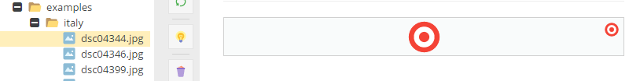
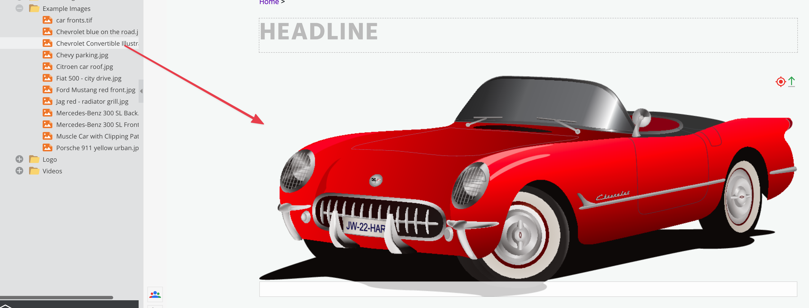
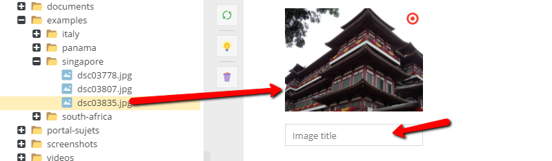
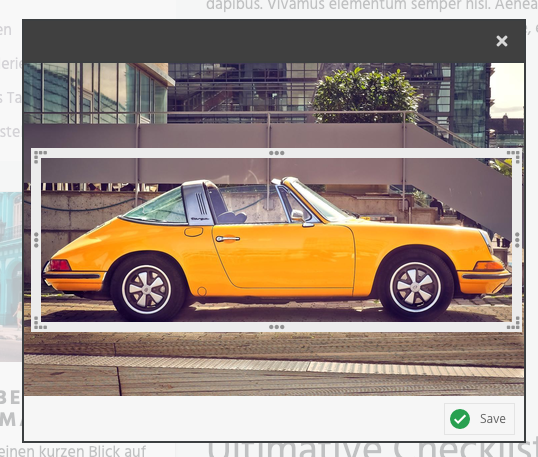

# Image Editable

## Description

The image editable adds an placeholder for images out of the assets module.
The biggest advantages of using that instead of (for example) the href editable:

* You are able to specify generated thumbnail properties (including high-res)
* There is a image preview rendered in the administration panel
* You can specify additional attribute for generated `` or `<picture>`
* You can crop the image directly inline
* You can put hotspots and markers on the actual image 

## Configuration

| Name                           | Type    | Description                                                                                                                                                                                                                              |
|--------------------------------|---------|------------------------------------------------------------------------------------------------------------------------------------------------------------------------------------------------------------------------------------------|
| `title`                        | string  | You can give the image widget in editmode a title. Using the new style (**ExtJS 6**) this title is displayed as a tooltip.                                                                                                               |
| `width`                        | integer | Width of the image in pixel                                                                                                                                                                                                              |
| `height`                       | integer | Height of the image in pixel                                                                                                                                                                                                             |
| `thumbnail`                    | string  | Name of the configured thumbnail which should be used                                                                                                                                                                                    |
| `hidetext`                     | boolean | Hides the input for the ALT-text in editmode                                                                                                                                                                                             |
| `reload`                       | boolean | Set true to reload the page in editmode after updating the image                                                                                                                                                                         |
| `minWidth`                     | integer | Min. width of the image (in pixel)                                                                                                                                                                                                       |
| `minHeight`                    | integer | Min. height of the image (in pixel)                                                                                                                                                                                                      |
| `ratioX`                       | integer | Set width in pixel to make sure a fixed aspect ratio size is choosen in the crop tool. Must be used with ratioY.                                                                                                                         |
| `ratioY`                       | integer | Set height in pixel to make sure a fixed aspect ratio size is choosen in the crop tool. Must be used with ratioX.                                                                                                                        |
| `attributes`                   | array   | Custom attributes for the  tag - this can be used to pass custom attributes (not w3c)                                                                                                                                             |
| `removeAttributes`             | array   | You can remove standard attributes using this configuration, e.g. `"removeAttributes" => ["controls","poster"]`                                                                                                                          |
| `uploadPath`                   | string  | Target path for (inline) uploaded images                                                                                                                                                                                                 |
| `highResolution`               | float   | Factor the thumbnail dimensions should be multiplied with (html attributes width and height contain the original dimensions ... used for **Retina* displays, print, ...)                                                                 |
| `disableWidthHeightAttributes` | bool    | Width & height attributes are set automatically by Pimcore, to avoid this set this option (eg. to true => isset check)                                                                                                                   |
| `disableAutoTitle`             | bool    | Set to true, to disable the automatically generated title attribute (containing title and copyright from the origin image)                                                                                                               |
| `disableAutoAlt`               | bool    | Set to true, to disable the automatically generated alt attribute                                                                                                                                                                        |
| `disableAutoCopyright`         | bool    | Set to true, to disable the automatically appended copyright info (alt & title attribute)                                                                                                                                                |
| `dropClass`                    | string  | This option can be used to add multiple alternative drop-targets and context menus on custom HTML elements in your code. <br /><br />Just add the class specified here also to custom HTML elements and they will get a drop target too. |
| `deferred`                     | bool    | Set to false to disable deferred (on demand) thumbnail rendering                                                                                                                                                                         |
| `class`                        | string  | A CSS class that is added to the surrounding container of this element in editmode                                                                                                                                                       |
| `svgPlaceholder`               | bool    | Put's a small SVG placeholder image into the `src` (data-uri), the real image path is placed in `data-src` and `data-srcset`. (requires https://github.com/technopagan/sqip)                                                                    |

You can also pass every valid `` tag attribute ([w3.org Image](http://www.w3.org/TR/html401/struct/objects.html#edef-IMG)), such as: `class`, `style`

## Methods

| Name                     | Arguments            | Return                                | Description                                                             |
|--------------------------|----------------------|---------------------------------------|-------------------------------------------------------------------------|
| `getThumbnail($name)`    | (string/array) $name | Pimcore\Model\Asset\Image\Thumbnail   | Get a specific thumbnail of the image                                   |
| `getText()` / `getAlt()` | -                    | string, alt/title text from the image | The entered alternative text in the widget                              |
| `getSrc()`               | -                    | string, absolute path to the image    | The path to the original image which is referenced                      |
| `getImage()`             | -                    | \Pimcore\Model\Asset\Image            | The asset object which is referenced (`\Pimcore\Model\Asset\Image`)     |
| `getHotspots()`          | -                    | array                                 | Returns the hotspot data (see example below)                            |
| `getMarker()`            | -                    | array                                 | Returns the marker data (see example below)                             |
| `isEmpty()`              | -                    | bool                                  | Whether the editable is empty or not                                    |

## Examples

### Basic usage

<div class="code-section">

```php
<?= $this->image("myImage"); ?>
```

```twig
{{ pimcore_image("myImage") }}
```
</div>


The code above generates an image area in the backend and displays the image at the frontend.

The empty backend area:


The filled backend area:



### Advanced Usage
In the example below you can see how to add a title and specify size of the image area.
Note that if you use the thumbnail argument, the rendered image on the frontend will use the specified thumbnail. 

Learn more about thumbnails here: [Image Thumbnails](../../04_Assets/03_Working_with_Thumbnails/01_Image_Thumbnails.md).

<div class="code-section">

```php
<?= $this->image("myImage", [
    "title" => "Drag your image here",
    "width" => 200,
    "height" => 200,
    "thumbnail" => "contentimages"
]); ?>
```

```twig
{{ pimcore_image("myImage", {
    "title": "Drag your image here",
    "width": 200,
    "height": 200,
    "thumbnail": "contentimages"
}) }}
```
</div>

###### Backend Preview



### An Example with a Direct Thumbnail Configuration

You can also change the thumbnail configuration:

<div class="code-section">

```php
<?= $this->image("myImage", [
    "title" => "Drag your image here",
    "width" => 200,
    "height" => 200,
    "thumbnail" => [
        "width" => 200,
        "height" => 200,
        "interlace" => true,
        "quality" => 90
    ]
]); ?>
```

```twig
{{ pimcore_image("myImage", {
    "title": "Drag your image here",
    "width": 200,
    "height": 200,
    "thumbnail": {
        "width": 200,
        "height": 200,
        "interlace": true,
        "quality": 90
    }
}) }}
```
</div>

### An Example Using Custom Attributes

<div class="code-section">

```php
<?= $this->image("myImage", [
    "thumbnail" => "content",
    "attributes" => [
        "custom-attr" => "value",
        "data-role" => "image"
    ]
]) ?>
```

```twig
{{ pimcore_image("myImage", {
    "thumbnail": "content",
    "attributes": {
        "custom-attr": "value",
        "data-role": "image"
    }
}) }}
```
</div>

And this is how the rendered html looks: ``

### Other Advanced Examples
<div class="code-section">

```php

// get retina image
<?= $this->image("myImage", [
    "thumbnail" => [
        "width" => 200,
        "height" => 200
    ],    
    "highResolution" => 2
]); ?>


// will output <!-- but the real image size is 400x400 pixel -->

// custom image tag (thumbnail objects)
<?php if($this->editmode): ?>
    <?= $this->image("myImage", ["thumbnail" => "myThumbnail"]); ?>
<?php else: ?>
    <?php $thumbnail = $this->image("myImage")->getThumbnail("myThumbnail"); ?>
    " width="<?= $thumbnail->getWidth(); ?>" height="<?= $thumbnail->getHeight(); ?>" data-custom="xxxx" />
<?php endif; ?>
 
 
// disable automatic width and height attributes
<?= $this->image("myImage", [
    "thumbnail" => "exampleScaleWidth",
    "disableWidthHeightAttributes" => true
]) ?>
  
// custom drop targets
<div class="myCustomImageDropTarget anotherClass">My first alternative drop target</div>
<?= $this->image("image", [
    "thumbnail" => "contentfullimage",
    "dropClass" => "myCustomImageDropTarget"
]) ?>
<div class="myCustomImageDropTarget someClass">My second alternative drop target</div>
```

```twig
{# Get retina image #}
{{ pimcore_image("myImage", {
    "thumbnail": {
        "width": 200,
        "height": 200
    },
    "highResolution": 2
}) }}

{# Will output <!-- but the real image size is 400x400 pixel --> #}


{# Custom image tag (thumbnail objects) #}

    {{ pimcore_image("myImage",{"thumbnail": "myThumbnail"}) }}

    
    



{# Disable automatic width and height attributes #}
{{ pimcore_image("myImage", {
    "thumbnail": "exampleScaleWidth",
    "disableWidthHeightAttributes": true
}) }}


{# Custom drop targets #}
<div class="myCustomImageDropTarget anotherClass">My first alternative drop target</div>
{{ pimcore_image("image",{
    "thumbnail": "contentfullimage",
    "dropClass": "myCustomImageDropTarget"
}) }}
<div class="myCustomImageDropTarget someClass">My second alternative drop target</div>

```
</div>

## Field-specific Image Cropping for Documents

### Backend Usage

Right-click on the image editable in editmode and press *Select specific area of image* 


Now you're able to select the desired area on the image: 


Therefore, there is no need any more to define specific images or thumbnails if a specific region of an image should be displayed. 
Just assign the original image and define field specific cropping directly within the document.

## Markers & Hotspots

This functionality is available on every image editable (no configuration necessary).

Setting a marker or a hotspot on an image has no direct effect on the output, the assigned image is displayed as usual.


You as a developer have to get the data out of the image editable to build amazing frontends with it.

You can get the data with the methods `getMarker()` and `getHotspots()`. 
All dimensions are in percent and therefore independent from the image size, you have to change them back to pixels according to your image size.
 
### Code Usage Example
<div class="code-section">
 
```php
<div>
 <p>
        <?= $this->image("myImage", [
            "title" => "Drag your image here",
            "width" => 400,
            "height" => 400,
            "thumbnail" => "content"
        ]); ?>
        
        <?php if(!$this->editmode): ?>
            <?php
            // outside the editmode: do something with the data
            if($this->image("myImage")->getHotspots()) {
                \Zend_Debug::dump($this->image("myImage")->getHotspots());
            }
            if($this->image("myImage")->getMarker()) {
                \Zend_Debug::dump($this->image("myImage")->getMarker());
            }
            ?>
        <?php endif; ?>
 </p>
</div>
```

```twig
<div>
    <p>
        {{ pimcore_image("myImage",{
            "title": "Drag your image here",
            "width": 400,
            "height": 400,
            "thumbnail": "content"
        }) }}

        
            
            
                {{ dump(image.getHotspots()) }}
            
            
                {{ dump(image.getMarker()) }}
            
        
    </p>
</div>
```
</div>

`getHotspots` output:

```
array(1) {
  [0] => array(6) {
    ["top"] => float(36.8)
    ["left"] => float(39.5)
    ["width"] => int(5)
    ["height"] => float(6.6666666666667)
    ["data"] => array(2) {
      [0] => object(Pimcore\Model\Element\Data\MarkerHotspotItem)#171 (3) {
        ["name"] => string(30) "checkbox_data_added_to_hotspot"
        ["type"] => string(8) "checkbox"
        ["value"] => bool(true)
      }
      [1] => object(Pimcore\Model\Element\Data\MarkerHotspotItem)#172 (3) {
        ["name"] => string(28) "object_data_added_to_hotspot"
        ["type"] => string(6) "object"
        ["value"] => int(6)
      }
    }
    ["name"] => NULL
  }
}
```


`getMarker` output:

```
array(1) {
  [0] => array(4) {
    ["top"] => float(35.466666666667)
    ["left"] => float(69.9)
    ["data"] => array(1) {
      [0] => object(Pimcore\Model\Element\Data\MarkerHotspotItem)#173 (3) {
        ["name"] => string(31) "Textarea data added to the marker"
        ["type"] => string(8) "textarea"
        ["value"] => string(38) "Here is a description of marked place."
      }
    }
    ["name"] => NULL
  }
}
```

