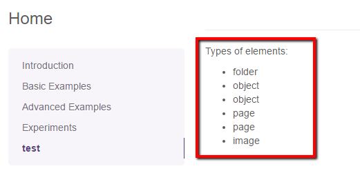

# Multihref Editable

## General
Multihref editable provides one to many relation to other Pimcore elements (document, asset, object). 


## Configuration 

| Name           | Type      | Description                                                                                                                                                     |
|----------------|-----------|-----------------------------------------------------------------------------------------------------------------------------------------------------------------|
| `width`        | integer   | Width for the widget in pixels (optional)                                                                                                                       |
| `height`       | integer   | Height for the widget in pixels  (optional)                                                                                                                     |
| `title`        | string    | Title for the input-widget                                                                                                                                      |
| `uploadPath`   | string    | Target path for (inline) uploaded assets                                                                                                                        |
| `types`        | array     | Allowed types (document, asset, object), if empty all types are allowed                                                                                         |
| `subtypes`     | array     | Allowed subtypes grouped by type (folder, page, snippet, image, video, object, ...), if empty all subtypes are allowed (see example below)                      |
| `classes`      | array     | Allowed object class names, if empty all classes are allowed                                                                                                    |
| `class`        | string    | A CSS class that is added to the surrounding container of this element in editmode                                                                              |

## Methods

| Name            | Return   | Description                          |
|-----------------|----------|--------------------------------------|
| `getElements()` | array    | Array of the assigned elements       |
| `current()`     | int      | Get the current index while looping  |
| `isEmpty()`     | boolean  | Whether the editable is empty or not |


## Example

### Basic Usage

The code below is responsible for showing the list of elements types related to the multihref. 

<div class="code-section">

```php
<p><?= $this->translate("Types of elements"); ?>:</p>
<?php if($this->editmode): ?>
    <?= $this->multihref("objectPaths"); ?>
<?php else: ?>
    <ul>
        <?php foreach($this->multihref("objectPaths") as $element):
            /** @var \Pimcore\Model\Element\ElementInterface $element */
            ?>
            <li><?= $element->getType(); ?></li>
        <?php endforeach; ?>
    </ul>
<?php endif; ?>
```

```twig
<p>{{ "Types of elements" | trans }}:</p>

    {{ pimcore_multihref("objectPaths") }}

<ul>
    
        <li>{{ element.getType() }}</li>
    
</ul>

```
</div>

Picture below, presents the editmode preview:


The frontend part looks like that:



To better understand what exactly is the `$element` variable, have a look at the output below:

```
array(6) {
  [0] => string(27) "Pimcore\Model\DataObject\Folder"
  [1] => string(32) "Pimcore\Model\DataObject\BlogArticle"
  [2] => string(32) "Pimcore\Model\DataObject\BlogArticle"
  [3] => string(27) "Pimcore\Model\Document\Page"
  [4] => string(27) "Pimcore\Model\Document\Page"
  [5] => string(25) "Pimcore\Model\Asset\Image"
}
```


### Example with allowed types and subtypes
Similar to the Href editable, Multihref also could specify allowed `types`, `subtypes` and `classes`. 
For example:
<div class="code-section">

```php
<?= $this->multihref("objectPaths", [
    "types" => ["asset","object"],
        "subtypes" => [
            "asset" => ["video","image"],
            "object" => ["object"]
         ],
        "classes" => ["person"]
]); ?>
```
```twig
{{ pimcore_multihref("objectPaths", {
    "types": ["asset","object"],
    "subtypes": {
        "asset": ["video","image"],
        "object": ["object"]
    },
    "classes": ["person"]
}) }}
```
</div>
Now, a user is not able to add elements other elements then specified in the types configuration part.

