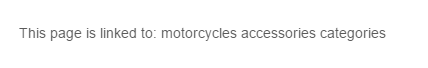

# Multiselect Editable

## General

The Multiselect editable generates a **multiselect** box component in editmode.

## Configuration

| Name     | Type    | Description                                                                        |
|----------|---------|------------------------------------------------------------------------------------|
| `store`  | array   | Key/Value pairs for the available options.                                         |
| `width`  | integer | Width of a generated block in editmode                                             |
| `height` | integer | Height of a generated block in editmode                                            |
| `class`  | string  | A CSS class that is added to the surrounding container of this element in editmode |

## Methods

| Name        | Return  | Description                                     |
|-------------|---------|-------------------------------------------------|
| `getData()` | array   | Returns array of values chosen in the editmode. |
| `isEmpty()` | boolean | Whether the editable is empty or not            |

## Example

The code below renders a multiselectbox in the backend. 
Also, it shows the list of chosen elements in the frontend. 

<div class="code-section">

```php
<?php if($this->editmode): ?>
    <?= $this->multiselect("categories", [
        "width" => 200,
        "height" => 100,
        "store" => [
            ["cars", "Cars"], //the first array element is a key, the second is a label rendered in editmode
            ["motorcycles", "Motorcycles"],
            ["accessories", "Accessories"] 
        ]
    ]) ?>
<?php else: ?>
    <p><?= $this->translate("This page is linked to"); ?>:
        <?php foreach($this->multiselect("categories")->getData() as $categoryKey): ?>
            <span>
                <?= $this->translate($categoryKey); ?>
            </span>
        <?php endforeach; ?>
        categories
    </p>
<?php endif; ?>
```

```twig

    {{ pimcore_multiselect('categories', {
        'width': 200,
        'height': 100,
        'store': [
            ['cars', 'Cars'],
            ['motorcycles', 'Motorcycles'],
            ['accessories', 'Accessories'],
        ]
    }) }}

    <p>{{ 'This page is linked to' | trans }}
        
            <span>
            {{ categoryKey | trans }}
        </span>
        
        categories
    </p>

```

</div>

The editmode preview:


In the frontend you can find the rendered text with the categories you have chosen in the editmode: 


