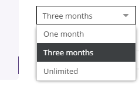

# Select Editable

## General

The select editable generates select-box component in Editmode.

## Configuration

| Name     | Type    | Description                                                                        |
|----------|---------|------------------------------------------------------------------------------------|
| `store`  | array   | Key/Value pairs for the available options.                                         |
| `reload` | bool    | Set true to reload the page in editmode after selecting an item                    |
| `width`  | integer | Width of the select box in pixel                                                   |
| `class`  | string  | A CSS class that is added to the surrounding container of this element in editmode |

## Methods

| Name                    | Return | Description                                                           |
|-------------------------|--------|-----------------------------------------------------------------------|
| `getData()`             | string | Value of the select, this is useful to get the value even in editmode |
| `isEmpty()`             | bool   | Whether the editable is empty or not                                  |
| `setDataFromResource()` | void   | Set a default value for the select                                    |

## Examples

### Basic Usage

The code below shows a select box in editmode,
in the frontend preview you will see simply the value of the chosen option.

<div class="code-section">


```php
<?php
if($this->editmode):

    echo $this->select("valid_for", [
            "store" => [
                ['one-month', 'One month'],
                ['three-months', 'Three months'],
                ['unlimited', 'Unlimited']
            ]
        ]);

else:
?>
<p>
    <?= $this->translate("Something is valid for") ?>: <?= $this->translate($this->select("valid_for")->getData()) ?>
</p>
<?php endif; ?>
```

```twig

    {{ pimcore_select("valid_for", {
            "store": [
                ["one-month", "One month"],
                ["three-months", "Three months"],
                ["unlimited", "Unlimited"]
            ]
        }) }}

    <p>
        {{ "Something is valid for" | trans }}:{{ pimcore_select("valid_for").getData() | trans  }}
    </p>

```
</div>

Editmode:


Frontend:


### Preselect an Option

You can ***preselect*** an option in your select editable by using `setDataFromResource()`. Be sure to use the preselection before you define your select.

<div class="code-section">
    
```php
if($this->editmode && $this->select("valid_for")->isEmpty()):
    $this->select("valid_for")->setDataFromResource("unlimited");
endif;

echo $this->select("valid_for", [
    "store" => [
        ['one-month', 'One month'],
        ['three-months', 'Three months'],
        ['unlimited', 'Unlimited']
    ]
]);
```

```twig

    


{{ pimcore_select("valid_for", {
    "store": [
        ["one-month", "One month"],
        ["three-months", "Three months"],
        ["unlimited", "Unlimited"]
    ]
}) }}
```
</div>
