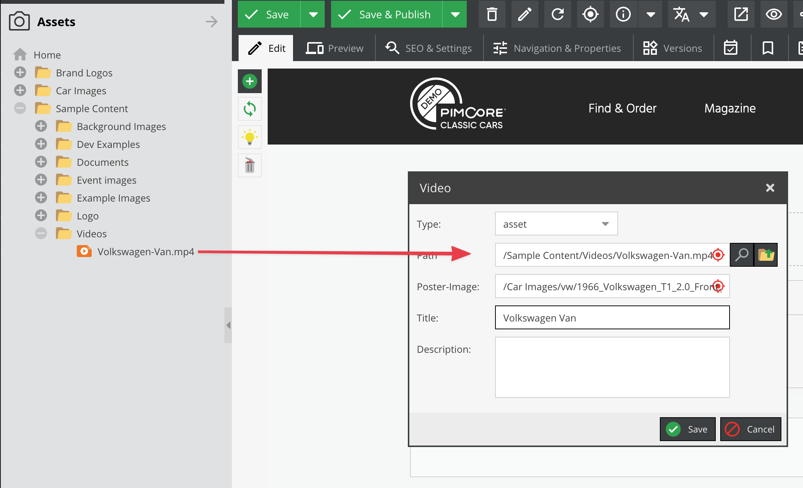
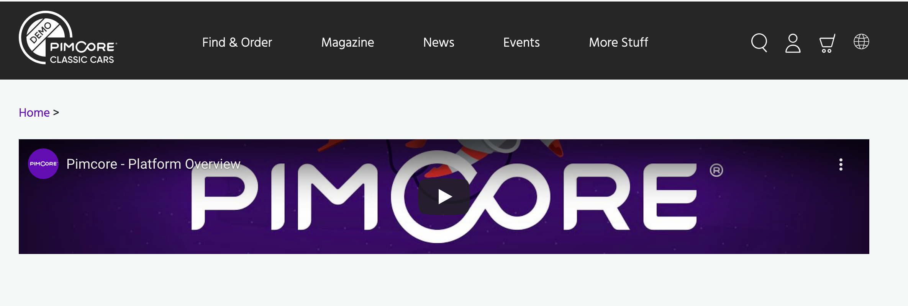

# Video Editable

## General

The video editable is a powerful editable to embed videos in the content.
Supported video sources are: local assets, YouTube, Vimeo and Dailymotion. 
Local asset videos support the automatic generation and transcoding of videos using [Video Thumbnails](../../04_Assets/03_Working_with_Thumbnails/03_Video_Thumbnails.md). 

## Configuration

| Name                      | Type      | Description                                                                                                                                                                                                             |
|---------------------------|-----------|-------------------------------------------------------------------------------------------------------------------------------------------------------------------------------------------------------------------------|
| `attributes`              | array     | Additional attributes for the generated `<video>` tag - only for type asset                                                                                                                                             |
| `disableProgressReload`   | bool      | Set to true to disable the automatic page refresh while the video thumbnail is generated                                                                                                                                |
| `editmodeImagePreview`    | bool      | Set to true to display only an image and not the video player in editmode, this can be necessary if you have many videos on one page (performance)                                                                      |
| `height`                  | integer   | Height of the video in pixel                                                                                                                                                                                            |
| `imagethumbnail`          | string    | Name of the image-thumbnail, this thumbnail config is used to generate the preview image (poster image), if not specified Pimcore tries to get the information out of the video thumbnail. see also: Video Thumbnails   |
| `removeAttributes`        | array     | You can remove standard attributes using this configuration, e.g. "removeAttributes" => ["controls","poster"]                                                                                                           |
| `thumbnail`               | string    | Name of the video-thumbnail (required when using automatic-transcoding of videos) see: [Video Thumbnails](../../04_Assets/03_Working_with_Thumbnails/03_Video_Thumbnails.md)                                            |
| `width`                   | integer   | Width of the video in pixel                                                                                                                                                                                             |
| `youtube`                 | array     | Parameters for youtube integration. Possible parameters: [https://developers.google.com/youtube/player_parameters](https://developers.google.com/youtube/player_parameters) - only for type ***youtube***               |
| `class`                   | string    | A CSS class that is added to the surrounding container of this element in editmode                                                                                                                                      |
  
## Methods

| Name                       | Arguments            | Return                                                  | Description                                                                                   |
|----------------------------|----------------------|---------------------------------------------------------|-----------------------------------------------------------------------------------------------|
| `getImageThumbnail($name)` | (string/array) $name | string, absolute path to the thumbnail                  | Get a specific image thumbnail of the video, or a thumbnail of the poster image (if assigned) |
| `getPosterAsset()`         |                      | Pimcore\Model\Asset                                     | Returns the [assigned poster image asset](#posterReturnedValue)                               |
| `getThumbnail()`           | (string/array) $name | array, absolute paths to the different video thumbnails | Get a specific video-thumbnail of the video                                                   |
| `getVideoAsset()`          | -                    | asset                                                   | Returns the video asset object if assigned, otherwise null                                    |
| `getVideoType()`           | -                    | string, type of the video (asset,youtube,vimeo,url)     | This is to check which video type is assigned                                                 |
| `getTitle()`               | -                    | string                                                  | Title of the video                                                                            |
| `getDescription()`         | -                    | string                                                  | Description of the video                                                                      |
| `getData()`                | -                    | array                                                   | All the available data on this editable                                                       |
| `isEmpty()`                | -                    | bool                                                    | Whether the editable is empty or not.                                                         |

Output returned by `getPosterAsset`:
```
[status] => finished
[formats] => Array
    (
        [mp4] => /var/tmp/video_3414__example.mp4
    )
```

## Examples

### Basic Usage - a Local Asset

To create a container for local video files you can just use the `$this->video` helperwithout any options.

<div class="code-section">

```php
<section id="campaign_video">
    <?= $this->video("campaignVideo", [
        "width" => 700,
        "height" => 400
    ]); ?>
</section>
```

```twig
<section id="campaign_video">
    {{ pimcore_video('campaignVideo', {
        width: 700,
        height: 400
    }) }}
</section>
```

</div>

In the editmode, there is now a container available where you can assign an asset path and a video poster. 




### YouTube, Vimeo & Dailymotion

You can use videos from external services, as well (at the moment, YouTube, Vimeo and Dailymotion) but with limited functionalities. 
In the video edit dialog, change the type to `youtube` and fill the **ID** input with a video identifier or the video URL.
(in that case you can easily find it in the url). Youtube playlists are supported as well - you can identify them by the prefix `PL` in the **ID**.


Have a look at the frontend preview:
 


In the configuration, you could also specify additional options for external services.

<div class="code-section">

```php
<section id="campaign_video">
    <?= $this->video("campaignVideo", [
        "width" => 700,
        "height" => 400,
        "youtube" => [
            "autoplay" => 1,
            "modestbranding" => 1
        ],
        "vimeo" => [
            "autoplay" => 1,
            "loop" => 1
        ]
    ]); ?>
</section>
```

```twig
<section id="campaign_video">
    {{ pimcore_video('campaignVideo', {
            width: 700,
            height: 400,
            youtube: {
                autoplay: true,
                modestbranding: true
            },
            vimeo: {
                autoplay: true,
                loop: true
            }
       })
    }}
</section>
```

</div>

### HTML5 with Automatic Video Transcoding (using video.js)

<div class="code-section">

```php
<!DOCTYPE HTML>
<html>
<head>
    <link href="http://vjs.zencdn.net/5.4.4/video-js.css" rel="stylesheet">
</head>
<body>
 
    <?= $this->video("myVideo", array(
        "thumbnail" => "example", // NOTE: don't forget to create a video thumbnail
        "width" => 400,
        "height" => 300,
        "attributes" => ["class" => "video-js custom-class", "preload" => "auto", "controls" => "", "data-custom-attr" => "my-test"]
    )); ?>
 
    <script src="http://vjs.zencdn.net/5.4.4/video.js"></script>
</body>
</html>
```

```twig
<!DOCTYPE HTML>
<html>
<head>
    <link href="http://vjs.zencdn.net/5.4.4/video-js.css" rel="stylesheet">
</head>
<body>
    {{ pimcore_video('myVideo', {
            thumbnail: 'example',
            width: 400,
            height: 300,
            attributes: {
                'class': 'video-js custom-class',
                'preload': 'auto',
                'controls': '',
                'data-custom-attr': 'my-test'
            }
        })
    }}
 
    <script src="http://vjs.zencdn.net/5.4.4/video.js"></script>
</body>
</html>
```

</div>

Read more about [Video Thumbnails](../../04_Assets/03_Working_with_Thumbnails/03_Video_Thumbnails.md).

