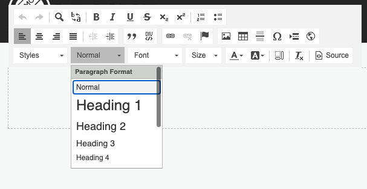
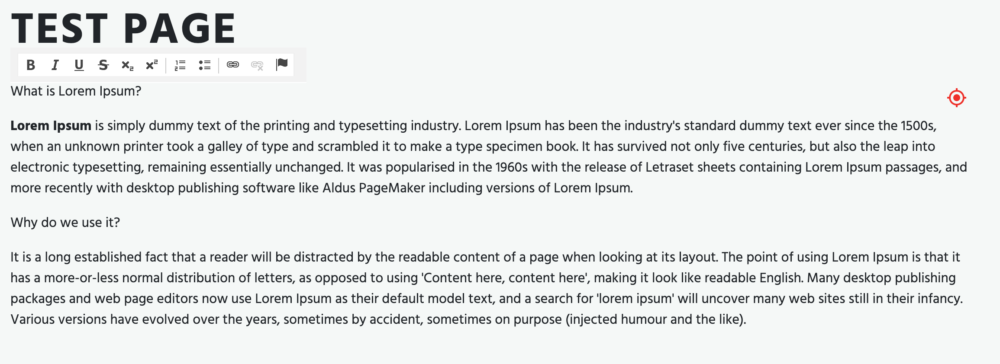

# WYSIWYG Editable

## General

Similar to Textarea and Input you can use the WYSIWYG editable in the templates to provide rich-text editing.
 
## Configuration

| Name            | Type    | Description                                                                        |
|-----------------|---------|------------------------------------------------------------------------------------|
| `customConfig`  | string  | Path to JavaScript file with configuration for CKEditor                            |
| `enterMode`     | integer | Set it to 2 if you don't want to add the P-tag                                     |
| `height`        | integer | Minimum height of the field in pixels                                              |
| `toolbarGroups` | string  | A toolbar config array (see below)                                                 |
| `width`         | integer | Width of the field in pixels                                                       |
| `class`         | string  | A CSS class that is added to the surrounding container of this element in editmode |

## Methods

| Name        | Return | Description                           |
|-------------|--------|---------------------------------------|
| `getData()` | array  | Get the value of the wysiwyg          |
| `isEmpty()` | bool   | Whether the editable is empty or not. |

## Examples

### Basic usage

`wysiwyg` helper doesn't require any additional configuration options.
The following code specifies tje height for the rendered WYSIWYG editable (has no effect in frontend).

<div class="code-section">

```php
<section id="marked-content">
    <?= $this->wysiwyg("specialContent", [
        "height" => 200
    ]); ?>
</section>
```

```twig
<section id="marked-content">
    {{  pimcore_wysiwyg("specialContent", {
            "height": 200
        }) 
    }}
</section>
```
</div>

If you have a look at the editmode, you will see that our WYSIWYG is rendered with the full toolbar.




### Custom configuration for CKEditor

The complete list of configuration options you can find in the [CKEditor toolbar documentation](http://docs.ckeditor.com/#!/guide/dev_toolbar).

The WYSIWYG editable allows us to specify the toolbar. 
If you have to limit styling options (for example only basic styles like `<b>` tag and lists would be allowed), just use `toolbarGroups` option.

<div class="code-section">

```php
<section id="marked-content">
    <?= $this->wysiwyg("specialContent", [
        "height" => 200,
        "toolbarGroups" => [
            [
                "name" => 'basicstyles',
                "groups" => [ 'basicstyles', 'list', "links"]
            ]
        ]
    ]); ?>
</section>
```

```twig
<section id="marked-content">
    {{  pimcore_wysiwyg("specialContent", {
        "height": 200,
        "toolbarGroups": [
            {
                "name": 'basicstyles',
                "groups": [ 'basicstyles', 'list', "links"]
            }
        ]}) 
    }}
</section>
```
</div>

Now the user can use only the limited toolbar.




There is also an additional way to specify the configuration by adding `customConfig`. 

```php
<section id="marked-content">
    <?= $this->wysiwyg("specialContent", [
        "height" => 200,
        "customConfig" => "/custom/ckeditor_config.js"
    ]); ?>
</section>
```

The `custom_config.js` file could look like the following (please refer to the [CKEditor documentation](https://docs.ckeditor.com/ckeditor4/docs/#!/guide/dev_configuration-section-using-a-custom-configuration-file) for further details):

```js
CKEDITOR.editorConfig = function (config) {
    config.uiColor = '#AADC6E';
};
```

##### Global Configuration

You can add a Global Configuration for all WYSIWYG Editors for all documents by setting `pimcore.document.tags.wysiwyg.defaultEditorConfig`.

For this purpose, you can create a [Pimcore Bundle](../../20_Extending_Pimcore/13_Bundle_Developers_Guide) and add the
configuration in a file in the `Resources/public` directory  of your bundle (e.g. `Resources/public/js/editmode.js`).

```
pimcore.document.tags.wysiwyg.defaultEditorConfig = pimcore.document.tags.wysiwyg.defaultEditorConfig || {};
pimcore.document.tags.wysiwyg.defaultEditorConfig.uiColor = '#AADC6E';
```

To load that file in editmode, you need to implement `getEditmodeJsPaths` in your bundle class. Given your bundle is named
`AppAdminBundle` and your `editmode.js` created before was saved to `src/AppAdminBundle/Resources/public/js/editmode.js`:
 
```php
<?php

namespace AppAdminBundle;

use Pimcore\Extension\Bundle\AbstractPimcoreBundle;

class AppAdminBundle extends AbstractPimcoreBundle
{
    public function getEditmodeJsPaths()
    {
        return [
            '/bundles/appadmin/js/pimcore/editmode.js'
        ];
    }
}
```


###### Registering global configuration via events

You can also add the file which should be loaded in editmode through an event listener to avoid having to implement a 
`PimcoreBundle` just for the sake of adding a file. Given you already have an `AppBundle` and put the JS config from above
to `src/AppBundle/Resources/public/js/editmode.js` you can create an event listener to add the path to the list of loaded
files in editmode (please see [Events](../../20_Extending_Pimcore/11_Event_API_and_Event_Manager.md) for details on how
to implement and register event listeners):

```php
<?php

namespace AppBundle\EventListener;

use Pimcore\Event\BundleManager\PathsEvent;
use Pimcore\Event\BundleManagerEvents;
use Symfony\Component\EventDispatcher\EventSubscriberInterface;

class EditmodeListener implements EventSubscriberInterface
{
    public static function getSubscribedEvents()
    {
        return [
            BundleManagerEvents::EDITMODE_JS_PATHS => 'onEditmodeJsPaths'
        ];
    }

    public function onEditmodeJsPaths(PathsEvent $event)
    {
        $event->setPaths(array_merge($event->getPaths(), [
            '/bundles/app/js/pimcore/editmode.js'
        ]));
    }
}
```


### Text Output in Editmode

With the following code you can get the text even in editmode:

```php
<?= $this->wysiwyg("specialContent"); ?>
<?php if($this->editmode): ?>
    <h4>Preview</h4>
    <div style="border: 1px solid #000;" class="preview">
        <?= $this->wysiwyg("specialContent")->getData(); ?>
    </div>
<?php endif; ?>
```


