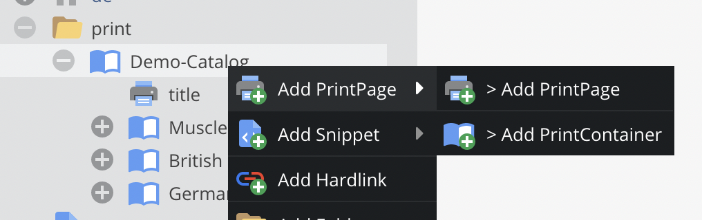
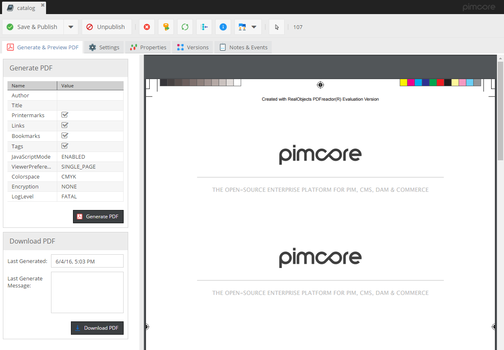

# Print Documents

Print documents are the way to create print-ready PDFs directly within Pimcore. 
They are based on the normal Pimcore documents and therefore support everything as pages do - starting from MVC pattern 
and template creation to document composing within Pimcore backend with areas, drag&drop etc. 

By default, web-to-print documents are disabled. To enable them, you need to activate them in the web-to-print settings:


Web to print flow implemented in Pimcore:


Once activated, print documents are integrated into the default documents tree. 
But of course you can setup your custom views to have separate trees for web documents and print documents. 
Just use our completely redesigned [custom views](../../05_Objects/01_Object_Classes/05_Class_Settings/11_Custom_Views.md) 
and all [new perspectives features](../../18_Tools_and_Features/13_Perspectives.md).

For more detail-information on the settings see later.

## Web-To-Print Document Types

### PrintPage 

PrintPages are the documents that contain the actual content - with all the areas, editables, images, and so on. 
They are based on the normal Pimcore documents and to content editing should be quite self explaining.



### PrintContainer

PrintContainers are a special document type to represent containers of PrintPages. They do not have content for their own, 
they just combine all sub pages to one single output PDF. By doing so they allow to structure big print documents like catalogs, 
pricelists, books, etc.

Of course, PrintContainers can be nested. So, one can use a root container, that contains several chapter containers 
that then contain the actual print pages.


Even they don't have content for their own, PrintContainers are based on normal Pimcore documents. 
Therefore, they also need a controller and a view. They have to make sure, that all sub pages are included into one single output view. 
Pimcore ships with default implementations (Web2PrintController, container-Action) on new installations. 
If you updated an existing Pimcore installation, please get the default implementations here: 

* Controller: `website_example/controllers/Web2printController.php`
* View: `website_example/views/scripts/web2print`

## PDF Rendering

Both web-to-print documents have an additional tab that is the place for rendering documents to print-ready PDFs. 
When rendering, the print is first rendererd to HTML and then rendered to an PDF. PDF rendering itself is done by an
third party renderer. Currently we support [wkhtmltopdf](http://wkhtmltopdf.org/) and [pdfreactor](http://www.pdfreactor.com/). 
Please see their documentation for details concerning template possibilities.



Depending on the renderer, there might be settings possible for the rendering process. 
The provided settings might be extended in future. 
For details of settings please see section below or renderer documentation.

## Special PDFreactor Settings

**Printermarks**: With PDFreactor there comes a out-of-the-box feature to add printermarks to the PDF. 
They can be activated by the printermarks rendering setting. Technically they are implemented by an additional CSS-file which needs to be included.
For Details, check links below:

* [view-script](https://github.com/pimcore/pimcore/blob/master/install-profiles/demo-cms/app/Resources/views/Web2print/default.html.php#L102-L102)
* [css-file](https://github.com/pimcore/pimcore/blob/master/web/pimcore/static6/css/print/print-printermarks.css)

## Settings
In the web-to-print settings, the used PDF renderer is specified. Depending on the renderer, there are additional settings to be made. 
Additional explanation can be found directly in the settings form. 
These settings have to be set properly before starting PDF rendering.

##Settings for WkHtmlToPdf

In the binary field enter the path to the wkhtmltopdf binary. For example: "/usr/bin/wkhtmltopdf". If you get an error like "QXcbConnection: Could not connect to display" you will need to install xvfb. [More about this error](https://unix.stackexchange.com/questions/192642/wkhtmltopdf-qxcbconnection-could-not-connect-to-display)

The command that you enter in the binary field can then be something like this:
```
xvfb-run -a -s "-screen 0 640x480x16" /usr/bin/wkhtmltopdf
```
In the host field, enter the full URL, like you would in a web browser, not just the hostname. For example: "http://example.mydevdomain.local"

To test and debug the PDF renderimg. open a Print document, go to the tab "Generate & Preview PDF", click the "Generate PDF" button and observe the message field for any errors.

## Relevant Log Files

If PDF rendering doesn't work properly, following log files should give you a hit for the reason.

* `var/logs/dev.log` or `var/logs/prod.log` - contains general logging information for rendering process at INFO level
* `var/logs/web2print-output.log` - contains output of rendering PHP process (if any). It is recreated on every rendering process.

