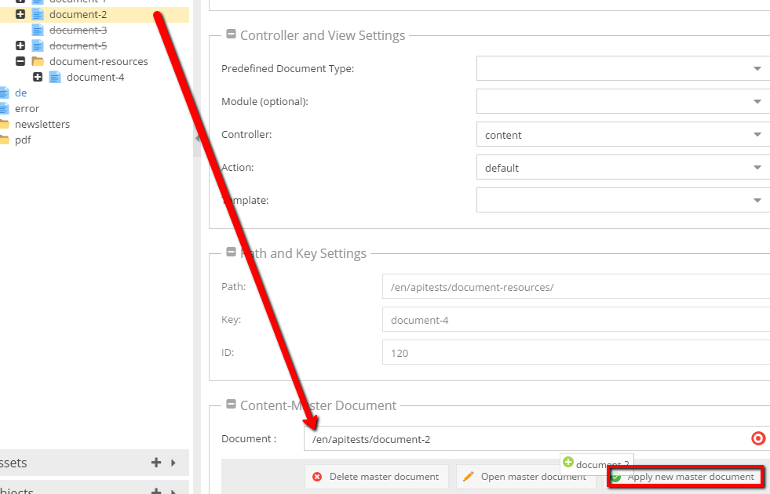
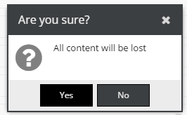

# Document Inheritance 

The *Content Master Document* setting, allows a document to inherit all of its contents from any other document which can 
then be overwritten individually on field level. Notice: Properties are not inherited via Content Master Documents.

If this setting is selected and *Apply new master document* is clicked, all contents will be erased from the current 
document and inherited from the master document. 

# How-To

1. Drag a master document to the document where you'd like to inherit the contents (*Content-Master Document* in settings tab).
2. Press the *Apply new master document* button



3. Confirm the warning dialog 



4. Now you can see grey spaces in the document. 
If you want to overwrite any value, just click the right button on it.
 


## Content Master Document in the Code

Using a master document doesn't change anything in the PHP API. If you load a document which has related a master document, 
then values returned by it will be replaced by values from the master document (unless values are overwritten).

You can get Master document object by `getContentMasterDocument` method available in `\Pimcore\Model\Document\Page`.

```php
$document = \Pimcore\Model\Document\Page::getById(130);
dump([
    'master_document' => $document->getContentMasterDocument()->getKey(),
    'document' => $document->getKey()
]);
```
