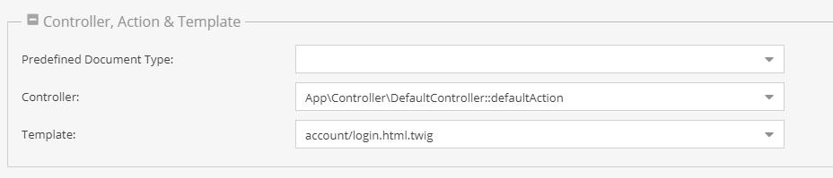

# Documents
Documents are the CMS part of Pimcore and are the way to go for managing unstructured contents using pages, content snippets and navigations. 

## Document Types
Pimcore offers different types of documents and each of them offers functionalities specific for the intended use-case. 

| Type           | Description                                                                                                                                                 | 
|----------------|-------------------------------------------------------------------------------------------------------------------------------------------------------------|
| Page           | Represents a typical web-page, the path in the tree is equal to the address in the browser.                                                                 |
| Snippet        | Makes it easier to extract often used contents into reusable containers. Can be embedded in pages or nested into other snippets.                            |
| Link           | A simple web-link to be used in navigations.                                                                                                                |
| Email          | A document like the page, but with special functionality for transactional emails.                                                                        |
| [Newsletter](./02_Document_Types/05_Newsletter_Documents.md)     | Like email, but offering additional newsletter functionality.                                                                                             |
| Hardlink       | Create links to other document structures and reuse them within a different structure / context. (see [Hard link](https://en.wikipedia.org/wiki/Hard_link)) |
| Folder         | Just like the folders you know from your local filesystem.                                                                                                  | 
| [PrintPage](./02_Document_Types/15_Print_Documents.md)      | Like pages, but specialized for print (PDF preview, rendering options, ...)                                                                                 | 
| [PrintContainer](./02_Document_Types/15_Print_Documents.md) | Organizing print pages in chapters and render them all together.                                                                                            | 

## Document Configuration

Many documents types are tight to the [MVC](../02_MVC/README.md) and therefore they need a underlying controller/action and a template. 
They are directly specified in the document settings in the admin interface: 

Not all of them are necessary, the table below shows which configurations are possible:

| Type | Controller | Action | Template | Description                                                                                                                                        |
|------|------------|--------|----------|----------------------------------------------------------------------------------------------------------------------------------------------------|
| 1    | X          | X      |          | The specified controller/action is executed, based on the names of them the right template is rendered (eg. `views/scripts/controller/action.php`) |
| 2    | X          | X      | X        | Same as above but the template specified is rendered and not the auto-discovered template                                                           |
| 3    |            |        | X        | Renders the template with the default controller/action, this is practical if there is only templating stuff                                       |

Optionally you can specify a module to each of the above combinations, this is useful if you want to use controllers/actions or templates out of plugins which are simply another ZF module. 
The default module (when empty) is website.

Pimcore is shipped with a default controller containing a default action, which is called when only a template is given to the document, 
you can edit the defaults in *Settings* > *System Settings*.

## Putting Configuration & Files Structure Together

The previous two sections outline how documents can be configured to use different controller/action and views.  
The table below represents the three configurations.

[comment]: #TODOimagesformatindaux

| Controller and Action                                                                                                                                       | Controller, Action and Template                                                          | Only Template                                                                                                       |
|-------------------------------------------------------------------------------------------------------------------------------------------------------------|------------------------------------------------------------------------------------------|---------------------------------------------------------------------------------------------------------------------|
|                                                                                   |       |                                               |
| If you have a controller named `content` with an action named `defaultAction` the template file required will be `/website/views/scripts/content/default.php` | The specified controller/action is executed, but then the specified template is rendered | The default controller/action defined in the system settings are executed, then the specified template is rendered. |

## Properties

[Properties](../08_Tools_and_Features/07_Properties.md) are very powerful in combination with documents.
Below, you can find some examples where properties can be very useful for the use with documents. 

1. **Navigation** - If you build the navigation based on the document-tree, sometimes you need special settings for the frontend, like separators or highlightings.
2. **Header Images** - Often there are header images on a website, if you don't want to define it for every page, you can use properties with inheritance. Then you can define a default one at the root document, and overrule this on a deeper level in the tree structure.
3. **Sidebars** - You can easily manage visibility of sidebars in specific documents.
4. **SEO** - It's also possible to use properties for SEO. It's very painful to define a nice title and description for every page on your site, with properties this is not necessary (inheritance).
5. **Protected Areas** - Closed user groups
6. Change the appearance of the website depending on the properties (eg. micro-sites, nested sites)
7. Mark them for some automated exports (PDF, RPC's, …)

As you can see there are really useful cases for properties, feel free to use them for whatever they seem to be useful.

## A Few Facts

* Documents follow the MVC pattern; therefore, Pimcore requires that there is at least one controller with an action and a view file.
* Pimcore comes with a DefaultController containing a defaultAction and a view file.
* Because of the MVC architecture, there is a clear separation between your data, the functionality and the templates.
* Pimcore has no need for a template engine since it uses `\Zend_View`, which offer many advantages. If you don't know how Zend_View works, please read more [here](https://framework.zend.com/manual/1.12/en/zend.view.html).
* The normal way to create templates for Pimcore is to use pure PHP. There's no new template syntax to learn - just code what you want - feel free!
* Although the templates are written in PHP, there is a clear separation as mentioned before.

## Create Your First Document 
Working with documents is described in detail in our [Create a First Project](../01_Getting_Started/06_Create_a_First_Project.md) manual. 

## Document Topics
- [Creating editable templates](./01_Editables/README.md) 
- [Navigation](./03_Navigation.md)
- [Inheritance](./11_Inheritance.md)
- [Working with the PHP API](./09_Working_with_PHP_API.md) 
- [Web-to-Print](./02_Document_Types/15_Print_Documents.md)
- [Predefined Document Types](./07_Predefined_Document_Types.md)

