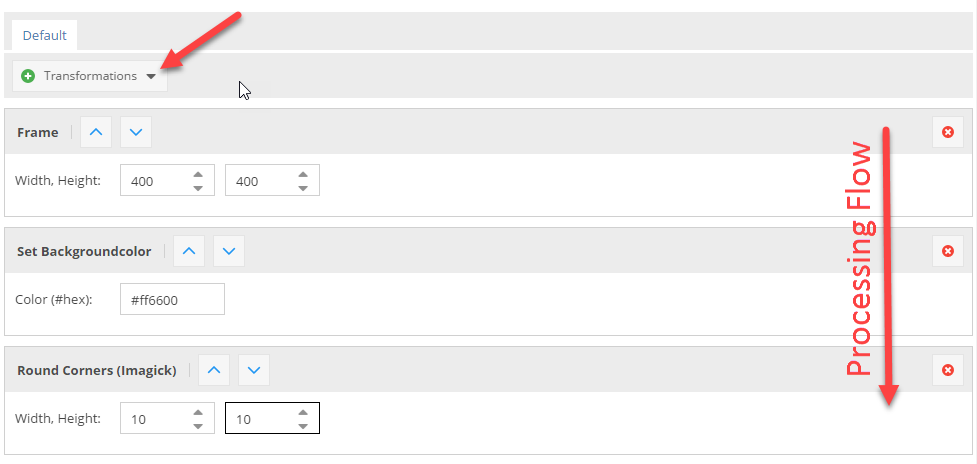
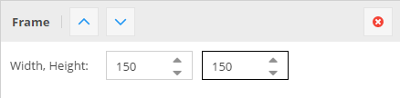
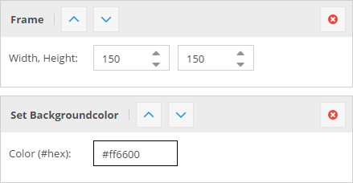

# Image Thumbnails

For images, Pimcore offers an advanced thumbnail-service also called 'image-pipeline'. It allows you to transform images
 in unlimited steps to the expected result. You can configure them in *Settings* > *Thumbnails*.
 
 
With this service every image which is stored as an asset can be transformed. Pimcore doesn't support to modify images 
which are not stored as an asset inside Pimcore.

> **IMPORTANT**  
> Use Imagick PECL extension for best results, GDlib is just a fallback with limited functionality 
> (only PNG, JPG, GIF) and less quality!
> Using ImageMagick Pimcore supports hundreds of formats including: AI, EPS, TIFF, PNG, JPG, GIF, PSD, ...

To use the thumbnailing service of Pimcore, you have to create a transformation pipeline first. To do so, open 
*Settings* > *Thumbnails* and click on *Add Thumbnail* to create a new configuration.
The fields name, description, format and quality should be self-explanatory, the interesting part are now the transformations. 
Click on *+* to add a new transformation, so that it look like that for example:



**Important**: The transformations are performed in the order from the top to the bottom. This is for example important 
in the configuration above. If the you first round the corners this would be performed on the original image, 
and then the image will get resized, so the rounded corners are also resized which is not intended. 

To retrieve a thumbnail from an asses simply call `$asset->getThumbnail("thumbnail-name")` on the asset object, which will return 
an `\Pimcore\Model\Asset\Image\Thumbnail` object. The thumbnail object's `__toString()` method returns the path to the thumbnail file 
beginning from the document root, for example: 
`/website/var/tmp/image-thumbnails/0/53/thumb__exampleCover/img_0322.jpeg`

This path can then be directly used to display the image in a `` or `<picture`> tag. For example:
```php
<?php
    use Pimcore\Model\Asset;
    // get an asset
    $asset = Asset::getById(1234);
?>
 
<?php if ($asset) { ?>
   getThumbnail("myThumbnailName") ?>" />

    <!-- preferred alternative - let Pimcore create the whole image tag -->
    <!-- including high-res alternatives (srcset) or media queries, if configured -->
    <?= $asset->getThumbnail("myThumbnail")->getHTML(); ?>

<?php } ?>
```

**An Alternative Adapter**

You can use the new adapter: `pimcore/lib/Pimcore/Image/Adapter/ImageMagick.php` instead of the standard `pimcore/lib/Pimcore/Image/Adapter/Imagick.php`.
 
The main difference: `ImageMagick` is using `convert` and `composite` CLI tools to manage thumbnails (it gives a better control of the generation process).

To try the new adapter add a new [dependency injection](../../10_Extending_Pimcore/03_Dependency_Injection.md) declaration in the `website/config/di.php` file. 

If `convert` and `composite` are accessible globally:

```php
\Pimcore\Image\Adapter::class => DI\object('Pimcore\Image\Adapter\ImageMagick')
```

Optionally, you can also specify the path to tools, like below:
```php
\Pimcore\Image\Adapter::class => DI\object('Pimcore\Image\Adapter\ImageMagick')
        ->method('setConvertScriptPath', '/usr/bin/convert')
        ->method('setCompositeScriptPath', '/usr/bin/composite')
```


## Explanation of the Transformations

| Transformation | Description | Configuration | Result |
|----------------|-------------|---------------|--------|
| ORIGINAL IMAGE | This is the image which is used in the following transformations | NONE ;-) |  |
| RESIZE | The image is exactly resized to the given dimensions without respecting the ratio. |  |  |
| SCALE BY HEIGHT | The image is scaled respecting the ratio to the given height, the width is variable depending on the original ratio of the image (portrait, landscape). |  |  |
| SCALE BY WIDTH | The image is scaled respecting the ratio to the given width, the height is variable depending on the original ratio of the image (portrait, landscape). |    |  |
| CONTAIN | The image is scaled to either the given height or the width, depending on the ratio of the original image. That means that the image is scaled to fit into a "virtual" box with the dimensions given in the configuration.  |    |  |
| CROP | Cuts out a box of the image starting at the given X,Y coordinates and using the width and height. |    |  |
| COVER | The image is resized so that it completely covers the given dimensions. Then the overlapping pieces are cropped depending on the given positioning. This is useful if you need a fixed size for a thumbnail but the source images have different ratios. |    |  |
| FRAME | The transformation is the same as CONTAIN the difference is, that the image gets exactly the entered dimensions by adding transparent borders left / right or top / bottom. |    |  |
| ROTATE | Rotates the image with the given angle. The background is transparent by default. |    |  |
| BACKGROUND COLOR | Background color is especially useful if you have transparent PNG as source data or if you're using the FRAME or the ROTATE transformations where you get transparencies. It allows you to give transparencies a color, and gives you the possibility to use them for examples JPEG's which doesn't support transparency.  |    |  |
| ROUNDED CORNERS | Rounds the corners to the given width/height. |    |  |


For thumbnails in action also have a look at our [Live Demo](http://demo.pimcore.org/en/basic-examples/thumbnails). 

## Usage Examples
```php
<?php // Use with the image tag in documents ?>
<div>
    <p>
        <?= $this->image("image", ["thumbnail" => "myThumbnail"]) ?>
    </p>
</div>
 
 
<?php // Use directly on the asset object ?>
<?php
    $asset = Asset::getByPath("/path/to/image.jpg");
    echo $asset->getThumbnail("myThumbnail")->getHTML();
?>
 
<?php // Use without pre-configured thumbnail ?>
<?= $this->image("image", [
    "thumbnail" => [
        "width" => 500,
        "height" => 0,
        "aspectratio" => true,
        "interlace" => true,
        "quality" => 95,
        "format" => "PNG"
    ]
]) ?>
 
<?php // Use from an object-field ?>
<?php if ($this->myObject->getMyImage() instanceof Asset\Image) { ?>
    myObject->getMyImage()->getThumbnail("myThumbnail"); ?>" />
<?php } ?>
 
// where "myThumbnail" is the name of the thumbnail configuration in settings -> thumbnails
 
 
<?php // Use from an object-field with dynamic configuration ?><?php if ($this->myObject->getMyImage() instanceof Asset\Image) { ?>
    myObject->getMyImage()->getThumbnail(["width" => 220, "format" => "jpeg"]); ?>" />
<?php } ?>
 
 
 
<?php // Use directly on the asset object using dynamic configuration ?>
<?php
 
$asset = Asset::getByPath("/path/to/image.jpg");
echo $asset->getThumbnail(["width" => 500, "format" => "png"])->getHTML();
 
?>
```

## Advanced Examples
Pimcore returns an `\Pimcore\Model\Asset\Image\Thumbnail` object when calling `$asset->getThumbnail("thumb-name")` 
which gives you even more flexibility when working with thumbnails.

```php
$thumbnail = $asset->getThumbnail("myThumbnail");
 
// get the final dimensions of the thumbnail (especially useful when working with dynamic configurations)
$width = $thumbnail->getWidth();
$height = $thumbnail->getHeight();
 
// get the html "img" tag for the thumbnail incl. custom class:
echo $thumbnail->getHTML(["class" => "custom-class"]);
 
// get the path to the thumbnail
$path = $thumbnail->getPath();
 
// Asset\Image\Thumbnail implements __toString(), so you can still print the path by
echo $thumbnail; // prints something like /website/var/tmp/....png
```

## More Examples
```php
// adding custom html attributes to the generated  or <picture> tag, using a dynamic thumbnail
<?= $asset->getThumbnail([
 "width" => 180,
 "height" => 180,
 "cover" => true
])->getHTML(["class" => "thumbnail", "data-my-name" => "my value"]) ?>
 
  
// same with a thumbnail definition
<?= $asset->getThumbnail("exampleScaleWidth")->getHTML([
    "class" => "thumbnail", 
    "data-my-name" => "my value"
]) ?>
  
// disable the automatically added width & height attributes
<?= $asset->getThumbnail("exampleScaleWidth")->getHTML([], ["width","height"]) ?>
```


## Using ICC Color Profiles for CMYK -> RGB 
Pimcore supports ICC color profiles to get better results when converting CMYK images (without embedded color profile) 
to RGB. 

Due licensing issues Pimcore doesn't include the color profiles (*.icc files) in the download package, but 
you can download them for free here: [Adobe ICC Profiles](http://www.adobe.com/support/downloads/detail.jsp?ftpID=4075) 
or here: [ICC (color.org)](http://www.color.org/profiles.xalter). 

After downloading the profiles put them into your `/website` folder or anywhere else on your sever 
(eg. `/usr/share/color/icc`). Then go to the Pimcore system settings, open the assets section and configure the 
path to your favorite color profile.


## Dynamic Generation on Request
Pimcore auto-generates a thumbnail if requested but doesn't exist and is directly called via it's file path (not using any of 
the `getThumbnail()` methods). 
For example: Call `http://example.com/website/var/tmp/image-thumbnails/0/6644/thumb__contentimages/placeholder.jpeg` 
 ("6644" is the asset ID and "contentimages" is the name of the thumbnail) directly in your browser. Now pimcore checks 
 if the asset with the ID 6644 and the thumbnail with the key "contentimages" exists, if yes the thumbnail is 
 generated on-the-fly and delivered to the client. When requesting the images again the image is directly served by 
 apache, because the file already exists (just the same way it works with the getThumbnail() methods). 
 
The structure of the path is identically with the one generated by the `getThumbnail()`  methods, so it doesn't 
matter whether the thumbnail is generated by `getThumbnail()` (inside a PHP process) or on-the-fly (in a separate 
process). 

Of course this works only with predefined (named) thumbnail configurations and not with dynamic configurations. 


## Deferred Rendering of Thumbnails
For performance reasons, Pimcore doesn't generate the thumbnail image directly when calling `getThumbnail()` 
on an asset, instead it generates them when they are actually needed (on request). 

But sometimes it's necessary to have the actual image already generated, in this case you can pass a 
2nd parameter to `getThumbnail()` to force the processing of the image. 

```php
$asset = Asset\Image::getById(123);
$asset->getThumbnail("myConfig", false); // set the 2nd parameter to false
```

The processing is also forced when calling the method `getFileSystemPath()` or `getPath(false)` on 
the returning thumbnail object: 

```php
$asset->getThumbnail("myConfig")->getFileSystemPath(); 
// or 
$asset->getThumbnail("myConfig")->getPath(false); 
```


## High-Resolution Support
This is a special functionality to allow embedding high resolution (ppi/dpi) images.
The following is only necessary in special use-cases like Web-to-Print, in typical web-based cases, Pimcore 
automatically adds the `srcset` attribute to `` and `<picture>` tags automatically, so no manual work is necessary. 

####Use in the Thumbnail Configuration: 

The above configuration will generate a thumbnail with 500px width. 

When using this configuration in combination with the [image editable](../../03_Documents/01_Editables/14_Image.md) 
using the following code
```php
<?= $this->image("myImage", ["thumbnail" => "contentimages"]); ?>
```
this will create the following output: 
```php

```
It's also possible to add the high-res dynamically: 
```php
<?= $this->image("myImage", ["thumbnail" => ["width" => 250, "contain" => true, "highResolution" => 2]])
```
This will create an image `width = 500px`

#### Combining "Dynamic Generation on Request" with High Resolution Images
This is especially useful in the case you want to serve thumbnails depending on the ppi of the device screen or in 
combination with Web2Print documents (browser preview with normal size, tripled in size for PDF ouptut). 
Pimcore also utilizes this functionality internally to provide the automatically added high.res support on `` and `<picture>` tags. 
So again, this feature is only useful in some edge-cases. 

###### Example 

```php
<?= $image->getThumbnail("testimage")->getPath(); ?>
```
this generates the followinig ouput: 
```php
/website/var/tmp/thumb_6644__testimage.png
```

To get an high-res version of the thumbnail, you can just add `@2x` before the file extension: 
```
/website/var/tmp/thumb_7865__teaserportal@2x.png
/website/var/tmp/thumb_6644__testimage@5x.png
``` 
Using float is possible too:
```
/website/var/tmp/thumb_123456__teaserportal@3.2x.png
```

Pimcore will then dynamically generate the thumbnails accordingly. 

## Media Queries in Thumbnail Configuration
If your're using media queries in your thumbnail configuration pimcore automatically generates a `<picture>`  tag 
instead of an `` tag when calling `$asset->getThumbnail("example")->getHTML()`.
But in some cases it is necessary to get single thumbnails for certain media queries out of the thumbnail object, 
which is described in the examples below. 
```php
$a = Asset::getById(71);
 
// list all available medias in "galleryCarousel" thumbnail configuration
p_r(array_keys(Asset_Image_Thumbnail_Config::getByName("galleryCarousel")->getMedias()));
 
// get the <picture> element for "galleryCarousel" => default behavior
$a->getThumbnail("galleryCarousel")->getHtml();
 
// get path of thumbnail for media query 940w
$a->getThumbnail("galleryCarousel")->getMedia("940w");
 
// get  tag for media query 320w including @srcset 2x
$a->getThumbnail("galleryCarousel")->getMedia("320w")->getHTML();
 
// get 2x thumbnail path for media query 320w
$a->getThumbnail("galleryCarousel")->getMedia("320w", 2);
```

## Disable Picture Polyfill
If you want to use your own Polyfill.
```php
<?php
Asset\Image\Thumbnail::setEmbedPicturePolyfill(false);
?>
```


