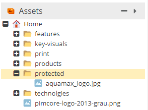

# Restricting Public Asset Access

Pimcore has following default behavior in terms of asset delivery: 

> All Data that is stored as Pimcore Assets can be accessed via its URL (e.g. https://mydomain.com/my-assetfolder/my-asset.jpg) 
> and therefore is public available without login or other access restriction!
> 
> As a consequence confidential data **must not** be stored as Pimcore Assets without additional protection measures.

The reason for this wanted behavior is performance. Delivering an asset directly via the web server needs significantly 
less resources than starting a php process for every asset request (especially when it comes to delivering thumbnails).  


If further restriction is needed, Pimcore provides two options for doing so: 


### Option 1 - Restricting access to certain assets completely  

All confidential assets need to be stored within one (or a few) folder(s), e.g. within `/protected` (to set up Pimcore 
backend permissions this is necessary anyway). 



In the `.htaccess` of the project, the access to this folder has to be restricted with an additional rewrite rule. It is
important, that this rule is placed **in front of** the rewrite rule for asset delivery. 

```.htaccess

...
RewriteRule ^protected/.* - [F,L]

# ASSETS: check if request method is GET (because of WebDAV) and if the requested file (asset) exists on the filesystem, if both match, deliver the asset directly
...

```

Because of this rule, all assets located within `/protected` (also all their thumbnails) are not delivered via the web 
server anymore. As a consequence also using the direct link for downloading or using the Pimcore generated img tags for 
thumbnails cannot be used anymore. All delivery of these assets has to be done manually via a custom controller action. 


### Option 2 - Checking permissions before delivery 

This option does not restrict the delivery in general, but routes the asset request to a controller action that can check 
access permissions with custom business logic and then deliver the asset or not. 

Again all confidential assets need to be stored within one (or a few) folders, e.g. within `/protected`. 


In the `.htaccess` of the project, requests to assets of this folder need to be routed to `app.php`. Again, it is
important, that this rule is placed **in front of** the rewrite rule for asset delivery.

```.htaccess
 
...
RewriteRule ^protected/(.*) %{ENV:BASE}/app.php [L]

# ASSETS: check if request method is GET (because of WebDAV) and if the requested file (asset) exists on the filesystem, if both match, deliver the asset directly
...
 
```

In the application, there has to be a route and a controller action that handles the request, e.g. like the following:

```php 
class MyAssetController extends AbstractController
{
 
    /**
     * @Route("/protected/{path}", requirements={"path"=".*"})
     */
    public function protectedAssetAction(Request $request) {
 
        $pathToAsset = $request->get("path");
 
        //do some checks and return proper response
 
    }
}
```

Of course this option has significant impact on server load and delivery performance of assets (and thumbnails). Therefore
it is **not** suggested to deliver all assets that way but only the confidential ones!  
