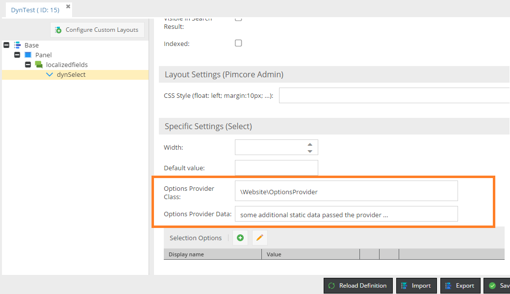
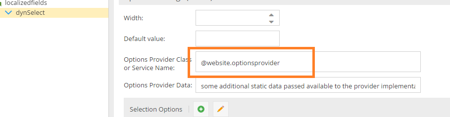
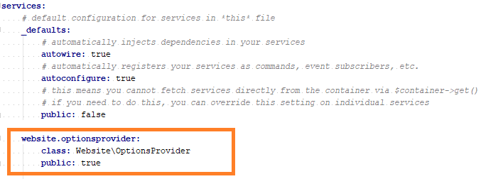

# Select Types with Dynamic Options

**Experimental, subject to change without notice!!!**

For the select & multiselect datatype you can specify a dynamic options provider class. 
This allows you to generate a list of valid options on-the-fly instead of using a static list.
The select datatype also allows you to define the default option at runtime.

You can also add some additional static data which will be passed to the data provider.

Note that there are two ways to define an options provider. 

Either simply specify the class name ...



... or the name of a Symfony service (notice the prefix).


The services.yml would then look like this one ...



Depending on your datatype you have to implement the appropriate interface.
 
 * `Pimcore\Model\Object\ClassDefinition\DynamicOptionsProvider\SelectOptionsProviderInterface` for the `Select` data type options,
 * `Pimcore\Model\Object\ClassDefinition\DynamicOptionsProvider\MultiSelectOptionsProviderInterface` for the Multiselect options 
 
 Implement the following methods:
 * `getOptions` should return a list of valid options in the format indicated below
 * `getDefaultValue` (Select data type only) returning the default value
 * `hasStaticOptions` should return whether your options are depending on the object context (i.e. different options for different objects) or not.
 This is especially important for the object grid. For object-context depending option there will be no batch assignment mode.
 Also, filtering can only be done through a text field instead of the options list.

```php
<?php

namespace Website;

use Pimcore\Model\Object\ClassDefinition\Data;
use Pimcore\Model\Object\ClassDefinition\DynamicOptionsProvider\SelectOptionsProviderInterface;


class OptionsProvider implements SelectOptionsProviderInterface
{
    /**
     * @param $context array
     * @param $fieldDefinition Data
     * @return array
     */
    public function getOptions($context, $fieldDefinition) {
        $object = $context["object"];
        $fieldname = "id: " . ($object ? $object->getId() : "unknown") . " - " .$context["fieldname"];
        $result = array(

            array("key" => $fieldname .' == A', "value" => 2),
            array("key" => $fieldname .' == C', "value" => 4),
            array("key" => $fieldname .' == F', "value" => 5)

        );
        return $result;
    }

    /**
     * @param $context array
     * @param $fieldDefinition Data
     * @return mixed
     */
    public function getDefaultValue($context, $fieldDefinition) {
        return 4;
    }

    /**
     * @param $context array
     * @param $fieldDefinition Data
     * @return bool
     */
    public function hasStaticOptions($context, $fieldDefinition) {
        return true;
    }

}
```

This will generate the following options.


## Context Information for the Provider Class

Note that depending the use case not all of the infos will be available.
Especially the existence of the object paramater cannot be guaranteed because the provider class will also be called when a class is saved or if you programmatically call $class->getFieldDefinitions().
Layout definition calls can be distinguished from other ones by checking if the `purpose` parameter is set to `layout`

The `purpose` parameter can take the following values:

| Value | Description |
| --- | ---- |
| null | unknown |
| layout | edit mode layout |
| gridconfig | grid configuration - usually no need to specify dynamic options|
| gridview | grid view |

#### Object (top-level)

| Name | Description |
| --- | ---- |
| object | the `"object"` |
| fieldname | the name of the select field (e.g. `dynSelect`) |


#### Localizedfields

| Name | Description |
| --- | ---- |
| ownerType | `"localizedfield"` |
| ownerName | the name of the localized field ("localizedfields") |
| object | the `"object"` |
| fieldname | the name of the select field (e.g. `dynSelect`) |


#### Objectbricks

| Name | Description |
| --- | ---- |
| containerType | `"objectbrick"` |
| containerKey | the type of the object brick |
| outerFieldname | the object's object brick attribute |
| object | the `"object"` |
| fieldName | the name of the attribute inside the object brick |

#### Fieldcollections

| Name | Description |
| --- | ---- |
| containerType | `"fieldcollection"` |
| containerKey | the type of the fieldcollection |
| subContainerType | sub container type (e.g. localized field inside a field collection) |
| outerFieldname | the object's field collection attribute |
| object | the `"object"` |
| fieldName | the name of the attribute inside the fieldcollection |


#### Classification Store

| Name | Description |
| --- | ---- |
| ownerType | `"classificationstore"` |
| ownerName | the name of the classificationstore attribute |
| fieldname | the name of the attribute inside the fieldcollection |
| groupId   | group id |
| keyId     | key id |
| keyDefinition | the fielddefinition of the classificationstore attribute |

