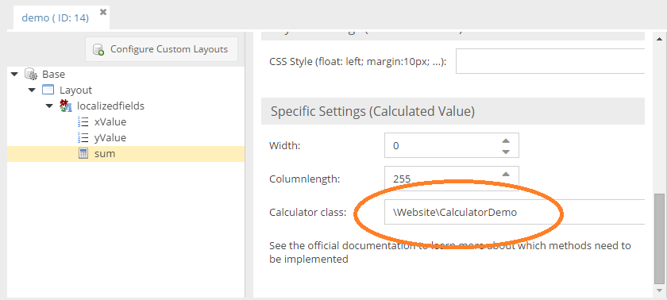

# Calculated Value Datatype


## General

The calculated-value datatype allows you to calculate attributes based on the value of various other attributes. 
The only data stored is the one in the object's query tables.

Let's have a closer look by walking through a simple example.

Let's suppose we have a very simple class with 2 number fields called xValue and yValue and a calculated-value field 
called `sum` placed inside a localizedfields container.




The first step is to provide a PHP calculator class implementing the `CalculatorClassInterface` interface. The `compute` method needs to be implemented which computes the result for the `sum` field. An example is shown below.

The arguments passed into this method is the Pimcore object and the contextual information telling you which 
calculated-value field is affected and where it is located at.

The extent of information depends on the datatype of the owner of the calculated-value field 
(localizedfield, object brick etc.). The details are documented below.

```php
namespace Website;
 
use Pimcore\Model\DataObject\Concrete;
use Pimcore\Model\DataObject\ClassDefinition\CalculatorClassInterface;
use Pimcore\Model\DataObject\Data\CalculatedValue;
 
class CalculatorDemo implements CalculatorClassInterface
{
    public function compute(Concrete $object, CalculatedValue $context):string {
        if ($context->getFieldname() == "sum") {
            $language = $context->getPosition();
            return $object->getXValue($language) +  $object->getYValue($language);
        } else {
            \Logger::error("unknown field");
        }
    }
} 
```

As we see here, the calculator class sums up the x and y values from the corresponding language tab.

In addition to the `compute` method you need to implement the `getCalculatedValueForEditMode` method. This method is used to display the value in object edit mode:
```php
public function getCalculatedValueForEditMode(Concrete $object, CalculatedValue $context): string {
    $language = $context->getPosition();
    $result = $object->getXValue($language) . " + " . $object->getYValue($language) . " = " . $this->compute($object, $context);
    return $result;
}
```

The visual outcome would be as follows: 


You can also provide a Symfony service as calculator class via `@` prefix (e.g. `@service_name`).


## Working with PHP API

Getter methods on the object class are generated as usual. The code to retrieve the values would then be: 
```php
$object = AbstractObject::getByPath("/demoobject");
$valueDe =  $object->getSum("de");   // => 38
$valueEn =  $object->getSum("en");   // => 11
```

## Context Information for Calculation Class
As said before, the richness of the context information depends on the location of the calculated-value field.


#### Object (top-level)

| Name | Description |
| --- | ---- |
| ownerType | `"object"` |
| fieldName | the name of the calcuated-value field (e.g. `sum`) |


#### Localizedfields

| Name | Description |
| --- | ---- |
| position | the language ("en", "de", ...) |
| ownerType | `"localizedfield"` |
| ownerName | the name of the localized field ("localizedfields") | 


#### Objectbricks

| Name | Description |
| --- | ---- |
| ownerType | `"objectbrick"` |
| ownerName | the name of the objectbrick field inside the object |
| fieldName | the name of the attribute inside the brick |
| index | the name of the brick |
| keyDefinition | the calculated-value field definition |
| position | the language ("en", "de", ...) if calculated field is localized |


#### Fieldcollections

| Name | Description |
| --- | ---- |
| ownerType | `"fieldcollection"` |
| ownerName | the name of the fieldcollection attribute |
| fieldName | the name of the attribute inside the fieldcollection |
| index | the index of the fieldcollection item |
| keyDefinition | the calculated-value field definition |


#### Classification Store

| Name | Description |
| --- | ---- |
| ownerType | `"classificationstore"` |
| ownerName | the name of the fieldcollection attribute |
| fieldName | the name of the attribute inside the fieldcollection |
| position  | the language |
| groupId   | group id |
| keyId     | key id |
| keyDefinition | the fielddefinition of the classificationstore attribute |

