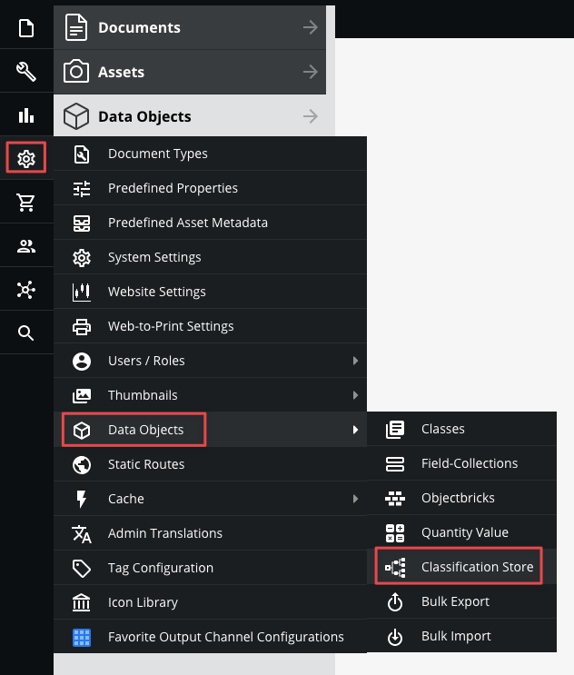
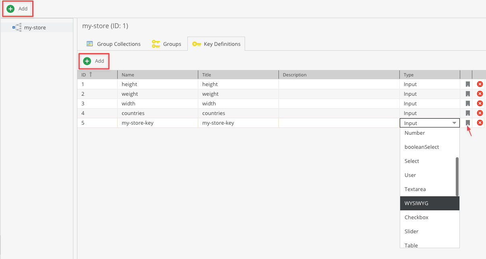
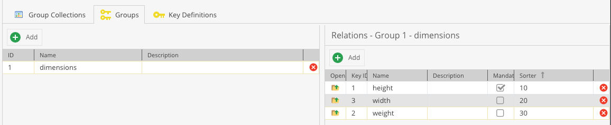
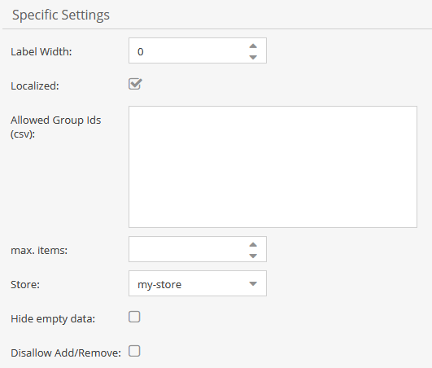
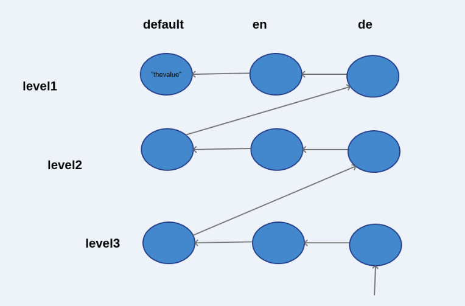

# Classification Store

## Overview

The classification store has quite some similarities to a key/value-like datatype. 

A key/value data type allows to add an arbitrary number of key/value pairs to objects with the restriction that each 
key can only be added once to that object.

#### The most important facts:
* There can be multiple store with completely isolated feature sets.
* Inheritance is supported.
* An object can have more than one classification store.
* Localization is supported (optionally, can be configured in the class definition).
* The classification store introduces the concept of a fallback language.
* All simple data types (e.g. textarea, date, etc are supported). The store can be extended with custom data types.
* Takes advantage of the built-in mechanism for the field definition + data editing (validation, etc).
* Keys can be organized in groups.
* A key can belong to several groups.
* Individual keys currently cannot be added to the object. Instead, the corresponding groups added.
* The allowed groups can be restricted via the class definition.


## Configuration of Classification Stores

Before using the classification store, at least one classification store with collections, groups and keys has to be
defined. 

### Key definition
* Go to classification store in Objects menu:



* Add a new store if necessary
* Add a key
* Select type



* Click on the configuration button on the right for detailed settings
* Note that not all settings are respected (e.g. `indexed`)


### Group definition and key assignment
* Use the group editor to define and organize keys into groups
* Similar to keys a sort order can be specified
* Groups with lower sort order are displayed first
* A key can belong to more than one group
* It is not necessary for the group name to be unique
* Use the grid on the right side to manage the keys belonging to the selected group
* Configure sort order for the object editor, keys with lower values are listed first
* Configure which keys should be mandatory in this group



### Collection definition

* Groups can optionally be organized into collections
* A collection is simply a container which allows to add several groups at once, there is no actual logic behind it


## Class definition

* Localization can be enabled, by default only the `default` language is available
* Allowed groups can be restricted by providing a comma-separated list of group ids
* There can be more than one classification store field 
* Configure the group sort order for the object editor, groups with lower values are listed first




## Object editor

* Groups can be added/removed via the add/remove buttons (see screenshot below)
* Keys are displayed in the specified sort order. If the order is equal then the keys are sorted by creation date


## Inheritance

In contrast to localized fields fallback and inherited values are first resolved in a horizontal way. 
If no value can be found on the same level, the parent level is scanned in the same language order. 
As mentioned before, there is the concept of a `default` language which is just an additional pseudo language 
which acts as the last resort.

Consider the following example and let’s assume that English is the fallback language for German. 
We request the German value for the object at level 3. 
Since the only value can be found on level 1 for the default language the tree is traversed as depicted.



## Using Classification Store via PHP api

```php
// setter, group id = 1, key id id = 2, language = de
$object->getClassificationStore2()->setLocalizedKeyValue(1, 2, "thevalue", "de");
  
// provide additional information about which collection the group belongs to
// group 1 belongs to collection with ID 2
$object->getClassificationStore2()->setGroupCollectionMapping(1, 2);
  
// retrieve the mapping 
// this will return 2 => collection with ID 2
$object->getClassificationStore2()->getGroupCollectionMapping(1);
  
// getter, group id = 1, key id id = 2, language = de
$value = $object->getClassificationStore2()->getLocalizedKeyValue(1, 2, "de");
  
// get the list of active groups
$store = $object->getClassificationStore2();
$groups = $store->getActiveGroups();
  
// get all values as associative array [groupId][keyid][language] => value
$allValues = $store->getItems();
   
```

### Adding new items to Classification Store through code

```php
// KeyConfig
$config = new \Pimcore\Model\Object\Classificationstore\KeyConfig();
$config->setName($name);
$config->setDescription($description);
$config->setEnabled(true);
$config->setType("input");
$config->setDefinition(json_encode($definition)); // The definition is used in object editor to render fields
$config->save();
  
// Definition example
{ 
   "name":"dcname",
   "datatype":"data",
   "fieldtype":"input",
   "title":"title",
   "tooltip":"",
   "mandatory":false,
   "noteditable":false,
   "invisible":false,
   "visibleGridView":false,
   "visibleSearch":false,
   "index":false,
   "style":"",
   "width":null,
   "columnLength":null,
   "regex":"",
   "textfield-1856-inputEl":"",
   "textfield-1883-inputEl":""
}
  
// Group
$config = new \Pimcore\Model\Object\Classificationstore\GroupConfig();
$config->setName($name);
$config->setDescription($description);
$config->save();
  
// Collection
$config = new \Pimcore\Model\Object\Classificationstore\CollectionConfig();
$config->setName($name);
$config->setDescription($description);
$config->save();
```

