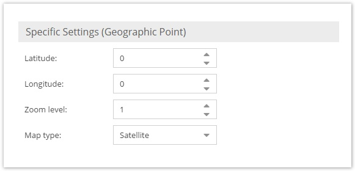
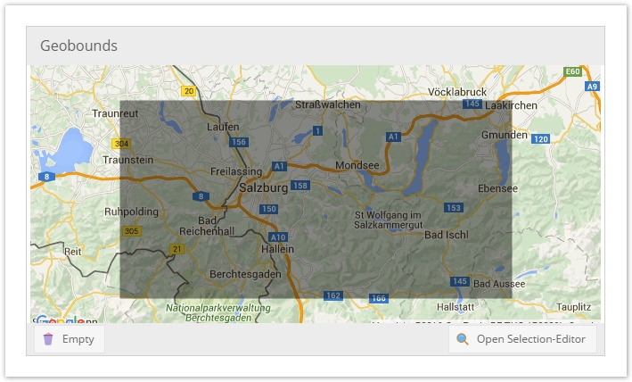

# Geographic Datatypes

There are three different geographic data types available in pimcore: `Geopoint`, `Geobounds` and `Geopolygon`. 
The country select box also belongs to the context of geo widgets, but it is rather a select input widget and therefore it is 
listed with the other select widgets.


## Geopoint




The geopoint consists of two coordinates: latitude and longitude. In the pimcore GUI there is the same geopoint selector 
widget as shown above. It allows to find coordinates for a geographic point easily. In the database the values are 
stored in two columns which are called latitude and longitude. Programmatically the data for this field is 
represented by `Pimcore\Model\Object\Data\Geopoint`. To set a geopoint programmatically, a new 
`Pimcore\Model\Object\Data\Geopoint` has to be instantiated:

```php
$longitude = 2.2008440814678;
$latitude = 102.25112915039;
$point = new \Pimcore\Model\Object\Data\Geopoint($longitude,$latitude);
$object->setPoint($point);
$object->save();
```


## Geobounds



Geobounds represent a geographic area defined by a north eastern point and a south western point. In the pimcore GUI the 
input widget as shown above is available. In the database there are 4 columns with coordinates to hold the data of 
geobounds. Programmatically both points are `Pimcore\Model\Object\Data\Geopoints` and they are wrapped by the 
`Pimcore\Model\Object\Data\Geopoints` Object. The following code snippet shows how to set Geobounds:

```php
use Pimcore\Model\Object\Data\Geopoint;
 
$northEast = new Geopoint(150.96588134765625, -33.704920213014425);
$southWest = new Geopoint(150.60333251953125, -33.893217379440884)
$object->setBounds(new Object_Data_Geobounds($northEast,$southWest));
$object->save();
```


## Geopolygon


The geopolygon is the third in the row of geo widgets. It allows to define a geographic area by setting an arbitrary 
amount of geo points. In the database these points are stored in a single column of the data type LONGTEXT in the 
form of a serialized array of `Pimcore\Model\Object\Data\Geopoints`. To set geopolygon data programmatically, an 
array of Geopoints has to be passed to the setter:

```php
use Pimcore\Model\Object\Data\Geopoint;
  
$data = [
    new Geopoint(150.54428100585938, -33.464671118242684),
    new Geopoint(150.73654174804688, -33.913733814316245),
    new Geopoint(151.2542724609375, -33.9946115848146)
];
$object->setPolygon($data);
$object->save();
```