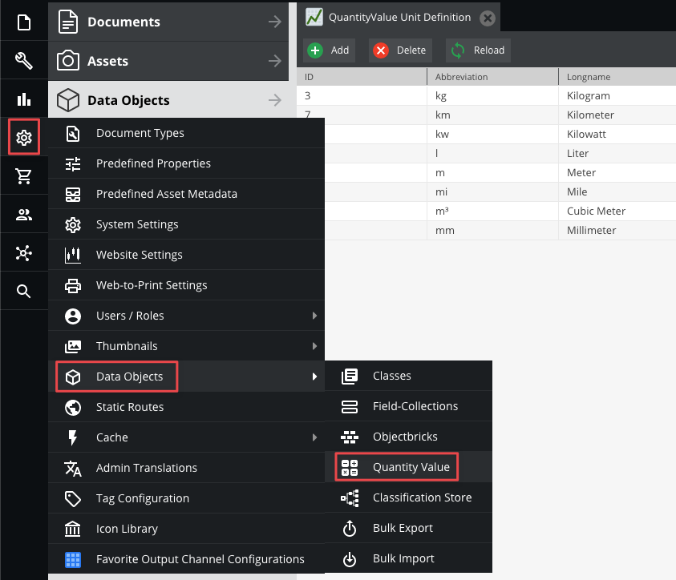
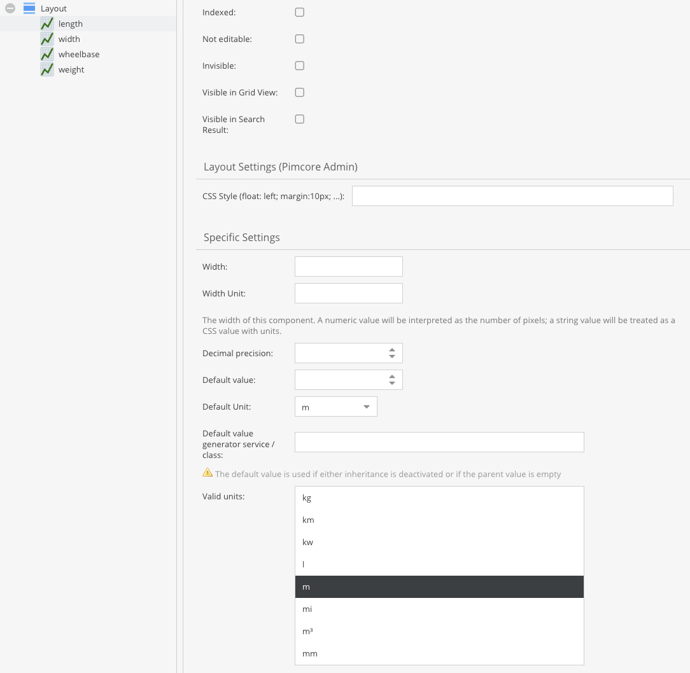

# Number Datatypes

Both numeric data types (`number` and `slider`) are stored as a number in a DOUBLE column in the database. 
To set numeric data, a number must be passed to the according setter. The two fields merely differ in their GUI input 
widgets and the fact that the slider has a min/max value and step size, which the numeric field does not have.


## Numeric


The numeric data field can be configured with a default value. In the GUI it is represented by a spinner field.


## Slider

In the GUI a slider can be used as a horizontal or vertical widget. It needs to be configured with a min and max value,
the increment step and decimal precision.


## Quantity Value

This is a numeric datatype that also allows to specify a unit.

Start off with defining a global list of known units.



This can also be achieved programmatically.

```php
$unit = new Pimcore\Model\DataObject\QuantityValue\Unit();
$unit->setAbbreviation("km");   // mandatory
$unit->setLongname("kilometers");
$unit->setGroup("dimension");
$unit->save();
```


In the class editor, it is possible to restrict the list of valid units on a field-level.



Only those units will be available then.


The following code snippet shows how to set a value.
```php
use Pimcore\Model\DataObject;

$parent = DataObject\AbstractObject::getByPath("/");

$object = new DataObject\Test();
$unit = DataObject\QuantityValue\Unit::getByAbbreviation("km");
$object->setKey("test2");
$object->setParent($parent);
$object->setHeight(new DataObject\Data\QuantityValue(27, $unit->getId()));
$object->save();
```

### Quantity Value Unit Conversion

#### Static unit conversion

You can also convert values between units. Therefore you have to define base units, conversion factors and offsets. 
All units with the same base unit can be converted to each other.

Example:
You have physical length units meter (m), millimeters (mm) and inches ("). Then your quantity value unit configuration could look like:

| Name       | Abbreviation | Baseunit | Factor |
|------------|--------------|----------|--------|
| Meter      | m            |          |        |
| Millimeter | mm           | m        |  0.001 |
| Inch       | "            | m        | 0.0254 |

When you now have a quantity value field in your data objects and change the unit to a unit which has the same base unit as the unit before the value gets automatically converted. For example when you have 2 m and change the unit to "mm" then the value will automatically change to 2000.

You can also trigger conversion programmatically:
```php
$originalValue = new QuantityValue(3, Unit::getByAbbreviation('m')->getId());
$converter = $this->container->get(\Pimcore\Model\DataObject\QuantityValue\UnitConversionService::class);
$convertedValue = $converter->convert($originalValue, Unit::getByAbbreviation('mm'));
// $convertedValue is a QuantityValue with value 3000 and unit mm
```

Units without base unit are expected to be a base unit itself. That is why in above example configuration meter has no base unit - but of course you can set it to meter to be more explicit.

In quantity value unit configuration there is also the column "offset". This is for unit conversions where addition / subtraction is needed. For example 

| Name               | Abbreviation | Baseunit | Factor | Offset |
|--------------------|--------------|----------|--------|--------|
| Degrees Celcius    | °C           |          |        |        |
| Degrees Fahrenheit | °F           | °C       | 1.8    |  32    |

These conversion parameters result from the formula `°F = °C * 1.8 + 32`

#### Dynamic unit conversion

When conversion factors / offsets change over time (e.g. money currencies) or you want to use an external API you have two opportunities:
1. You could periodically update the factors / offsets in quantity value unit configuration
2. You can create a converter service class

If you prefer the latter you have to create a class which implements  `\Pimcore\Model\DataObject\QuantityValue\QuantityValueConverterInterface` and define a service for this class in your `services.yml`. The service name can then be entered in quantity value unit configuration's column "Converter service" for the base unit.

## Input Quantity Value

[Input Quantity Value](95_Text_Types.md) is quite similar to Quantity Value except that text values are allowed instead of the strict restriction to numeric values.
