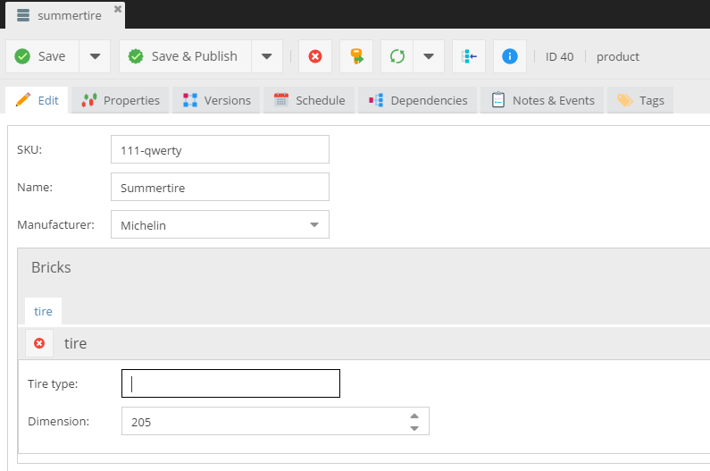
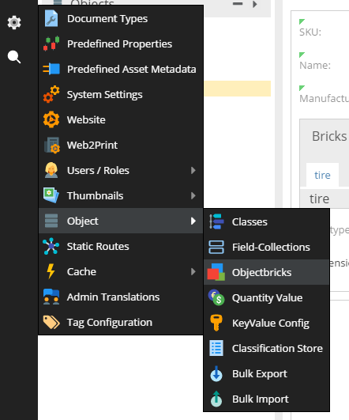
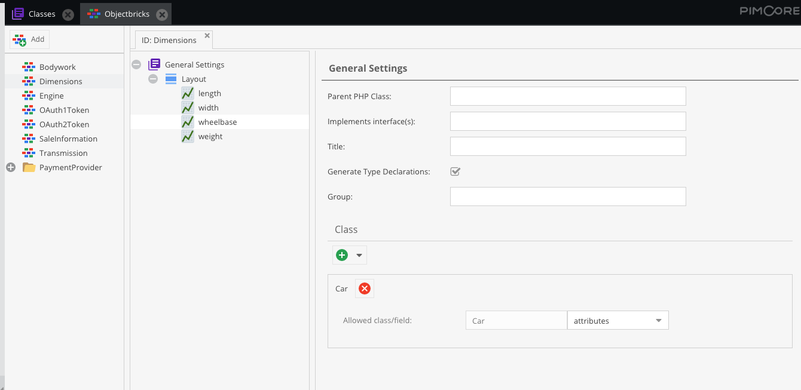

# Objects Bricks 

## General

With Objectbricks, objects can be extended without changing the class definition. 
This is especially useful when storing product data.
Often there is a base set of attributes, which all products have. 
But then there are lots of attributes, which only a subset of your products have.

Take the example of a car accessories dealer. Brakes have different attributes than tires, rims or navigation systems.
The old-fashioned way to deal with this use case is, to define a product class which contains all possible attributes 
from all product types. This would work fine, but most of the attributes will be empty and the object editor 
would be quite unmanageable.

The new way is to use Objectbricks. The product class itself has only attributes all products have. This might be 
attributes like name, article number, manufacturer, price, etc. In addition to that, for each product group there 
is an object brick. The object brick for brakes has attributes like diameter, material. 
The object brick for tires has dimension, type, maximum speed and so on.

By creating a tire product object, the tire object brick is added and so this tire product has all the tire attributes.



To one object a number of Objectbricks can be added, but just one instance per object brick type. 
This is the main difference to Fieldcollections.
Because only one instance per object brick can be added to an object, Objectbricks fully support inheritance on 
field level. Each attribute of an object brick can be overwritten in child objects.


Despite this flexibility, the database model in the background stays clean and well structured. 
This is because the attributes of an object brick have to be defined like these of Fieldcollections.

## Definition of an Objectbrick

As mentioned before, Objectbricks themselves are defined the same way as objects and Fieldcollections are and support 
similar data types as Fieldcollections.



To allow adding an Objectbrick to an object, two things have to be done:

* In data components list (when you're creating the class) is Objectbricks data type. 
This data type defines, where Objectbricks can be added. 
A field of this data type has to be added to the object class.


* In the Objectbrick definition, the object class and the desired field has to be added to the allowed classes.



In the object bricks definition, you can also specify a parent class - a way is the same like for 
classes (you can find more details in the [Parent Class for Objects section](../../../20_Extending_Pimcore/07_Parent_Class_for_Objects.md)).


## Working with PHP API

### Retrieving Objectbricks

By saving the object class, for each Objectbrick field of this class, the own data class is created with getters for each 
allowed Objectbrick. In our example, this data class would looks like this.

The getter `$product->getBricks()` returns an instance of this class filled with the Objectbricks of the `$product`. 
By calling the getter, the Objectbrick class with its attribute getter is returned.

```php
//receiving data of a Objectbrick
$product = DataObject\Product::getById(4);
$tiretype = $product->getBricks()->getTire()->getTiretype();
```

Setting data works the same way as retrieving data. 
For all getters there are corresponding setters. By saving an object, all bricks are saved too.

```php
//setting data of a Objectbrick
$product = DataObject\Product::getById(4);
$product->getBricks()->getTire()->setTiretype("Winter");
$product->save();
```

```php
//adding a new Objectbrick to an object
$product = new DataObject\Product();
$product->setKey("testproduct");
$product->setParent(DataObject\Product::getById(4));
 
$product->setName("testproduct");
 
$tireBrick = new DataObject\Objectbrick\Data\Tire($product);
$tireBrick->setTiretype("allyear");
$product->getBricks()->setTire($tireBrick);
$product->save();
```

### Deleting ObjectBricks via code

```php
//remove all ObjectBricks from an ObjectBrick field
$product->getBricks()->delete($product);
$product->save();
```

```php
$productBricks = $product->getBricks();
$tireBrick = $productBricks->getTire();
 
if ($tireBrick) {
    $tireBrick->setDoDelete(true);
}
$product->save();
```

### Querying for Objectbrick data

Data of Objectbricks can be queried in the same way as data of fieldcollections. 
The Objectbricks have to be added to the `DataObject\Listing` object and then the Objectbrick data can be queried in the 
condition like in the sample below.

```php
//querying for Objectbrick data
$productList = DataObject\Product::getList([
    /* add here all Objectbricks you need in the condition */
    "objectbricks" => ["Tire","Brake"],
    /* in the condition access Objectbrick attributes with OBJECTBRICKNAME.ATTRIBUTENAME */
    "condition" => "Tire.dimension > 200"
]);
```

If you want to obtain a list of objects which have a specific Objectbrick you can query for the `fieldname` value 
in the condition statement.

```php
//return all Products that have the Objectbrick "Tire"
$productList = DataObject\Product::getList([
    /* add here all Objectbricks you need in the condition */
    "objectbricks" => ["Tire"],
    /* in the condition access Objectbrick attributes with OBJECTBRICKNAME.ATTRIBUTENAME */
    "condition" => "Tire.fieldname != ''"
]);
```
