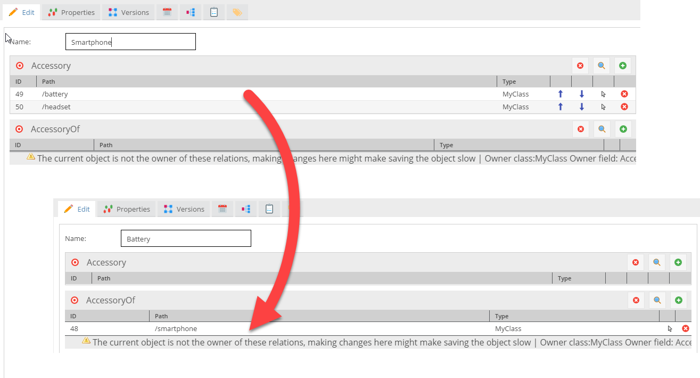
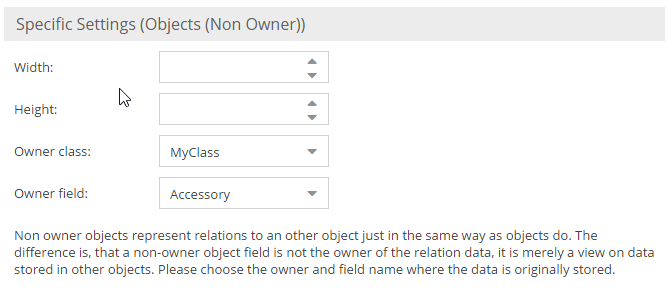

# Reverse Many-To-Many Object Relation Datatype

Reverse Many-To-Many Object Relation are the counter part to the [Many-To-Many Object Relation field](70_Relation_Types.md).
They allow to display and edit relations which are owned by a remote object. 

This is best explained with an example: 



Let's say there is a product, which has an Many-To-Many Object Relation field called `accessories`. The straight forward way of establishing 
a relation is to open a product and assign it it's accessories by dragging and dropping other products into the 
accessories field. If you now also want to be able to go to the accessory product and define which other products 
this is an accessory of, you'd have to set up a Reverse Many-To-Many Object Relation field to do that. The reverse field needs to be configured 
with the remote class name and the field name of the objects field in the remote class. Having done that, you can 
not only assign accessories to a product, but you can also define of which other products the current one is an accessory of.





The Reverse Many-To-Many Object Relation field do not have a database column or any data storage at all. They are stored in the remote object and 
merely represent a different way of establishing data relations from within the dependent object. When an object is added 
to a Reverse Many-To-Many Object Relation field, this means the object owning the relation is modified implicitly. If the owning object is open in 
Pimcore as well, Pimcore will warn you that you are about to modify an object that is already open. If the owning
object is already open in the UI, it will have to be reloaded, before the new relation established by a remote object, 
becomes visible.


## Working with PHP API
Reverse Many-To-Many Object Relation are a pure Pimcore admin feature, they don't play any role in scripting or services.

Since Reverse Many-To-Many Object Relation are owned by the remote object, they can only be set through the remote owner. Also the getter 
has been omitted because Reverse Many-To-Many Object Relation are not exposed through exporters or webservices.

The best way to "get" non owner objects would be to use the `getRelationData()` method of objects:

```php
$def = $object->getClass()->getFieldDefinition("myNonOwnerObjectField");
$refKey = $def->getOwnerFieldName();
$refId = $def->getOwnerClassId();
$nonOwnerRelations = $object->getRelationData($refKey, false, $refId);
```
