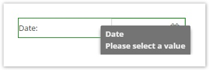

# Object Data Types

The entire list of data types is indicated below:

### [Text Datatypes](./01_Text_Types.md)

| Name                     | Description                                                                                                                                                                                                                                                                                                                                                                                                                                                                    |
|--------------------------|---------------------------------------------------------------------------------------------------------------------------------------------------------------------------------------------------------------------------------------------------------------------------------------------------------------------------------------------------------------------------------------------------------------------------------------------------------------------------------|
| Input                    | text input field                                                                                                                                                                                                                                                                                                                                                                                                                                                                |
| Textarea                 | textarea                                                                                                                                                                                                                                                                                                                                                                                                                                                                        |
| Wysiwyg                  | text area with formatting options through a WYSIWYG editor                                                                                                                                                                                                                                                                                                                                                                                                                      |
| Password                 | password field                                                                                                                                                                                                                                                                                                                                                                                                                                                                  |

### [Number Datatypes](./03_Number_Types.md)

| Name                     | Description                                                                                                                                                                                                                                                                                                                                                                                                                                                                    |
|--------------------------|---------------------------------------------------------------------------------------------------------------------------------------------------------------------------------------------------------------------------------------------------------------------------------------------------------------------------------------------------------------------------------------------------------------------------------------------------------------------------------|
| Numeric                  | spinner field for number input                                                                                                                                                                                                                                                                                                                                                                                                                                                  |
| Slider                   | number input with slider widget (min - max slider)                                                                                                                                                                                                                                                                                                                                                                                                                              |
| Quantity Value           | number input with an additional unit. available units can be configured centrally.  |

### [Date Datatypes](./05_Date_Types.md)

| Name                     | Description                                                                                                                                                                                                                                                                                                                                                                                                                                                                    |
|--------------------------|---------------------------------------------------------------------------------------------------------------------------------------------------------------------------------------------------------------------------------------------------------------------------------------------------------------------------------------------------------------------------------------------------------------------------------------------------------------------------------|
| Date                     | calendar date selector                                                                                                                                                                                                                                                                                                                                                                                                                                                          |
| Date & Time              | calendar date selector + combo box for time                                                                                                                                                                                                                                                                                                                                                                                                                                     |
| Time                     | combo box for time                                                                                                                                                                                                                                                                                                                                                                                                                                     |

### [Select Datatypes](./07_Select_Types.md)

| Name                     | Description                                                                                                                                                                                                                                                                                                                                                                                                                                                                    |
|--------------------------|---------------------------------------------------------------------------------------------------------------------------------------------------------------------------------------------------------------------------------------------------------------------------------------------------------------------------------------------------------------------------------------------------------------------------------------------------------------------------------|
| Select                   | combo box                                                                                                                                                                                                                                                                                                                                                                                                                                                                       |
| User                     | combo box to select from all existing Pimcore users (available since build 716)   In the user settings the object dependencies of each user are shown in the second tab panel. All objects which reference the selected user are listed in a grid view.  If one needs to find out which objects hold a reference to a specific user, the `Pimcore\\Tool\\Admin::getObjectsReferencingUser($userId)` method can be used to find all referencing objects. |
| Country                  | combo box with predefined country list from Zend_Locale                                                                                                                                                                                                                                                                                                                                                                                                                         |
| Language                 | combo box with predefined language list from Zend_Locale                                                                                                                                                                                                                                                                                                                                                                                                                        |
| Multiselect              | combo box with multiple select                                                                                                                                                                                                                                                                                                                                                                                                                                                  |
| Countries                | combo box with multiple select and predefined country list from Zend_Locale                                                                                                                                                                                                                                                                                                                                                                                                                         |
| Languages                | combo box with multiple select and combo box with multiple select and predefined language list from Zend_Locale                                                                                                                                                                                                                                                                                                                                                                 |

### [Relational Datatypes](./09_Relation_Types.md)

| Name                     | Description                                                                                                                                                                                                                                                                                                                                                                                                                                                                    |
|--------------------------|---------------------------------------------------------------------------------------------------------------------------------------------------------------------------------------------------------------------------------------------------------------------------------------------------------------------------------------------------------------------------------------------------------------------------------------------------------------------------------|
| 1:1 Relation (href)      | reference to a Pimcore document, object or asset                                                                                                                                                                                                                                                                                                                                                                                                                                |
| 1:n Relation (Multihref) | collection of references to Pimcore documents, objects, assets                                                                                                                                                                                                                                                                                                                                                                                                                  |
| 1:n Relation - Advanved (Multihref Medatadata)   | collection of references to Pimcore documents, objects, assets with additional metadata on the relation                                                                                                                                                                                                                                                                                                                                                                                                                 |
| 1:n Object Relation  (Objects)  | collection of Pimcore object references                                                                                                                                                                                                                                                                                                                                                                                                                                         |
| 1:n Object Relation - Advanved (Objects Metadata)          | collection of Pimcore object references with additional metadata on the relation                                                                                                                                                                                                                                                                                                                                                                                                                                        |
| [nonownerobjects](./37_Non_Owner_Objects_Type.md)          | object relations which are owned by a different object                                                                                                                                                                                                                                                                                                                                                                                                                          |

### Structured Datatypes

| Name                     | Description                                                                                                                                                                                                                                                                                                                                                                                                                                                                    |
|--------------------------|---------------------------------------------------------------------------------------------------------------------------------------------------------------------------------------------------------------------------------------------------------------------------------------------------------------------------------------------------------------------------------------------------------------------------------------------------------------------------------|
| [Block](./11_Blocks.md)  | repeatable block of attributes within an object                                                                                                                                                                                                                                                                                                                                                                                                                                                                        |
| [Classification Store](./13_Classification_Store.md)      | advanced store for classification systems like ETIM, ecl@ss, etc. |
| [Table](./15_Table.md)   | table input                                                                                                                                                                                                                                                                                                                                                                                                                                                                     |
| [Structured Table](./17_Structured_Table.md)          | table with predefined rows and columns  |
| [Field Collections](./19_Fieldcollections.md)         | A collection of fields that can be added to the object                                                                                                                                                                                                                                                                                                                                                                                                                                                         |
| [Object Bricks](./21_Object_Bricks.md)             | Bricks of attributes, that can be added to objects | 
| [Localized Fields](./23_Localized_Fields.md)          | Set of attributes that can be translated |

### [Geographic Datatypes](./27_Geographic_Types.md)

| Name                     | Description                                                                                                                                                                                                                                                                                                                                                                                                                                                                    |
|--------------------------|---------------------------------------------------------------------------------------------------------------------------------------------------------------------------------------------------------------------------------------------------------------------------------------------------------------------------------------------------------------------------------------------------------------------------------------------------------------------------------|
| Geo-Point                 | maps widget to find longitude/latitude                                                                                                                                                                                                                                                                                                                                                                                                                                   |
| Geo-Bounds                | maps widget to define geographical bounds                                                                                                                                                                                                                                                                                                                                                                                                                                |
| Geo-Polygon               | maps widget to define a geographical area                                                                                                                                                                                                                                                                                                                                                                                                                                |

### Other Datatypes

| Name                     | Description                                                                                                                                                                                                                                                                                                                                                                                                                                                                    |
|--------------------------|---------------------------------------------------------------------------------------------------------------------------------------------------------------------------------------------------------------------------------------------------------------------------------------------------------------------------------------------------------------------------------------------------------------------------------------------------------------------------------|
| [Image](./29_Image_Types.md)                    | drop area & preview for a Pimcore image asset                                                                                                                                                                                                                                                                                                                                                                                                                                         |
| [External Image](./29_Image_Types.md#external-image-extjs6-only)            | relation to an image that is not stored in Pimcore |
| [Image Advanced](./29_Image_Types.md#image-advanced-supporting-hotspotsmarkerscropping)            | drop area & preview for a Pimcore image asset with additional features for markers, hotspots, cropping |
| [Video](./31_Video_Type.md)                    | drop area & preview for a Pimcore video asset                                                                                                                                                                                                                                                                                                                                                                                                                                                                          |
| [Checkbox](./35_Others.md#checkbox)                  | checkbox                                                                                                                                                                                                                                                                                                                                                                                                                                                                        |
| [Link](./35_Others.md#link)                     | link selector with link target                                                                                                                                                                                                                                                                                                                                                                                                                                                  |
| [Calculated Value](./33_Calculated_Value_Type.md)          | datatype for calculated values - calculation can be defined with a PHP class  |

### CRM Datatypes

| Name                     | Description                                                                                                                                                                                                                                                                                                                                                                                                                                                                    |
|--------------------------|---------------------------------------------------------------------------------------------------------------------------------------------------------------------------------------------------------------------------------------------------------------------------------------------------------------------------------------------------------------------------------------------------------------------------------------------------------------------------------|
| Firstname                | typed input field for firstname |
| Lastname                 | typed input field for lastname |
| Email                    | typed input field for email including validation |
| Gender                   | typed and prefilled select for gender |
| Newsletter Active         | typed checkbox if newsletter is active |
| Newsletter Confirmed      | typed checkbox if newsletter is confirmed |
| Persona                  | typed selectbox for personas defined within Pimcore |
| Personas                 | typed selectbox with multiselect for personas defined within Pimcore |
| [Consent](./39_Consent.md)| store consent of user for something, e.g. consent for direct marketing mailing |

### General Aspects

All data types are wrapped in an object derived from `Pimcore\Model\DataObject\Class\Data`. 
These data type objects provide getters and setters and they define the Description in the frontend. 
Data type objects are displayed in the first column of the table above. 
The second column indicates the underlying data type class and the third column outlines the Description used in Pimcore 
to fill in, edit and display data objects.

Besides the `name`, which is the name of the object's property and the `title`, which is shown in the GUI, an 
object field has the general configuration options listed below. The title can be translated for different system 
languages. Please see the article about Translations to find out how to add object field translations.

* `mandatory`: Makes the field mandatory and does not allow saving the object when it is empty
* `not editable`: Does not allow a change of this field's value in Pimcore backend (data change can only be done 
  programmatically)
* `invisible`: The field is not visible in Pimcore
* `visible in grid view`: Determines if the field's data column is shown in the object grid view, or hidden 
  (meaning it has to be activated manually)
* `visible in search result`: Determines if the field's data column is shown in the search results grid, or hidden 
  (meaning it has to be activated manually)
* `indexed`: puts an index on this column in the database
Moreover, each data field can have a `tooltip`, which is shown when the mouse hovers over the input field.
* `unique`: currently the `input` and `numeric` data type allows to add a unique constraint.If checked, the values will also be indexed. Note that only works on top level attributes and not on nested stuff inside localized fields etc.

The `layout settings` allow to apply custom CSS to any object field.

> **WARNING**  
> Please note that renaming a field means the loss of data from the field in all objects using this class.

See sub-pages of this page for detail documentation of different data types. 