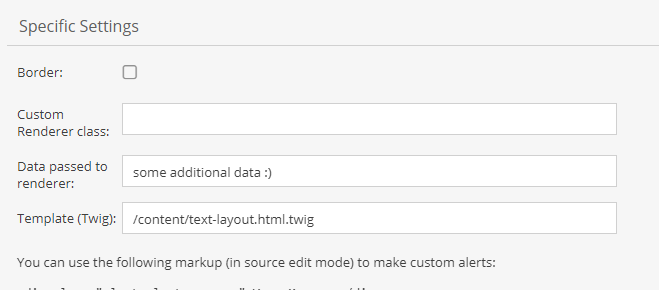

# Dynamic Text Labels

Similar to the [CalculatedValue](../../../05_Objects/01_Object_Classes/01_Data_Types/10_Calculated_Value_Type.md) data type,
it is possible to generate the Layout Text dynamically based on the current object and the label's context. There are two options for defining dynamic content: 
- Providing a custom renderer class
- Using twig in template
This is an alternative to the static text defined in the class definition.

For all ways, the preview tab shows a preview of the generated content. If you are using object context in your content, then just drag & drop object on "Drag Object for Preview" field before checking the output in preview tab.


## Custom Renderer Class

Let's consider the following example.

It states that we want to use a custom renderer service which implements `DynamicTextLabelInterface` and in turn returns dynamic text string from `renderLayoutText` method. We also want to pass some additional data (*some additional data :)* in this example) to the rendering method.


Here is an example for a rendering class.

```php
<?php

namespace App\Helpers;

use Pimcore\Model\DataObject\Concrete;

class CustomRenderer implements DynamicTextLabelInterface
{
    /**
     * @param string $data as provided in the class definition
     * @param Concrete|null $object
     * @param mixed $params
     *
     * @return string
     */
    public function renderLayoutText($data, $object, $params) {
        $text = '<h1 style="color: #F00;">Last reload: ' . date('c') . '</h1>' .
            '<h2>Additional Data: ' . $data . '</h2>';

        if ($object) {
            $text .= '<h3>BTW, my fullpath is: ' . $object->getFullPath() . ' and my ID is ' . $object->getId() . '</h3>';
        }

        return $text;
    }
}
```

*$data* will contain the additional data from the class definition. In *$params* you will find additional information about the current context.
For example: If the text label lives inside a field collection, *$params* will contain the name of the field collection (and of course the name of the label itself).

The result will be as follows:


## Twig & Preview
It is possible to use Twig syntax inside htmleditor (Source Edit) and Renderer class. You can also check the generated output in preview tab.

Following variables are available in twig context: 
- `object` - current data object
- `data` - data provided to renderer defined in the class defintion

Here is an example of Twig content in htmleditor source edit mode:




### Sandbox Restrictions
Dynamic Text renders user controlled twig templates in a sandbox with restrictive
security policies for tags, filters & functions. Please use following configuration to allow more in template rendering:

```yaml
    pimcore:
          templating_engine:
              twig:
                sandbox_security_policy:
                  tags: ['if']
                  filters: ['upper']
                  functions: ['include', 'path']
```