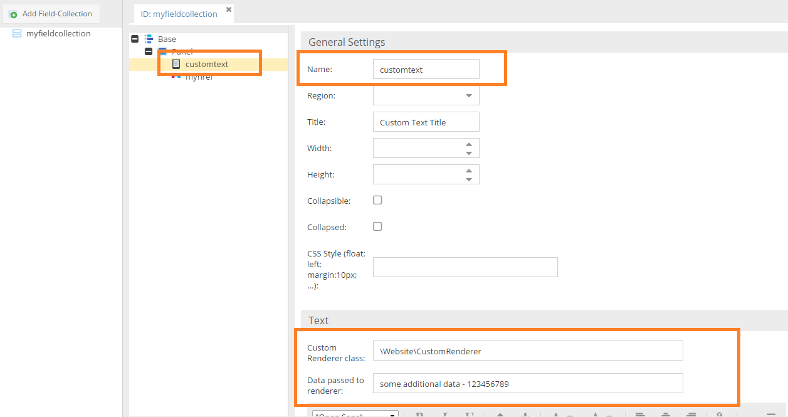
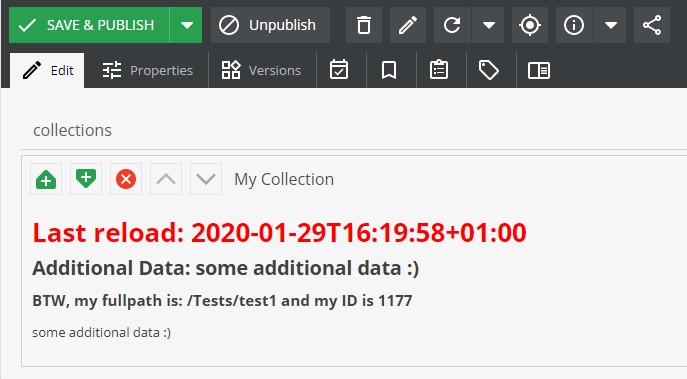

# Dynamic Text Labels

Similar to the [CalculatedValue](../../../05_Objects/01_Object_Classes/01_Data_Types/10_Calculated_Value_Type.md) data type,
it is possible to generate the Layout Text dynamically based on the current object and the label's context.
This is an alternative to the static text defined in the class definition.

Let's consider the following example. 

It states that we want to use a custom renderer service which implements `DynamicTextLabelInterface` and in turn returns dynamic text string from `renderLayoutText` method. We also want to pass some additional data (*some additional data :)* in this example) to the rendering method.



Here is an example for a rendering class.

```php
<?php

namespace AppBundle\Helpers;

use Pimcore\Model\DataObject\Concrete;

class CustomRenderer implements DynamicTextLabelInterface
{
    /**
     * @param string $data as provided in the class definition
     * @param Concrete|null $object 
     * @param mixed $params 
     * 
     * @return string
     */
    public function renderLayoutText($data, $object, $params) {
        $text = "<h1 style='color: #F00;'>Last reload: " . date('c') . '</h1>'
            . '<h2>Additional Data: ' . $data . "</h2>";

        if ($object) {
            $text .= '<h3>BTW, my fullpath is: ' . $object->getFullPath() . ' and my ID is ' . $object->getId() . '</h3>';
        }

        return $text;
    }
}
```

*$data* will contain the additional data from the class definition. In *$params* you will find additional information about the current context.
For example: If the text label lives inside a field collection, *$params* will contain the name of the field collection (and of course the name of the label itself).

The result will be as follows:


   
   
