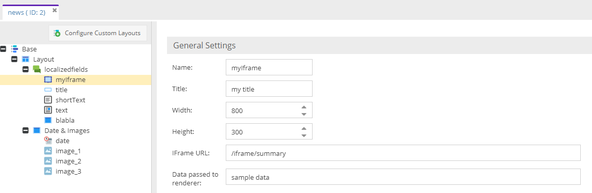
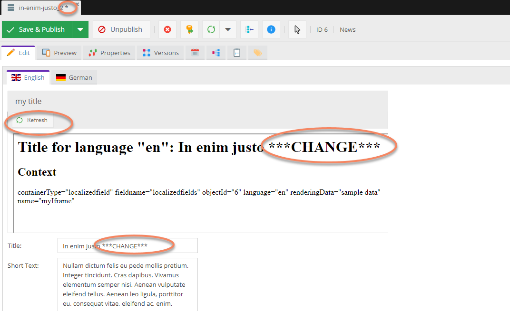

# Preview / Iframe Panel

Provide a URL and make use of the context paramater to render a response of your choice.
 
## Class Configuration


Note that you can provide a freely selectable string that will be added to the context information. See the output of the example below.

## Sample Controller Code
```
<?php

namespace AppBundle\Controller;

use Pimcore\Model\DataObject\Service;
use Symfony\Component\HttpFoundation\Request;
use Symfony\Component\HttpFoundation\Response;
use Symfony\Component\Routing\Annotation\Route;

class IFrameController extends \Pimcore\Controller\FrontendController
{

    /**
     * @Route("/iframe/summary")
     *
     * @param Request $request
     */
    public function summaryAction(Request $request) {
        $context = json_decode($request->get("context"), true);
        $objectId = $context["objectId"];
        $language = $context["language"];

        // get the current editing data, not the saved one! 
        $object = Service::getElementFromSession('object', $objectId);

        $response =  '<h1>Title for language "' . $language . '": '  . $object->getTitle($language) . "</h1>";

        $response .= '<h2>Context</h2>';
        $response .= array_to_html_attribute_string($context);
        return new Response($response);
    }
}

```

## Object Editor


