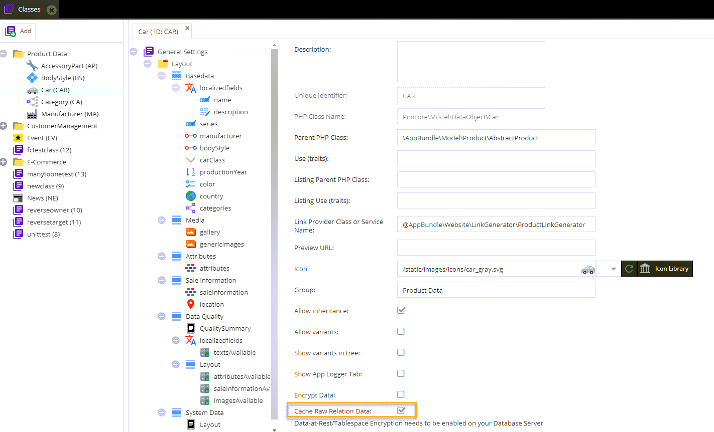

# Cache Raw Relation Data

Enable this if you want to retrieve all rows of the affected `object_relation_` table in one go and cache the results.

This can be beneficial if your model contains many lazy loaded fields that are frequently used.

> Note: This will become the default behavior in future releases. 

