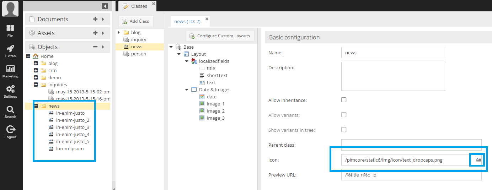

# Custom Icons for Objects

Pimcore allows you to define custom icons for objects. Either, icons can be the same for all objects of a class 
(via configuration in class) or objects depending on their data values can have different icons (see below). 
In addition to that, the tooltip of an object in object tree can be customized via admin style.   

## Static Custom Icons for Classes

Objects can be displayed in Pimcore with custom icons. This makes objects distinguish themselves visually based on the 
class they are based on.
In the object tree the user can see on the first sight what an object should represent. The example below shows how 
custom icons are assigned to a class and how they are displayed in the object tree. It is easy for the user to see 
immediately which objects are of the type "News".

Icons that come along with Pimcore by default can be found in `<YOUR-DOMAN>/admin/misc/icon-list` (backend session needed).

#### Icon Sizes
As icons SVG graphics are recommended. If you use pixel graphics, the maximum size is 18x20 pixels. 

## Dynamically define Custom Icons and Style in Object-Tree (AdminStyle)

You can dynamically define custom icons based on the element.
Read [Dynamic Icons](../../../18_Tools_and_Features/02_Custom_Icons.md) for details.
